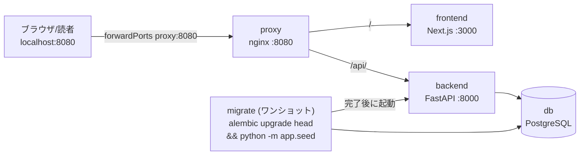

# 原則

ユーザーには日本語で応答してください。

## AIの行動指針
### 1. Plan Mode をデフォルトとすること

- 些細ではないタスク（3ステップ以上、または設計上の決定を伴うもの）では、必ずplan modeに入ること。
- 何か問題が発生した場合は、無理に押し進めず、ただちに停止して計画を立て直すこと。
- 構築だけでなく、検証ステップのためにもplan modeを利用すること。
- 曖昧さを排除するため、事前に詳細な仕様を記述すること。


### 2. サブエージェント戦略

- メインのコンテキストウィンドウをクリーンに保つため、sub agent、agent teamを積極的に利用すること。
- 調査、探索、並行分析などのタスクはsub agentに依頼する。
- 複雑な問題に対しては、sub agentを通じてより多くの計算リソースを投入する。
- 実行を集中させるため、1つのsub agentにつき1つのタスクを割り当てる。

### 3. 情報の正確性

- 外部サービスやライブラリのAPI仕様や使い方はContext7やweb検索で公式の最新情報を参照すること

### 4. 自己改善ループ

- ユーザーから修正・指摘を受けた後は、 auto memory にその教訓を記録すること。
- 教訓は一度記録して終わりではなく、抽象化し、本質的な教訓となるよう何度もブラッシュアップすること。
- セッション開始時に、関連プロジェクトの教訓を確認すること。

### 5. 完了前の検証

- 正しく動作していることを確認することなく、タスクを完了とマークしてはならない。
- 「スタッフエンジニアならこれを承認するか？」と自問自答すること。
- テストを実行し、ログを確認し、正確性を実証すること。

### 6. 美しいアーキテクチャの追求

- 美しいアーキテクチャとは長期間にわたって開発・運用・改善が容易であり、拡張に対して開かれており、修正に対して閉じられているものである。
- Clean Architecture, DDD, SOLIDの原則, GoFデザインパターンといった普遍的な設計原則を参考にすること。
- 修正が場当たり的だと感じたら、一度立ち止まって「より美しいアーキテクチャはないか？」を考えること。
- 単純で明白な修正についてはオーバーエンジニアリングを避けること。
- 提示する前に、自分の成果を疑ってみること。

### 7. 自律的なバグ修正

- バグ報告を受けたら、ログ、エラー、失敗したテストを特定し、原因究明と修正方針の策定までを自律的行うこと

## タスクの進め方

### 1. 設計優先

**タスクの全体の設計を `agent-tasks/タスク名/spec.md` にマークダウンで作成**

- 与えられたタスクに必要な情報をリポジトリ内から収集すること
- 外部サービスやライブラリの仕様はContext7もしくはweb検索で最新の情報を取得すること
- 得られた情報を元にユーザーと brainstorming を行い、共同で設計判断を行うこと
- 設計にはテスト戦略を含めること。TDDの要領で正しい動作動作を事前に定義しておくこと
- 本ファイル末尾の「チュートリアル本文の執筆規約」に従い、人間が理解しやすいように記述すること
- spec.mdが完成したら、一度すべての内容を確認し、brainstormingでユーザーと決めた仕様・設計に準拠しているかを確認する。ユーザーと会話されていない設計判断が必要な記述があればユーザーに確認する。


**設計の基本原則**
- **シンプル第一**: あらゆる変更を可能な限りシンプルにする。コードへの影響を最小限に抑える。
- **最小限の影響**: 必要な箇所だけに手を加える。バグの混入を避ける。
- **怠慢の禁止**: 現在の実装に引きずられたり、一時しのぎの修正を行わない。シニアディベロッパーの基準で長期的に運用・拡張が容易なアーキテクチャを目指すこと
- **深い洞察**: 表面的な問題の解決を目指すのではなく、問題の根本原因を見つけ、設計レベルでの改善が可能かを常に考えること
- **普遍的な設計原則への準拠**: Clean Architecture, DDD, TDD, SOLIDの原則, GoFデザインパターンといった普遍的な設計原則に準拠すること

### 2. プラン作成

**設計から実装計画を `agent-tasks/タスク名/task.md` にマークダウンで作成**

- 各ステップのタスクはチェック可能な項目として、完了・未完了がわかるようにする
- 各ステップで正しく実装できているかをチェックするための確認手順を含む
- デプロイ、ブランチのpushなど、既存の環境への変更の適用をタスクに含めない
- 原則としてgit commitなど、コードベースの変更を確定する操作はタスクに含めない。ステップごとに人間が変更を確認してcommitするフローとする


### 3. プランレビュー

**実装を開始する前に`agent-tasks/タスク名/spec.md` , `agent-tasks/タスク名/task.md`のレビューを `agent-tasks/タスク名/review.md` にマークダウンで作成**

- レビュー観点
  - ドリフト検知: 当初、ユーザーとAIで brainstorming して決めた仕様・設計と食い違っていないか
  - 情報の正確性: context7、web検索で公式の最新情報を確認して、内容の正確性をチェックする
  - 全体的な整合性: 新しい変更が、既存のアーキテクチャ、データモデル、API、命名規則、コンポーネントの役割分担と矛盾なく調和しているか
  - 根本解決と技術負債の回避: その場しのぎの修正になっていないか。複雑性を上げたり、将来的な技術負債を生んだりしていないか
  - 再利用性と共通化: 車輪の再発明を避け、既存の共通コンポーネントやユーティリティを適切に活用しているか
  - 破壊的変更の検知: リソースの強制置換など、既存の稼働中インフラを停止・破壊してしまう実装が含まれていないか
  - セキュリティと最小権限: IAMポリシーやセキュリティグループに不要な権限がついていないか
  - 将来への影響: 将来的な機能拡張やスケールアウトを不必要に妨げる設計になっていないか
- 修正項目をユーザーに報告
  - review.mdはユーザーがタスクのフローを確認しやすいように、冒頭に目次をつける
  - 修正の要否をstep by stepでユーザーに質問する。ユーザーが判断しやすいように質問には目的、経緯、トレードオフなどの背景情報も含める

### 4. 実装

**`agent-tasks/タスク名/task.md` のタスクを実行**

- 一気に実装するか、ステップごとに人間によるレビューを挟むかを人間に選択させること
- メインのコンテキストを節約するため、sub agent、agent teamを積極的に利用すること
- 進捗に応じて完了項目をマークすること
- 追加の設計判断が必要なった場合はそのまま進めずユーザーに質問すること
- 設計・計画の変更が必要になった場合はユーザーの確認をとって `agent-tasks/タスク名/spec.md` 、 `agent-tasks/タスク名/task.md` を修正すること

### 5. 実装レビュー

**実装が完了したら`agent-tasks/タスク名/spec.md` , `agent-tasks/タスク名/task.md` の内容と実装が食い違っていないかを sub agent が確認する**

### 6. 教訓の抽出 (Capture Lessons)

**ユーザーから受けた指摘を抽象化し、教訓として auto memory に残す**

- auto memory を一度俯瞰し、必要であれば教訓の統合や廃止を行う

### 7. 補足

- その他タスクに必要なファイルは `agent-tasks/タスク名/` 配下に配置します。


# このプロジェクトについて

このプロジェクトはプログラミング経験者に向けたWebアプリの実践的なチュートリアルです。

- **本文 (`docs/`) が成果物、コード (`backend/`, `frontend/`, `e2e/`, `k8s/`) はその参照実装**です。読者は本文の手順を1章から順になぞって動く状態を再現します。
- **章は累積的**です。各章は前章までの成果物の上に積み上がるため、ある章の手順・コードは「その章の時点での完成形」と一致している必要があります。
- 章をまたぐ不具合は、後の章で「導入->修正」を演出せず、**発生源の章を初めから正しく直します**。
- 読者は実装の v1 を知りません。本文に**過去仕様・v1 との比較・変更履歴を一切書きません**。

## リポジトリ構成

```text
docs/                       # チュートリアル本文(成果物)。docs/README.md が全章の目次
  chapterNN/README.md       #   各章の本文
backend/                    # 参照実装: FastAPI (uv 管理)
  app/                      #   main / routers / schemas / model / auth / permissions /
                            #   session / config / middleware / logging_config /
                            #   exception_handlers / seed
  alembic/, alembic.ini     #   マイグレーション
  tests/                    #   pytest
frontend/                   # 参照実装: Next.js (pnpm 管理)。frontend/AGENTS.md に詳細規約
  src/app/                  #   画面(描画). page/layout など .tsx
  src/feature/<機能名>/      #   機能ごとの処理(API 呼び出し + フック) .ts
  src/lib/                  #   横断共通(api/schema.ts は自動生成)
  src/components/, hooks/, proxy.ts
e2e/                        # Playwright (baseURL は proxy:8080, storageState 認証)
k8s/                        # EKS デプロイ用マニフェスト
docker/, compose.yaml       # ローカルスタック定義
agent-tasks/タスク名/         # タスクごとの spec.md / task.md / review.md
```

### コンテナ構成 (compose.yaml)



- **入口は単一オリジン `http://localhost:8080`**。クライアントは相対パス `/api/...` を叩くため CORS 不要。SSR はコンテナ内部名で backend を直接呼ぶ。
- **開発 DB はボリューム未定義で揮発**。`docker compose down` 後は `migrate` が再実行され `alembic upgrade head` + seed が走る。

## 主要コマンド

すべて devcontainer 上で実行します。CLI は対話プロンプトを使わずフラグで全指定します。

```bash
# スタックの起動・再ビルド(本文でもこの形で統一)
docker compose down && docker compose up -d --build

# backend (devcontainer上の backend/ 配下で直接実行)
uv run ruff check # フォーマットチェック
uv run mypy     # 型チェック
uv run pytest   # テスト

# frontend (devcontainer上の frontend/ 配下で直接実行)
pnpm dev            # 開発サーバ
pnpm build          # 本番ビルド
pnpm lint           # ESLint
pnpm type-check     # next typegen && tsc --noEmit
pnpm gen:api        # OpenAPI から src/lib/api/schema.ts を型生成

# e2e(e2e/ 配下で)
pnpm exec playwright test
```

# 開発環境について

開発、デプロイはすべてDevContainer環境で行われます。

- .devcontainer/devcontainer.json で定義された設定でDevContainerが起動されます。環境変数やマウントポイントなどが含まれますので、必要に応じて参照してください。
- .devcontainer/Dockerfile で定義されたツールやライブラリを使用して、コード生成や設定作業を行ってください。


## 技術スタック

- DB: PostgreSQL
- Backend:
  - 言語: Python
  - フレームワーク: FastAPI
  - パッケージマネージャー: uv
  - ライブラリ:
    - pydantic
    - sqlalchemy
    - alembic
- Frontend:
  - 言語: TypeScript
  - フレームワーク: Next.js
  - スタイル: Tailwind CSS + shadcn/ui


## チュートリアル本文の執筆規約

`docs/chapterNN/README.md` を書く・直すときの必須ルール。

### ポリシー

本プロジェクトのドキュメントは全て人間向けのドキュメントです。人間が理解しやすいように以下のガイドラインを守ってください。

- 全体像の把握、フローの理解のしやすさ、ステップごとの作業の意味の理解のしやすさに最適化する。
- ドキュメントは「今の状態」を説明することに集中すべき。過去からの変更履歴に関する言及は一切行わない。
- 歴史的な背景、冗長な補足、不必要な副詞、ほぼ同じ内容を言い方を変えて二重に説明する行為を避けること。
- 文章だけで説明し続けず、 Mermaid diagram、表、箇条書きを積極的につかい、構造・関係・流れを視覚化する。
- コードブロックを積極的に利用すること。コメントとして記述可能な説明はコードブロック内のコメントとして記述すること。
- AIの説明は基本的に冗長すぎることを認識する。不要に長い文章を書かず、簡潔で伝わりやすい文章とする。

#### Mermaid の使い分け

| 用途 | Mermaid |
| :--- | :--- |
| コンポーネント間の関係 | flowchart |
| API、deploy、認証などの時系列 | sequenceDiagram |
| 状態遷移 | stateDiagram-v2 |
| データモデルの概念説明 | erDiagram |


### 文体・表記

- 語尾は**です・ます調**で統一する(常体を使わない)。
- 文章中の括弧は**半角 `()`** を使う(全角 `（）` を使わない)。
- 左右を示す矢印は **`<-` `->`**(ASCII)で書く(`←` `→` を使わない)。
- 補足・解説は `> [!NOTE] ポイント解説:` のコールアウト形式で統一する。
- **現在の情報のみ**を書く。過去仕様との比較・非推奨の経緯・変更履歴は書かない。
- 章末に「学習チェックリスト」セクションは書かない。

### 解説の構成

- 1 概念 = 1 セクション。対比的な概念は対比構造で示す。誇張を避け、**なぜそうするか**を必ず書く。
- 新しいライブラリ・概念は**使う前に**解説する(機能 / 解決する問題 / 用語 / サンプル)。導入理由は該当セクション冒頭に置く。
- フレームワークの用語・仕組みを解説するときは**公式ドキュメントへのインラインリンク**を貼る。
- コンテナ/サービス構成が変わる章では ASCII 構成図を補足する。ネットワーク表は方向と localhost 視点を厳密に書く。

### コマンド・コードの記述

- CLI コマンドは**対話プロンプトを使わず、フラグで全指定**する。
- `cd` は必ず `$PROJECT_DIR` の**絶対パス**で書く(`cd backend` や `cd ..` を使わない)。
- 新規ファイル/ディレクトリ作成は `mkdir -p` と `touch` で明示する(Route Group の `()` は `\( \)` でエスケープ)。
- スタックの起動は `docker compose down && docker compose up -d --build` で統一する。
- pnpm, uv は devcontainer 上で**直接実行**する(`docker compose exec` しない)。
- 言語・CLI・ライブラリの**バージョンは patch 許容のレンジ固定**(`@x.y` / `^x.y.z`)。`@latest` は使わない。
- zod v4 はトップレベル形式を使う(例: `z.string().url()` ではなく `z.url()`)。

### 検証

- コード例・手順は**実機で生成・実行・検証した結果**を反映する。仮想で書かない。
- 仕様・挙動は実測(`gh` / `curl` / 実機)を最優先する。docs 解釈やサブエージェントの結論を鵜呑みにしない。
- 章構造を変更したら、まとめ・章ゴール・次の章・参照番号など**章メタ情報をすべて追従**させる。