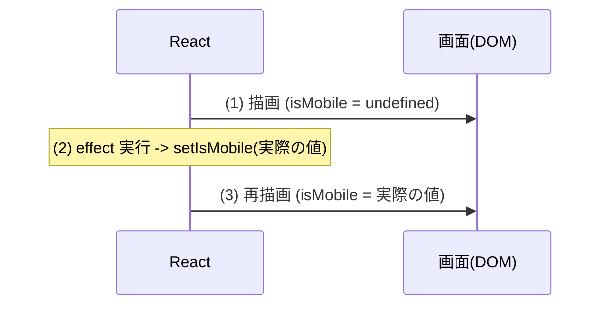
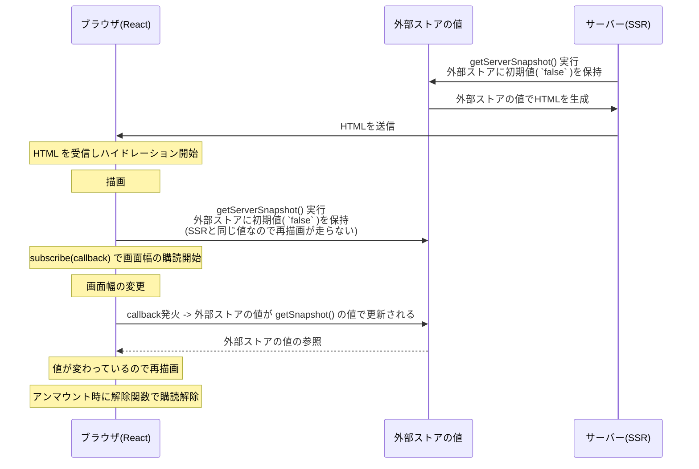

# Chapter14


## Lintエラーの理由と修正方針について

指摘内容:

```
Error: Calling setState synchronously within an effect can trigger cascading renders
```

つまり、`useEffect` の中で同期的に `useState` の状態を変更すると連鎖的なレンダリングが発生する、という指摘です。


この指摘を理解するために、まず 2 つの Hook を押さえます。

| Hook | 役割 |
| :--- | :--- |
| **[`useState`](https://react.dev/reference/react/useState)** | コンポーネントに「状態」を持たせる。`const [v, setV] = useState(初期値)`。`setV(...)` を呼ぶと、新しい値で**再描画(re-render)が予約**される |
| **[`useEffect`](https://react.dev/reference/react/useEffect)** | 描画が画面に反映された**後**に走る。Reactのstateが変わったときにReact以外のリソース(DOM や外部システム)をあわせて操作したいときに利用する |

### effect の中で setState すると何が起きるか

問題となったコードを確認してみましょう。

```tsx
// src/hooks/use-mobile.ts
import * as React from "react"

const MOBILE_BREAKPOINT = 768

export function useIsMobile() {
  const [isMobile, setIsMobile] = React.useState<boolean | undefined>(undefined)  // <- useState を初期値 undefined で初期化

  React.useEffect(() => {
    const mql = window.matchMedia(`(max-width: ${MOBILE_BREAKPOINT - 1}px)`)
    const onChange = () => {
      setIsMobile(window.innerWidth < MOBILE_BREAKPOINT)
    }
    mql.addEventListener("change", onChange)
    setIsMobile(window.innerWidth < MOBILE_BREAKPOINT)  // <- useEffect 内で同期的に state の値を更新
    return () => mql.removeEventListener("change", onChange)
  }, [])

  return !!isMobile
}
```

問題のコードは「`useState` を初期値 `undefined` で初期化し、useEffect 内で同期的に state の値を更新する」しています。  
これは次の流れになります。  



この図を見ると **1 回のマウントで描画が 2 回** 走ることがわかります。これが "cascading renders"(連鎖した再描画)です。  
ツリーが大きければこのレンダリングは無視できないコストになります。

`react-hooks/set-state-in-effect` は、この「effect 中の同期的な setStateの呼び出し」を警告します。React 公式も **「effect は外部との同期に使い、描画に必要な値は描画時に計算するべき」** としています。

### 修正方針

`window.matchMedia` のような **React の外にある状態**を定期購読するには、 **[`useSyncExternalStore`](https://react.dev/reference/react/useSyncExternalStore)** を使います。引数は3つです。

| 引数 | 役割 |
| :--- | :--- |
| `subscribe(cb)` | 外部の変化を購読する関数。変化したら `cb` を呼ぶ。戻り値は購読の解除関数。 |
| `getSnapshot()` | 描画時や `cb` が呼び出されたときに現在値を読む関数 (クライアント側で動作) |
| `getServerSnapshot()` | 初期値を返す関数。SSR とハイドレーション最初の描画で評価される (window を触らない) |


```tsx
// src/hooks/use-mobile.ts
import * as React from "react"

const MOBILE_BREAKPOINT = 768

// メディアクエリの変化を購読する(変化時に callback を呼び、解除関数を返す)
function subscribe(callback: () => void) {
  const mql = window.matchMedia(`(max-width: ${MOBILE_BREAKPOINT - 1}px)`)
  mql.addEventListener("change", callback)
  return () => mql.removeEventListener("change", callback)
}

export function useIsMobile() {
  return React.useSyncExternalStore(
    subscribe,
    () => window.innerWidth < MOBILE_BREAKPOINT,  // クライアントでの現在値
    () => false,                                  // 初期値を返す関数。SSR とハイドレーション最初の描画で評価される 
  )
}

```

各関数の呼び出しタイミング (SSR -> ハイドレーション -> 実行)

