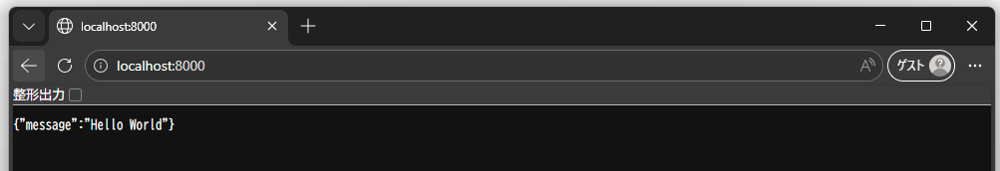
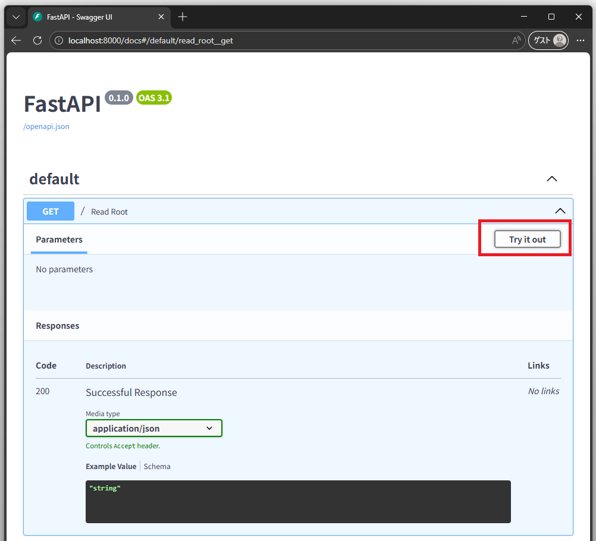
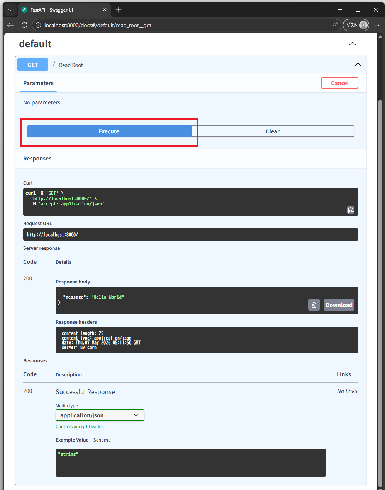

# Chapter 1: 開発環境セットアップ (Docker Compose)

[← 目次に戻る](../README.md)

## この章のゴール

- Docker Compose で **FastAPI コンテナ** を起動できる
- ブラウザで `http://localhost:8000` を開くと "Hello World" が返ってくる
- ソースコードを書き換えると **ホットリロード** で自動反映される

> **この章で扱うのは「環境構築」だけです。** FastAPI のルーティングや Pydantic などのコードの書き方は Chapter 2 で学びます。

## スタート地点

```bash
git checkout chapter01-start
```

## 完成形

```bash
git checkout chapter01-end
```

---

## はじめに

このチュートリアルでは **必ず Dev Container 上で作業** します。Dev Container を使うことで、学習者ごとに OS や言語のバージョンが違うことによる「動かない」問題を避けられます。

このリポジトリには既に `.devcontainer/` が用意されており、以下のツールがインストール済みです：

| ツール | 用途 |
|---|---|
| `docker` (outside-of-docker) | コンテナ操作 |
| `uv` | Python のパッケージマネージャ |
| `node`, `npm`, `pnpm` | Node.js（後の章で使う） |
| `psql` | PostgreSQL クライアント（Chapter 3 以降で使う） |
| `kubectl`, `helm`, `k9s` | Kubernetes 系（Chapter 16 で使う） |

つまり **Dev Container を起動した時点で、学習に必要なツールは全部入っている** ことになります。

### Dev Container を起動する

1. このリポジトリを **フォーク** してローカルにクローン
2. VS Code でリポジトリを開く
3. コマンドパレット (`F1`) → **「Dev Containers: Reopen in Container」** を選択
4. 初回はビルドに数分かかる
5. ターミナルが Dev Container 内のシェルになっていれば成功

以降、すべてのコマンドは **Dev Container のターミナル内で実行** します。

### このチュートリアルで使う環境変数

Dev Container 内では、以下の環境変数があらかじめ定義されています（`.devcontainer/devcontainer.json` の `containerEnv` で設定）。本文中のコマンド例にも頻出するので、最初に意味を押さえておきましょう。

| 変数 | 値の例 | 用途 |
|---|---|---|
| `$PROJECT_DIR` | `/workspaces/web-tutorial-v2` | **Dev Container 内** のプロジェクトルート |
| `$HOST_DIR` | `/Users/foo/projects/web-tutorial-v2` | **ホスト OS 上** のプロジェクトルート |
| `$HOST_USER` | `foo` | ホスト OS のユーザー名（コンテナ名・ネットワーク名に使用） |

`$PROJECT_DIR` は Dev Container の中で作業するときの基準パスです。`$HOST_DIR` と `$HOST_USER` は、Dev Container から `docker compose` でコンテナを起動するときに「ホスト OS から見たパス」「他のコンテナと衝突しない命名」のために使います。

---

## この章で作るファイル

```
web-tutorial-v2/
├── backend/                 # ← 今回新規作成
│   ├── pyproject.toml
│   ├── uv.lock
│   ├── .python-version
│   └── app/
│       └── main.py
├── docker/                  # ← 今回新規作成
│   └── backend.Dockerfile
└── compose.yaml             # ← 今回新規作成
```

---

## 1. uv とは

[uv](https://docs.astral.sh/uv/) は Rust 製の **Python パッケージマネージャ** です。`pip` や `poetry` の役割を高速に置き換えるツールで、近年の Python プロジェクトで広く採用されています。

### `pyproject.toml` と `uv.lock` の役割

- **`pyproject.toml`** … 依存パッケージの **要件**（"FastAPI 0.115 以上が必要" など）を記述する
- **`uv.lock`** … 実際にインストールされる **正確なバージョン** を全パッケージ分記録するロックファイル

`pyproject.toml` だけだと「FastAPI 0.115 以上」という曖昧さが残るため、別環境で `uv sync` したときに違うバージョンが入る可能性があります。`uv.lock` を git にコミットしておけば、誰がいつどこで `uv sync` しても **完全に同じバージョン** がインストールされます。

### Python のプロジェクトを作る

Dev Container のターミナルで以下を実行します：

```bash
# プロジェクトルートで作業
cd $PROJECT_DIR

# backend ディレクトリを作って Python プロジェクトを初期化
uv init backend --bare --python 3.12
cd backend

# .python-versionファイル生成してPythonのバージョンを3.12に固定
uv python pin 3.12

# FastAPI を依存に追加 (--extra standard で Uvicorn など標準ツール一式も同時にインストール)
uv add fastapi~=0.136.1 --extra standard
```

実行後、以下のファイルが生成されます：

- `backend/pyproject.toml` … FastAPI が `[project.dependencies]` に追加されている
- `backend/uv.lock` … 解決された全バージョンが記録されている
- `backend/.python-version` … Python 3.12 を指定

> **`uv init` の `--bare` オプション**  
> `main.py` や `README.md` などのサンプルファイルを生成せず、`pyproject.toml` だけを生成します。
>

> **`--extra standard` オプション**  
> FastAPI のオプション機能をまとめてインストールするための指定で、Uvicornなどの標準的に使うパッケージが一括で入ります。(`uv add 'fastapi[standard]'` と同義)

---

## 2. FastAPI の最小コードを書く

`backend/app/` ディレクトリを作り、`main.py` を以下の内容で作成します：

```bash
mkdir -p $PROJECT_DIR/backend/app
touch $PROJECT_DIR/backend/app/main.py
```

```python
# backend/app/main.py
from fastapi import FastAPI

app = FastAPI()


@app.get("/")
def read_root():
    return {"message": "Hello World"}
```

たった 7 行のコードですが、これで「`/` にアクセスすると JSON で `{"message": "Hello World"}` を返す Web API」が完成しています。FastAPI の詳しい話は Chapter 2 で扱うので、今は「こういう書き方なんだ」程度で大丈夫です。

---

## 3. Dockerfile を書く

`docker/backend.Dockerfile` を以下の内容で作成します：

```bash
mkdir -p $PROJECT_DIR/docker
touch $PROJECT_DIR/docker/backend.Dockerfile
```

```dockerfile
# docker/backend.Dockerfile
FROM python:3.12-slim

# uv をコンテナにインストール
COPY --from=ghcr.io/astral-sh/uv:latest /uv /uvx /bin/

# 作業ディレクトリ
WORKDIR /opt/backend

# 依存定義をコピーして先にインストール
COPY backend/pyproject.toml backend/uv.lock backend/.python-version ./
RUN uv sync --locked --no-install-project

# アプリのソースコードをコピー
COPY backend/app /opt/backend/app

# Uvicorn を起動 (--reload で自動リロード)
CMD ["uv", "run", "uvicorn", "app.main:app", "--reload", "--host", "0.0.0.0", "--port", "8000"]
```

### ポイント解説

- **`COPY --from=ghcr.io/astral-sh/uv:latest`** … uv の公式イメージから `uv` バイナリだけを取り出す方式
  - 公式推奨: https://docs.astral.sh/uv/guides/integration/docker/#installing-uv
- **`uv sync --locked --no-install-project`** … `uv.lock` が `pyproject.toml` と整合していることを検証した上で、依存パッケージだけを先にインストール
  - `--no-install-project` を付けることでアプリ自身のコード（`app/`）はインストールせず、ソース変更時に依存の再インストールが走らないようにしている
- **`uv run uvicorn ... --reload`** … ファイル変更を検知して Uvicorn が自動再起動する開発用フラグ

---

## 4. compose.yaml を書く

プロジェクトルートに `compose.yaml` を作成します：

```bash
touch $PROJECT_DIR/compose.yaml
```

```yaml
# compose.yaml
services:
  backend:
    container_name: web-tutorial-v2-backend-${HOST_USER}
    build:
      context: .
      dockerfile: docker/backend.Dockerfile
    ports:
      - "8000:8000"
    volumes:
      # ホットリロード用にホスト側のディレクトリをマウント
      - ${HOST_DIR}/backend/app:/opt/backend/app  # ホスト側:コンテナ側
    networks:
      # devcontainerと同じネットワークで起動
      - devcontainer-nw
networks:
  devcontainer-nw:
    external: true
    name: br-web-tutorial-v2-${HOST_USER}
```

### ポイント解説

- **`build.context: .`**  
プロジェクトルートをビルドコンテキストにします。これにより Dockerfile から `backend/` も `docker/` も両方参照できる
- **`ports: "8000:8000"`**  
コンテナの 8000 番ポートをホストの 8000 番にバインド。ホストブラウザから `http://localhost:8000` で接続できる
- **`volumes`**  
ホスト側のプロジェクトディレクトリ (`$HOST_DIR/backend/app`) をコンテナにマウントすることで、ホスト側でのコードの変更を即座にコンテナに反映する（`--reload` と組み合わせてホットリロード実現）

> **なぜルート直下に `compose.yaml` を置くのか？**
> Docker Compose v2 では `docker compose up` を引数なしで叩くと、カレントディレクトリの `compose.yaml` を自動で読みます。プロジェクトルートに置くことで、どこから起動しても迷いません。

---

## 5. 起動して動作確認

Dev Container のターミナルで以下を実行：

```bash
# プロジェクトルートで実行
cd $PROJECT_DIR

# ビルドして起動 (-d でバックグラウンド)
docker compose up --build

# 起動状態を確認
docker compose ps
# NAME                              IMAGE                     COMMAND                  SERVICE   CREATED         STATUS         PORTS
# web-tutorial-v2-backend-ktamido   web-tutorial-v2-backend   "uv run uvicorn app.…"   backend   7 minutes ago   Up 7 minutes   0.0.0.0:8000->8000/tcp, [::]:8000->8000/tc
```

`STATUS` が `Up` になっていれば起動成功です。

### Hello World を確認

#### Dev Container 内のターミナルから

Dev Container と FastAPI コンテナは **同じ Docker ネットワーク** に所属しているので、コンテナ名で直接アクセスできます。

```bash
curl http://web-tutorial-v2-backend-${HOST_USER}:8000
# {"message":"Hello World"}
```

#### ホスト OS のブラウザから

`compose.yaml` の `ports: "8000:8000"` でホスト OS のポートに公開しているので、ホスト OS のブラウザから `http://localhost:8000` でアクセスできます。



#### 補足: ネットワーク構成

ここで「なぜ `localhost` でも動いて、コンテナ名でも動くのか？」を整理しておきます。Dev Container と FastAPI コンテナは、ホスト OS 上で動く **同じ Docker bridge ネットワーク** に接続されています。

```
                                                ホスト OS の :8000 へ公開
                                                  (ports: "8000:8000")
                                                          ▲
                                                          │
┌─ Host OS ───────────────────────────────────────────────┼──────────┐
│                                                         │          │
│    ┌─────────────────┐                ┌─────────────────────────┐  │
│    │ Dev Container   │                │ FastAPI Container       │  │
│    │                 │                │ web-tutorial-v2-backend-│  │
│    │                 │                │ ${HOST_USER}            │  │
│    │                 │                │ :8000                   │  │
│    └────────┬────────┘                └────────────┬────────────┘  │
│             │                                      │               │
│             │                                      │               │
│             └──────────────────┬───────────────────┘               │
│                                │                                   │
│              ┌─────────────────┴─────────────────┐                 │
│              │ Docker bridge network             │                 │
│              │ br-web-tutorial-v2-${HOST_USER}   │                 │
│              └───────────────────────────────────┘                 │
│                                                                    │
└────────────────────────────────────────────────────────────────────┘
```

- Dev Container は `.devcontainer/devcontainer.json` の `runArgs: ["--network=br-web-tutorial-v2-${localEnv:USER}"]` でこのネットワークに参加している
- FastAPI コンテナは `compose.yaml` の `networks: [devcontainer-nw]` で同じネットワークに参加している
- 同一ネットワーク内ではコンテナ名が DNS で解決されるため、Dev Container から `web-tutorial-v2-backend-${HOST_USER}` という名前で FastAPI コンテナに到達できる

| アクセス元 | 使えるアドレス | 仕組み |
|---|---|---|
| ホスト OS のブラウザ | `http://localhost:8000` | `compose.yaml` の `ports` でホスト OS にポート公開している |
| Dev Container のターミナル | `http://web-tutorial-v2-backend-${HOST_USER}:8000` | 同じ Docker ネットワーク内なのでコンテナ名で名前解決できる |
| Dev Container のターミナル | `http://localhost:8000` | ❌ Dev Container 自身の 8000 番を見にいくので届かない |

「Dev Container から `localhost:8000` で繋がらない」のはよくあるハマりどころです。**Dev Container は独立したコンテナ**なので、その中の `localhost` は Dev Container 自身を指します。FastAPI コンテナにアクセスするには、コンテナ名を使うか、ホスト OS のブラウザを使ってください。

### Swagger UI も確認

FastAPI は **OpenAPI ドキュメントを自動生成** します。`http://localhost:8000/docs` を開いてみてください。  
`GET /` のエンドポイントが一覧に表示され、ブラウザから直接 API を実行できます。





### ホットリロードを試す

`backend/app/main.py` を以下のように書き換えて保存します：

```python
@app.get("/")
def read_root():
    return {"message": "Hello FastAPI"}
```

すると Dev Container のターミナルで以下のようなログが流れるはずです：

```
WARNING:  WatchFiles detected changes in 'app/main.py'. Reloading...
```

再度 `curl http://localhost:8000` で確認すると、メッセージが `"Hello FastAPI"` に変わっています。**コンテナを再起動せずに変更が反映される** のがホットリロードです。

### 停止する

`docker compose up` をフォアグラウンドで実行している場合、まずターミナルで `Ctrl+C` を押してプロセスに停止シグナルを送ります。これでコンテナの **動作** が止まります。

ただし `Ctrl+C` だけだと **コンテナ自体は停止状態で残った** ままです（`docker compose ps` で確認できる）。これを完全に削除したい場合は、別ターミナルから以下を実行します。

```bash
# プロジェクトルートで実行
cd $PROJECT_DIR

# コンテナとネットワークを停止・削除する
docker compose down
```

| コマンド | 効果 |
|---|---|
| `Ctrl+C` | フォアグラウンド実行中のコンテナを停止する（コンテナは残る） |
| `docker compose stop` | バックグラウンド実行中のコンテナを停止する（コンテナは残る） |
| `docker compose down` | コンテナを停止して **削除** する（compose で作ったネットワークも削除） |

---

## 次の章

[Chapter 2: FastAPI 入門 →](../chapter02/README.md)
