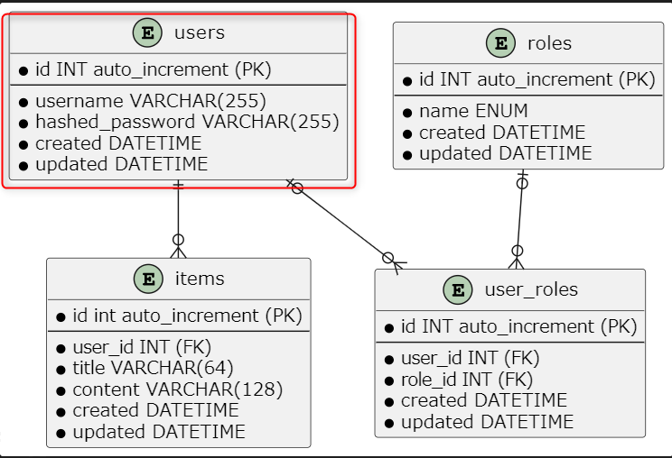
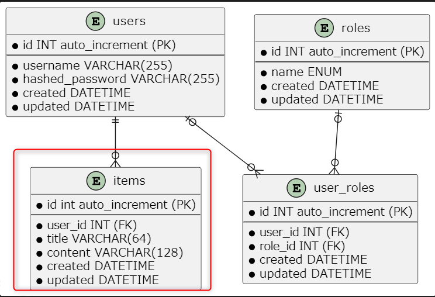
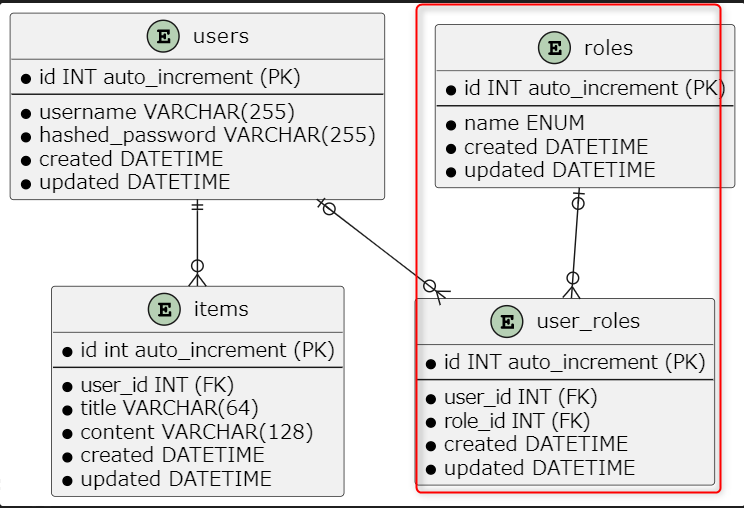
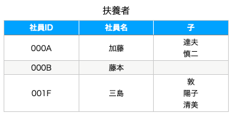
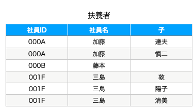
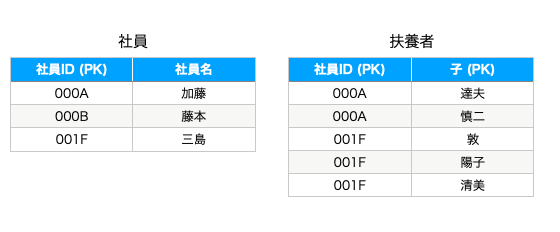
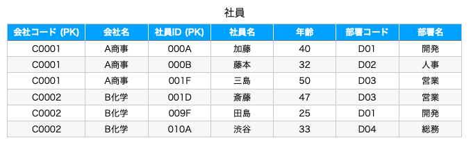
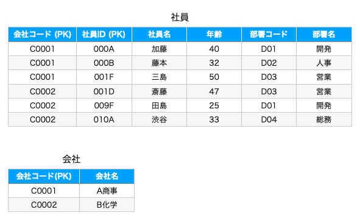
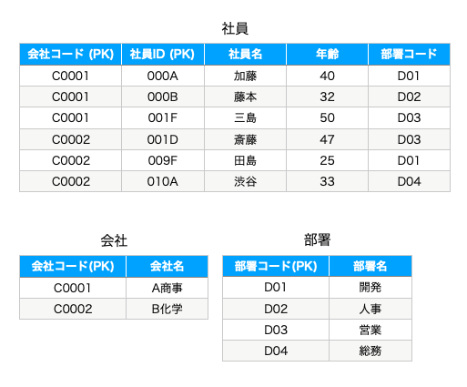

# Chapter 3: PostgreSQL + SQLAlchemy

[← 目次に戻る](../README.md)

## この章のゴール

- Docker Compose で **PostgreSQL** を起動し、`psql` で接続できる
- **生 SQL** で CREATE / INSERT / SELECT / UPDATE / DELETE および JOIN を扱える
- **1 対多 / 多対多** のリレーションをスキーマで表現できる
- テーブル設計の基本である **正規化（第 1〜3 正規形）** を理解する
- **SQLAlchemy 2.x** スタイル（`Mapped[...]` / `select(...)`）でモデルを定義し、Python から DB を操作できる

## スタート地点

```bash
git checkout chapter03-start
```

## 完成形

```bash
git checkout chapter03-end
```

---

## はじめに

これまでの章ではアプリケーションの **メモリ上** にデータを置いていました（Chapter 2 の `ITEMS = {...}`）。ですが実際の Web アプリでは、データを **永続化** するためにデータベースを使います。

この章では **PostgreSQL** というリレーショナルデータベース (RDB) を Docker Compose で立ち上げ、SQL でデータベースを操作する基礎、テーブル設計の理論、そして Python から DB を操作するための **SQLAlchemy** ライブラリを学びます。

ボリュームのある章なので、4 つのパートに分かれています：

1. **PostgreSQL を起動する** — compose.yaml に `db` サービスを追加
2. **SQL を実行してみる** — `psql` で生 SQL を試す（CRUD・JOIN・リレーション）
3. **テーブルの論理設計（正規化）** — RDB のテーブル設計の基本ルール
4. **SQLAlchemy で同じことをやってみる** — Python の ORM ライブラリで再実装

---

## 第 1 部: PostgreSQL を起動する

### 1.1 compose.yaml に db サービスを追加する

Chapter 1 で作った `compose.yaml` に **PostgreSQL の db サービス** を追加します。

```yaml
# compose.yaml
services:
  backend:
    container_name: web-tutorial-v2-backend-${HOST_USER}
    build:
      context: .
      dockerfile: docker/backend.Dockerfile
    volumes:
      - ${HOST_DIR}/backend/app:/opt/backend/app
    networks:
      - devcontainer-nw

  # ↓ 追加
  db:
    container_name: web-tutorial-v2-db-${HOST_USER}
    # PostgreSQL 18 の Alpine Linux ベース公式イメージ (軽量で起動が速い)
    image: postgres:18-alpine
    # PostgreSQL 公式イメージは初回起動時にこれらを読んで、 ユーザー / DB 作成を自動で行う
    environment:
      POSTGRES_USER: app
      POSTGRES_PASSWORD: app_pass
      POSTGRES_DB: app
    networks:
      # backend と同じ Docker ネットワークに参加させる -> コンテナ間でコンテナ名で通信できる
      - devcontainer-nw

networks:
  devcontainer-nw:
    external: true
    name: br-web-tutorial-v2-${HOST_USER}
```

> [!NOTE] 永続化ボリュームは設定していません。 学習目的のため、 コンテナを停止すると DB の中身は消えます。

### 1.2 db サービスを起動する

```bash
cd $PROJECT_DIR

# 既存コンテナを破棄して、 db を含めた全サービスを再ビルドして起動
# (初回は postgres イメージのダウンロードが入ります)
docker compose down
docker compose up -d --build

# db の起動状態を確認
docker compose ps db
# NAME                         IMAGE                COMMAND                  SERVICE   CREATED         STATUS         PORTS
# web-tutorial-v2-db-ktamido   postgres:18-alpine   "docker-entrypoint.s…"   db        2 seconds ago   Up 1 second    0.0.0.0:5432->5432/tcp, [::]:5432->5432/tcp
```

`STATUS` が `Up` になっていれば起動成功です。

### 1.3 接続情報を環境変数として用意する

学習者の DB 接続用に **環境変数のテンプレートファイル** を作ります。

```bash
mkdir -p $PROJECT_DIR/backend
touch $PROJECT_DIR/backend/.env.sample
```

`backend/.env.sample` の内容：

```bash
# DB 接続情報
DB_HOST=db
DB_PORT=5432
DB_USER=app
DB_PASSWORD=app_pass
DB_NAME=app
```

> **`.env.sample` と `.env` を分ける理由**  
> `.env.sample` は **git にコミットするテンプレート**で、開発用の既定値が入っています。`.env` は **`.gitignore` で除外**し、本番では秘密の値（`DB_PASSWORD` や後の章で追加する `TOKEN_SECRET_KEY` など）をここで上書きします。  
> 「**秘密の値はリポジトリに置かない**」というセキュリティ上の慣例で、開発ではテンプレートをそのままコピーすれば動きます。

### `.env` を生成する

テンプレートをコピーして `.env` を作ります（開発用の既定値のまま動きます）。

```bash
cd $PROJECT_DIR

# テンプレートをコピー
cp backend/.env.sample backend/.env

# 中身を確認
cat backend/.env
# DB_HOST=db
# DB_PORT=5432
# DB_USER=app
# DB_PASSWORD=app_pass
# DB_NAME=app
```

### 環境変数として読み込む

`.env` の値をシェルの環境変数として読み込みます。

```bash
# .env をコメント行を除いて環境変数として export
export $(grep -v '^#' backend/.env | xargs)

# 確認
echo $DB_HOST
# db
```

> [!NOTE] ポイント解説:  
> `DB_HOST` の `db` は **compose のサービス名**です。compose は同一ネットワーク上のサービスをサービス名で名前解決できるようにするので、backend コンテナからも Dev Container からも `db` で PostgreSQL に到達できます

### 1.4 psql で接続する

Dev Container には PostgreSQL クライアント (`psql`) がインストール済みです。`psql` で DB に接続してみます。

```bash
PGPASSWORD=$DB_PASSWORD psql -h $DB_HOST -p $DB_PORT -U $DB_USER -d $DB_NAME
```

| 要素 | 役割 |
|---|---|
| `PGPASSWORD=$DB_PASSWORD` | `psql` はデフォルトで接続時にパスワードを対話的に聞いてきます。`PGPASSWORD` 環境変数を設定するとそれをパスワードとして使ってくれます。 |
| `-h $DB_HOST` | 接続先のホスト名 |
| `-p $DB_PORT` | 接続先のポート番号 |
| `-U $DB_USER` | DB ユーザー名 |
| `-d $DB_NAME` | 接続先のデータベース名 |

成功するとプロンプトが `app=#` のように変わります：

```
psql (18.x ...)
Type "help" for help.

app=#
```

このプロンプトは「`app` データベースに接続中の対話セッション」という状態を表しています。ここから先は SQL 文やメタコマンドを入力できます。

> **psql で SQL を入力するときの基本ルール**  
> - **SQL 文の末尾には必ずセミコロン `;` を付ける**。セミコロンが来るまで psql は入力を待ち続けます
> - 途中改行しても問題ありません。複数行にまたがる SQL では、プロンプトが `app=#` から **`app-#` に変わって続きの入力を待つ** 状態になります（セミコロンを忘れたときもこの状態になるので、忘れたら最後にセミコロンだけ打って Enter で実行できます）
> - **`\` で始まる行はメタコマンド**（次の表）。psql クライアント自体への命令で SQL ではないため、**末尾にセミコロンは不要**です

メタコマンドでデータベース・テーブル一覧を確認してみましょう。

```
app=# \l
                       List of databases
   Name    | Owner | Encoding |  Collate   |   Ctype    | ...
-----------+-------+----------+------------+------------+----
 app       | app   | UTF8     | en_US.utf8 | en_US.utf8 |
 postgres  | app   | UTF8     | en_US.utf8 | en_US.utf8 |
 template0 | app   | UTF8     | en_US.utf8 | en_US.utf8 |
 template1 | app   | UTF8     | en_US.utf8 | en_US.utf8 |
(4 rows)

app=# \dt
Did not find any relations.
```

| psql のメタコマンド | 内容 |
|---|---|
| `\l` | データベース一覧 |
| `\c db_name` | 接続するデータベースを切り替える |
| `\dt` | テーブル一覧 |
| `\d table_name` | テーブル定義を表示 |
| `\q` | 終了 |
| `\?` | メタコマンド一覧を表示 |

ログアウトする：

```
app=# \q
```

---

## 第 2 部: SQL を実行してみよう

ここからは生 SQL を `psql` で実行して、リレーショナルデータベースの基本操作を学びます。

> **学習者向け補足**  
> SQL は「リレーショナルデータベースを操作するための言語」です。多くの RDB（PostgreSQL、MySQL、SQLite、Oracle、SQL Server など）で共通して使えるので、一度覚えれば応用範囲が広いです。

再度 psql で接続：

```bash
PGPASSWORD=$DB_PASSWORD psql -h $DB_HOST -p $DB_PORT -U $DB_USER -d $DB_NAME
```

### 2.1 users テーブルを作成



- `NOT NULL` … `NULL` 値を許容しない
- `PRIMARY KEY` … 主キーに設定する。主キーとは「レコードを一意に特定できる値を持つカラム」
- `GENERATED ALWAYS AS IDENTITY` … レコード追加時に自動で連番が振られる（PostgreSQL 10 以降の標準的な書き方）
- `DEFAULT 値` … 登録時に値の指定がない場合のデフォルト値
- `UNIQUE` … 重複した値を登録できなくなる制約

```sql
-- テーブルを作成
CREATE TABLE users (
  id              INTEGER      GENERATED ALWAYS AS IDENTITY PRIMARY KEY,
  username        VARCHAR(255) NOT NULL UNIQUE,
  hashed_password VARCHAR(255) NOT NULL,
  created         TIMESTAMPTZ  NOT NULL DEFAULT CURRENT_TIMESTAMP,
  updated         TIMESTAMPTZ  NOT NULL DEFAULT CURRENT_TIMESTAMP
);

-- テーブル一覧を表示
\dt
--           List of relations
--  Schema | Name  | Type  | Owner
-- --------+-------+-------+-------
--  public | users | table | app

-- テーブル定義を表示
\d users
--                              Table "public.users"
--      Column      |           Type           | Collation | Nullable |             Default
-- -----------------+--------------------------+-----------+----------+----------------------------------
--  id              | integer                  |           | not null | generated always as identity
--  username        | character varying(255)   |           | not null |
--  hashed_password | character varying(255)   |           | not null |
--  created         | timestamp with time zone |           | not null | CURRENT_TIMESTAMP
--  updated         | timestamp with time zone |           | not null | CURRENT_TIMESTAMP
-- Indexes:
--     "users_pkey" PRIMARY KEY, btree (id)
--     "users_username_key" UNIQUE CONSTRAINT, btree (username)
```

> **`TIMESTAMPTZ` (timestamp with time zone)**  
> タイムゾーン付きの日時型。PostgreSQL では `TIMESTAMPTZ` を推奨します。`TIMESTAMP`（タイムゾーンなし）と違って、サーバーやクライアントのタイムゾーン設定に依存せず、確実に同じ瞬間を表現できます。

#### updated を自動更新するトリガーを設定する

PostgreSQL では「行が更新されたときに `updated` カラムを自動で現在時刻にする」ような構文は用意されていません。代わりに **トリガー** を使って実装するのが定石です。

トリガーとは「特定のテーブルに対する INSERT / UPDATE / DELETE などのイベントが発生したときに自動で実行される関数」です。今回は「行が UPDATE される直前に `updated` カラムを現在時刻に書き換える」トリガーを定義します。

```sql
-- 1. 共通で使えるトリガー関数を定義
--    NEW は「これから書き込もうとしている行」を表す特殊な変数
CREATE OR REPLACE FUNCTION set_updated_at()
RETURNS TRIGGER AS $$
BEGIN
  NEW.updated = CURRENT_TIMESTAMP;
  RETURN NEW;
END;
$$ LANGUAGE plpgsql;

-- 2. users テーブルに BEFORE UPDATE トリガーを設定
CREATE OR REPLACE TRIGGER set_users_updated_at
BEFORE UPDATE ON users
FOR EACH ROW
EXECUTE FUNCTION set_updated_at();
```

#### `CREATE FUNCTION` の構文

トリガーから呼び出される関数を定義する構文です。

```sql
CREATE [OR REPLACE] FUNCTION 関数名(引数...)
RETURNS 戻り値の型 AS $$
  -- 関数の本体
$$ LANGUAGE 言語名;
```

| 要素 | 意味 |
|---|---|
| `CREATE OR REPLACE` | 関数が既に存在していれば上書き、無ければ新規作成。省略すると同名関数が既にある場合エラーになる |
| `関数名(引数...)` | 関数の名前と引数。トリガー関数の場合は引数なしで定義する |
| `RETURNS 型` | 関数が返す値の型。**トリガーから呼ぶ関数は必ず `RETURNS TRIGGER`** にする |
| `$$ ... $$` | 関数本体を囲む区切り（ドルクォート）。本体内のシングルクォートをエスケープせずに書ける |
| `LANGUAGE 言語名` | 関数本体を解釈する言語の指定。PostgreSQL では **`plpgsql`**（PL/pgSQL: PostgreSQL の手続き型言語）を使うのが一般的 |

PL/pgSQL の関数本体は `BEGIN ... END;` で囲み、その中に処理を書きます。トリガー関数では以下の特殊変数が使えます：

| 特殊変数 | 意味 |
|---|---|
| `NEW` | INSERT / UPDATE で **これから書き込もうとしている行** |
| `OLD` | UPDATE / DELETE で **更新前 / 削除前の行** |
| `TG_OP` | トリガーが発火した操作の種類 (`'INSERT'`, `'UPDATE'`, `'DELETE'`) |

今回の `set_updated_at()` は「`NEW` の `updated` カラムを `CURRENT_TIMESTAMP` で書き換えてから `RETURN NEW;` で返す」処理になっています。`BEFORE UPDATE` トリガーは関数が返した `NEW` を実際の DB 書き込みに使うので、こうすることで「**更新時に `updated` を書き換える**」が実現できます。

#### `CREATE OR REPLACE TRIGGER` の構文

```sql
CREATE OR REPLACE TRIGGER トリガー名
{ BEFORE | AFTER | INSTEAD OF } { INSERT | UPDATE | DELETE } [OR ...]
ON テーブル名
[FOR EACH { ROW | STATEMENT }]
EXECUTE FUNCTION 関数名(引数...);
```

> **`OR REPLACE`** を付けると、同名のトリガーが既に存在する場合は上書きする（エラーにならない）。`CREATE OR REPLACE FUNCTION` と同じ考え方。PostgreSQL 14 以降でサポート。

| 要素 | 意味 |
|---|---|
| `BEFORE / AFTER / INSTEAD OF` | トリガー関数を **イベントの前 / 後 / 代わり** のどこで実行するかを指定。`updated` の自動書き換えのように **書き込まれる値そのものを操作したい場合は `BEFORE`** にする |
| `INSERT / UPDATE / DELETE` | どのイベントで発火するかを指定。`OR` で繋いで複数指定もできる（例: `BEFORE INSERT OR UPDATE`） |
| `ON テーブル名` | どのテーブルに対するトリガーか |
| `FOR EACH ROW` | **更新される行ごと** にトリガー関数を呼ぶ。`FOR EACH STATEMENT`（デフォルト）にすると 1 つの SQL 文に対して 1 回だけ呼ばれる |
| `EXECUTE FUNCTION` | 発火時に呼び出す関数を指定 |

今回は「行ごとに `updated` を書き換えたい」ので `FOR EACH ROW` を指定し、UPDATE が発生する直前に書き換えたいので `BEFORE UPDATE` を指定しています。

トリガー関数 `set_updated_at()` は **テーブルに依存しない** ので、後で作る `items` `roles` `user_roles` テーブルでも同じ関数を使い回せます。トリガー本体だけテーブルごとに `CREATE OR REPLACE TRIGGER` で結びつけます。

トリガーが正しく動いているかは、次のセクションでデータを更新したときに `updated` が自動更新されることで確認できます。

> **`'` (シングルクォート)と `"` (ダブルクォート)の違い**  
> 次のセクションから `'yamada'` のような文字列リテラルが頻繁に登場します。**PostgreSQL では文字列リテラルは必ずシングルクォート** で囲みます。  
> ダブルクォートは「**識別子（テーブル名やカラム名など）を引用するため**」の記号で、文字列に使うとエラーになるので注意してください。

### 2.2 データの操作

データの挿入 (`INSERT`)、取得 (`SELECT`)、更新 (`UPDATE`)、削除 (`DELETE`) を順に試します。`SELECT` などで使う `WHERE` の条件式では以下の演算子がよく登場します：

| 演算子 | 例 | 意味 |
|---|---|---|
| `=` `<>` `!=` | `WHERE id = 1` | 等しい / 等しくない |
| `<` `<=` `>` `>=` | `WHERE created <= CURRENT_TIMESTAMP` | 大小比較 |
| `AND` `OR` `NOT` | `WHERE id >= 2 AND id <= 4` | 論理結合 |
| `IN (...)` | `WHERE id IN (1, 3, 5)` | 列挙されたいずれかと一致 |
| `BETWEEN ... AND ...` | `WHERE id BETWEEN 2 AND 4` | 範囲内 |
| `LIKE` | `WHERE username LIKE 's%'` | パターンマッチ（`%` は任意の 0 文字以上、`_` は任意の 1 文字） |
| `IS NULL` `IS NOT NULL` | `WHERE content IS NULL` | NULL 判定（`= NULL` は使えない） |

```sql
-- データの挿入
-- INSERT INTO テーブル名 (カラム名, ...) VALUES (値, ...);
-- ※ id カラムは GENERATED ALWAYS AS IDENTITY なので指定しない (指定するとエラー)
INSERT INTO users (username, hashed_password) VALUES
  ('yamada', 'dummy_password'),
  ('sato'  , 'dummy_password'),
  ('suzuki', 'dummy_password'),
  ('tanaka', 'dummy_password'),
  ('dummy' , 'dummy_password');

-- データの取得
-- SELECT カラム名, ... FROM テーブル名 WHERE 条件;
SELECT * FROM users;
--  id | username | hashed_password |            created            |            updated
-- ----+----------+-----------------+-------------------------------+-------------------------------
--   1 | yamada   | dummy_password  | 2026-05-07 12:00:00.123456+09 | 2026-05-07 12:00:00.123456+09
--   2 | sato     | dummy_password  | 2026-05-07 12:00:00.123456+09 | 2026-05-07 12:00:00.123456+09
--   3 | suzuki   | dummy_password  | 2026-05-07 12:00:00.123456+09 | 2026-05-07 12:00:00.123456+09
--   4 | tanaka   | dummy_password  | 2026-05-07 12:00:00.123456+09 | 2026-05-07 12:00:00.123456+09
--   5 | dummy    | dummy_password  | 2026-05-07 12:00:00.123456+09 | 2026-05-07 12:00:00.123456+09

-- 条件を指定してデータを取得 (id が 3 以下のレコード)
SELECT * FROM users WHERE id <= 3;

-- 複数条件 (AND)
SELECT * FROM users WHERE id >= 2 AND id <= 4;

-- IN: いずれかの値と一致
SELECT * FROM users WHERE username IN ('yamada', 'suzuki');

-- LIKE: パターンマッチ (% は任意の 0 文字以上、_ は任意の 1 文字)
SELECT * FROM users WHERE username LIKE 's%';  -- s で始まる username

-- 件数を指定してデータを取得
-- ORDER BY カラム名 [ASC|DESC]: 昇順または降順で整列
-- LIMIT 数値: 取得する最大件数を指定
SELECT id, username FROM users ORDER BY id ASC LIMIT 1;
--  id | username
-- ----+----------
--   1 | yamada

-- データの変更
-- UPDATE テーブル名 SET カラム名=値, ... WHERE 条件;
UPDATE users SET username='midorikawa' WHERE username='sato';

-- データの削除
-- DELETE FROM テーブル名 WHERE 条件;
DELETE FROM users WHERE username = 'dummy';

-- 結果 (sato → midorikawa の updated だけが INSERT 時刻より後になっている)
SELECT id, username, created, updated FROM users;
--  id |  username  |            created            |            updated
-- ----+------------+-------------------------------+-------------------------------
--   1 | yamada     | 2026-05-08 12:00:00.111111+09 | 2026-05-08 12:00:00.111111+09
--   3 | suzuki     | 2026-05-08 12:00:00.111111+09 | 2026-05-08 12:00:00.111111+09
--   4 | tanaka     | 2026-05-08 12:00:00.111111+09 | 2026-05-08 12:00:00.111111+09
--   2 | midorikawa | 2026-05-08 12:00:00.111111+09 | 2026-05-08 12:00:10.222222+09
```

`midorikawa` の行だけ `updated` が `created` より後の時刻になっています。`UPDATE` を発行したときに **トリガー `set_users_updated_at` が自動で `updated` を `CURRENT_TIMESTAMP` に書き換えてくれた** ためです。

### 2.3 1 対多のリレーション

`users` テーブルに紐づく `items` テーブルを作成します。1 対多のリレーションでは、子テーブル (`items`) に親テーブル (`users`) の `id` と紐づくカラム `user_id` を **外部キー** として定義します。



- `REFERENCES 親テーブル(カラム名)` … 外部キー制約。「このカラムは親テーブル.カラム名 を参照する」ことを宣言
- `CREATE INDEX` … 指定カラムにインデックスを作成。インデックスとは「データを木構造で保持して高速に検索できるようにする仕組み」

```sql
-- usersに紐づくitemsテーブルを作成
CREATE TABLE items (
  id       INTEGER      GENERATED ALWAYS AS IDENTITY PRIMARY KEY,
  user_id  INTEGER      NOT NULL REFERENCES users(id),
  title    VARCHAR(64)  NOT NULL,
  content  VARCHAR(128) NOT NULL,
  created  TIMESTAMPTZ  NOT NULL DEFAULT CURRENT_TIMESTAMP,
  updated  TIMESTAMPTZ  NOT NULL DEFAULT CURRENT_TIMESTAMP
);

-- user_id にインデックスを作成
CREATE INDEX ix_items_user_id ON items(user_id);

-- updated 自動更新トリガーを設定 (関数 set_updated_at は users 用に作成済みのものを使い回す)
CREATE OR REPLACE TRIGGER set_items_updated_at
BEFORE UPDATE ON items
FOR EACH ROW
EXECUTE FUNCTION set_updated_at();

-- itemsを追加
INSERT INTO items (user_id, title, content) VALUES
  (1, 'a', 'foo' ),
  (2, 'b', 'bar' ),
  (1, 'c', 'baz' ),
  (3, 'd', 'hoge'),
  (2, 'e', 'fuga');

-- 登録された items を確認
SELECT * FROM items;
```

#### 内部結合 (INNER JOIN)

`users.id` と `items.user_id` が一致するレコードを連結します。**指定したカラムの値が一致するレコードのみ**抽出されます（相手方に一致するレコードが無い場合は除外）。

```sql
-- INNER JOIN: items が存在するユーザーとそのアイテムを抽出
SELECT users.id, users.username, items.title, items.content
FROM users
INNER JOIN items ON users.id = items.user_id;
--  id |  username  | title | content
-- ----+------------+-------+---------
--   1 | yamada     | a     | foo
--   2 | midorikawa | b     | bar
--   1 | yamada     | c     | baz
--   3 | suzuki     | d     | hoge
--   2 | midorikawa | e     | fuga
```

#### 外部結合 (LEFT OUTER JOIN)

内部結合と異なり、**相手方に一致するレコードが存在しないレコードも抽出**されます。`LEFT OUTER JOIN` の場合、**左側のテーブル (`users`) のレコードは全件**抽出され、**右側のテーブル (`items`) は一致するもののみ**抽出されます（一致しない場合は NULL）。

```sql
-- LEFT OUTER JOIN: 全ユーザーとそのアイテムを抽出 (アイテムが無いユーザーも含む)
SELECT users.id, users.username, items.title, items.content
FROM users
LEFT OUTER JOIN items ON users.id = items.user_id;
--  id |  username  | title | content
-- ----+------------+-------+---------
--   1 | yamada     | a     | foo
--   1 | yamada     | c     | baz
--   2 | midorikawa | b     | bar
--   2 | midorikawa | e     | fuga
--   3 | suzuki     | d     | hoge
--   4 | tanaka     |       |          ← items が無いが抽出される
```

### 2.4 多対多のリレーション

`users` テーブルに多対多で紐づく `roles` テーブルを作成します。1 対多と異なり、`roles` には `users.id` と紐づくカラムが**存在しない**ことに注目してください。**多対多のリレーションでは中間テーブル**を利用して 2 つのテーブルを関連付けます。



#### Enum 型の作成

PostgreSQL では `CREATE TYPE ... AS ENUM` で **列挙型** を定義できます。

```sql
-- ロールの種類を表す Enum 型を定義
CREATE TYPE role_type AS ENUM ('SYSTEM_ADMIN', 'LOCATION_ADMIN', 'LOCATION_OPERATOR');

-- rolesテーブルの作成
CREATE TABLE roles (
  id       INTEGER     GENERATED ALWAYS AS IDENTITY PRIMARY KEY,
  name     role_type   NOT NULL UNIQUE,
  created  TIMESTAMPTZ NOT NULL DEFAULT CURRENT_TIMESTAMP,
  updated  TIMESTAMPTZ NOT NULL DEFAULT CURRENT_TIMESTAMP
);

-- updated 自動更新トリガーを設定
CREATE OR REPLACE TRIGGER set_roles_updated_at
BEFORE UPDATE ON roles
FOR EACH ROW
EXECUTE FUNCTION set_updated_at();

-- データ登録
INSERT INTO roles (name) VALUES ('SYSTEM_ADMIN'), ('LOCATION_ADMIN'), ('LOCATION_OPERATOR');

-- 結果
SELECT * FROM roles;
--  id |       name        |            created            |            updated
-- ----+-------------------+-------------------------------+-------------------------------
--   1 | SYSTEM_ADMIN      | 2026-05-07 12:00:00.123456+09 | 2026-05-07 12:00:00.123456+09
--   2 | LOCATION_ADMIN    | 2026-05-07 12:00:00.123456+09 | 2026-05-07 12:00:00.123456+09
--   3 | LOCATION_OPERATOR | 2026-05-07 12:00:00.123456+09 | 2026-05-07 12:00:00.123456+09
```

#### 中間テーブル user_roles

`users` と `roles` を関連付ける中間テーブルを作ります。中間テーブル (`user_roles`) は **`users.id` に紐づく `user_id` カラム**と、**`roles.id` に紐づく `role_id` カラム**を持ちます。

```sql
CREATE TABLE user_roles (
  id       INTEGER     GENERATED ALWAYS AS IDENTITY PRIMARY KEY,
  user_id  INTEGER     NOT NULL REFERENCES users(id),
  role_id  INTEGER     NOT NULL REFERENCES roles(id),
  created  TIMESTAMPTZ NOT NULL DEFAULT CURRENT_TIMESTAMP,
  updated  TIMESTAMPTZ NOT NULL DEFAULT CURRENT_TIMESTAMP,
  -- (user_id, role_id) の組み合わせは重複しないようにユニーク制約
  UNIQUE (user_id, role_id)
);

CREATE INDEX ix_user_roles_user_id ON user_roles(user_id);
CREATE INDEX ix_user_roles_role_id ON user_roles(role_id);

-- updated 自動更新トリガーを設定
CREATE OR REPLACE TRIGGER set_user_roles_updated_at
BEFORE UPDATE ON user_roles
FOR EACH ROW
EXECUTE FUNCTION set_updated_at();

-- ユーザーにロールをアサイン
INSERT INTO user_roles (user_id, role_id) VALUES
  (1, 1), (1, 2), (1, 3),  -- yamada に 3 つすべて
  (2, 2),                   -- midorikawa に LOCATION_ADMIN
  (3, 3);                   -- suzuki に LOCATION_OPERATOR

-- 結果
SELECT * FROM user_roles;
--  id | user_id | role_id |            created            |            updated            
-- ----+---------+---------+-------------------------------+-------------------------------
--   1 |       1 |       1 | 2026-05-08 00:54:44.255681+00 | 2026-05-08 00:54:44.255681+00
--   2 |       1 |       2 | 2026-05-08 00:54:44.255681+00 | 2026-05-08 00:54:44.255681+00
--   3 |       1 |       3 | 2026-05-08 00:54:44.255681+00 | 2026-05-08 00:54:44.255681+00
--   4 |       2 |       2 | 2026-05-08 00:54:44.255681+00 | 2026-05-08 00:54:44.255681+00
--   5 |       3 |       3 | 2026-05-08 00:54:44.255681+00 | 2026-05-08 00:54:44.255681+00
```

#### 内部結合（多対多の取得）

`users`, `user_roles`, `roles` を内部結合します。

```sql
-- 紐づく role が存在しない tanaka(id=4) は抽出されない
SELECT
  users.id          AS user_id,
  users.username    AS user_name,
  roles.name        AS role_name
FROM users
INNER JOIN user_roles ON user_roles.user_id = users.id
INNER JOIN roles      ON roles.id           = user_roles.role_id;
--  user_id | user_name  |     role_name
-- ---------+------------+--------------------
--        1 | yamada     | SYSTEM_ADMIN
--        1 | yamada     | LOCATION_ADMIN
--        1 | yamada     | LOCATION_OPERATOR
--        2 | midorikawa | LOCATION_ADMIN
--        3 | suzuki     | LOCATION_OPERATOR

-- users.id でグルーピングしてロールを集約
SELECT
  users.id          AS user_id,
  users.username    AS user_name,
  string_agg(roles.name::text, ',') AS role_names
FROM users
INNER JOIN user_roles ON user_roles.user_id = users.id
INNER JOIN roles      ON roles.id           = user_roles.role_id
GROUP BY users.id, users.username;
--  user_id | user_name  |                role_names
-- ---------+------------+-----------------------------------------------
--        1 | yamada     | SYSTEM_ADMIN,LOCATION_ADMIN,LOCATION_OPERATOR
--        2 | midorikawa | LOCATION_ADMIN
--        3 | suzuki     | LOCATION_OPERATOR
```

> **`string_agg`** は PostgreSQL の集約関数で、グループ化したカラムの値を区切り文字で連結した文字列にして返します。  
> `roles.name::text` の `::text` は「`role_type`（Enum 型）を文字列にキャストする」記法です。

#### 外部結合（多対多の取得）

```sql
-- 外部結合なので、紐づく role が存在しない tanaka(id=4) も抽出される
SELECT
  users.id          AS user_id,
  users.username    AS user_name,
  roles.name        AS role_name
FROM users
LEFT OUTER JOIN user_roles ON user_roles.user_id = users.id
LEFT OUTER JOIN roles      ON roles.id           = user_roles.role_id;
--  user_id | user_name  |     role_name
-- ---------+------------+--------------------
--        1 | yamada     | SYSTEM_ADMIN
--        1 | yamada     | LOCATION_ADMIN
--        1 | yamada     | LOCATION_OPERATOR
--        2 | midorikawa | LOCATION_ADMIN
--        3 | suzuki     | LOCATION_OPERATOR
--        4 | tanaka     |                       ← role が無いが抽出される
```

### 2.5 テーブル・データベースの削除

```sql
-- テーブルの中身をすべて削除
-- TRUNCATE は「テーブルの全行削除」の高速版。
-- WHERE 条件付きの DELETE と違い、行ごとの削除ログを残さずに一気にテーブルを空にする。
-- IDENTITY カラム (id) のシーケンスはリセットされず、続きの番号から採番される
-- (リセットしたい場合は `TRUNCATE TABLE items RESTART IDENTITY;`)。
TRUNCATE TABLE items;
TRUNCATE TABLE user_roles;

-- テーブルを削除（外部キーで参照されているテーブルから先に消す）
-- ※ テーブルに紐づくトリガーはテーブルと一緒に自動で削除されます
DROP TABLE items;
DROP TABLE user_roles;
DROP TABLE roles;
DROP TABLE users;

-- Enum 型を削除
DROP TYPE role_type;

-- トリガー関数を削除
DROP FUNCTION set_updated_at;

-- ログアウト
\q
```

> **`DROP TABLE ... CASCADE`** を使えば「依存しているテーブル・制約も含めて一括削除」できますが、思わぬデータ消失を招きやすいので、明示的な順序で `DROP` する方が安全です。

---

## 第 3 部: テーブルの論理設計（正規化）

ここまで実際に SQL を実行してデータベース操作を学んできましたが、リレーショナルデータベースの **論理設計（テーブル設計）** にも触れておきましょう。

リレーショナルデータベースのテーブル設計には、データの **冗長性を排除し、一貫性を保つ** ためのルールがあります。このルールを **正規化** と呼び、ルールを満たしている形式を **正規形** と呼びます。

正規化には 1〜5 までのレベルがあります：

1. 第1正規形 (スカラ値の原則)
2. 第2正規形 (部分関数従属)
3. 第3正規形 (推移的関数従属)
4. ボイス-コッド正規形
5. 第4正規形 (多値従属性)
6. 第5正規形

業務系システムの大半は **第 3 正規形まで** に整理できれば実用上のデータ整合性は保てるとされており、それ以降の正規形は専門的な要件（特殊な多値属性の扱いなど）で必要になります。本章では第 1 〜 第 3 正規形までを解説します。

### 3.1 第1正規形 (スカラ値の原則)

**一つのセルには単一の値を格納する。**

#### 問題となるテーブル




#### 問題点

- 子のカラムに複数値（非スカラ値）が入っている
- 主キーが子カラムの値を一意に決定できない

#### 正規化

まず、子の数だけ行を増やして、セルの値がスカラ値（単一値）となるように分解します。




しかしこの形だと **主キーを決められません**。社員 ID には重複があるため、主キーには設定できません（`子` は `社員 ID` に対する関数従属性を満たしていない）。

> **主キー** … レコードを一意に識別できる列または列の組み合わせ。値が重複してはならない。  
> **関数従属性** … 「入力 `X` に対して出力 `Y` が一意に決まる関係」のこと（`Y は X に従属する` と言う）。例えば `社員ID → 社員名` のように、**社員 ID が決まれば社員名は 1 つに決まる** ような関係を指す。

そこで、テーブルを分割することで主キーで一意のレコードを決定できるようにします。`社員テーブル` と `扶養者テーブル` に分割することで、それぞれのテーブルで主キーが決まれば全カラムの値が一意に決まる状態になります（`社員テーブル` では `{社員ID} → {社員名}`、`扶養者テーブル` では `{社員ID, 子}` の組合せ自体が主キーで重複しない）。




#### 正規化したテーブルを非正規形に戻すクエリ

```sql
-- 内部結合: 子供がいる社員とその子供を抽出
SELECT 社員.社員ID, 社員.社員名, 扶養者.子
FROM 社員
INNER JOIN 扶養者 ON 社員.社員ID = 扶養者.社員ID;

-- 外部結合: 全社員とその子供（子供がいない社員も含む）を抽出
SELECT 社員.社員ID, 社員.社員名, 扶養者.子
FROM 社員
LEFT OUTER JOIN 扶養者 ON 社員.社員ID = 扶養者.社員ID;
```

### 3.2 第 2 正規形 (部分関数従属)

**テーブル内の部分関数従属を解消し、完全関数従属のみのテーブルを作る。**

> **部分関数従属** … 主キーの **一部の列** に対して非キーが従属している状態  
> **完全関数従属** … 主キー全体に対して非キーが従属し、部分関数従属がない状態  

#### 問題となるテーブル




#### 問題点

- `{会社コード} → {会社名}` という部分関数従属性が存在する
- 結果、**社員がいないと会社名を登録できない** という運用上の問題が発生する

#### 正規化

部分関数従属している列（`会社名`）を別のテーブルに切り出します。**第 2 正規化とは、`社員` と `会社` という異なるレベルのエンティティ（実体）をきちんとテーブルとして分離する作業**です。

ここで言う「異なるレベル」とは、**会社は社員より上位の概念で、社員に依存しない独立した存在** という意味です。実世界でも「社員ゼロでも会社は登記できる」ように、両者は独立して扱えるべきです。それが 1 つのテーブルに同居していると、片方の都合で片方が登録できないという不具合が発生します。

`会社名` を `会社` テーブルに独立させることで、`{会社コード} → {会社名}` となり、部分関数従属が解消されて完全関数従属となります。




#### 正規化したテーブルを非正規形に戻すクエリ

```sql
SELECT
    社員.会社コード, 会社.会社名, 社員.社員ID, 社員.社員名, 社員.年齢, 社員.部署コード, 社員.部署名
FROM 社員
INNER JOIN 会社 ON 社員.会社コード = 会社.会社コード;
```

### 3.3 第 3 正規形 (推移的関数従属)

**非キー列が非キー列に従属しないようにテーブルを分割することで、推移的関数従属を取り除く。**

> **推移的関数従属** … テーブル内に存在する段階的な従属関係。**非キー列が別の非キー列に従属している**ことが問題。

#### 問題となるテーブル


#### 問題点

- `部署名` は `部署コード` に関数従属しており、`部署コード` は `{会社コード, 社員ID}` (主キー) に関数従属している。つまり `{会社コード, 社員ID} → {部署コード} → {部署名}` という推移的関数従属が存在する
- 結果、**社員がいないと部署を登録できない** という運用上の問題が発生する

#### 正規化

`部署コード` という非キーに関数従属している `部署名` を別テーブルに切り出します。`部署名` を `部署テーブル` に独立させることで `{部署コード} → {部署名}` となり、推移的関数従属が解消されます。




#### 正規化したテーブルを非正規形に戻すクエリ

```sql
SELECT
    社員.会社コード, 社員.社員ID, 社員.社員名, 社員.年齢, 社員.部署コード, 部署.部署名
FROM 社員
INNER JOIN 部署 ON 社員.部署コード = 部署.部署コード;
```

---

## 第 4 部: SQLAlchemy で同じことをやってみる

ここまでは生 SQL でデータベースを操作してきました。Web アプリの実装では、Python のような **プログラミング言語** からデータベースを操作する場面がほとんどです。Python から SQL を扱う方法として、**ORM (Object-Relational Mapper)** というライブラリを使うのが一般的です。

### 4.1 ORM とは / なぜ ORM を使うのか

**ORM はオブジェクト指向言語のオブジェクトとリレーショナルデータベースのレコードを対応付けるライブラリ**です。

Python では [SQLAlchemy](https://www.sqlalchemy.org/) という ORM がデファクトスタンダードです。

#### 生 SQL のリスク：SQL インジェクション

例えば、Python で生 SQL を文字列として組み立てる場合：

```python
# SQL インジェクションの危険があるコード（やってはいけない）
def print_user(user_id):
    conn = engine.connect()
    result = conn.execute(text(f"SELECT * FROM users WHERE id = {user_id};"))
    print(result.all())
    conn.close()
```

一見、`user_id` 引数と一致するユーザーを取得するように見えます。しかし、`user_id` に **`"1 OR 1 = 1"`** が入力されたらどうでしょう？

```sql
-- このSQLはすべてのユーザーを出力してしまう
SELECT * FROM users WHERE id = 1 OR 1 = 1;
```

このような攻撃を **SQL インジェクション** と呼びます。生 SQL を直接利用すると常にこのセキュリティ上の問題を考慮しながら実装することになります。  
加えて、このようなバグは**静的解析や単体テストでは検知できません**。アプリケーションが巨大になると発見は容易ではありません。  
このような理由から、プログラムから DB へのアクセスは **特別な理由がない限り ORM を利用する** ことが推奨されます。  

> **ORM を使う場合でも裏側で実行される SQL を意識すること**
> ORM を使えば SQL を直接書かなくて済みますが、**裏側で何の SQL が走っているかを意識することは非常に重要**です。SQL を意識しないで書かれたコードは非効率になりがちで、N+1 問題のようなパフォーマンス問題を引き起こします。

ちなみに `print_user` を ORM (SQLAlchemy) で実装するとこうなります：

```python
from sqlalchemy import select

def print_user(user_id: int):
    with SessionLocal() as session:
        user = session.execute(
            select(User).where(User.id == user_id)
        ).scalar_one_or_none()
        print(user)
```

`User.id == user_id` の部分は **値が SQL 文字列に直接埋め込まれない**（パラメータバインディング）ので、SQL インジェクションを根本的に防げます。

### 4.2 JupyterLab を準備する

ここから先の SQLAlchemy のサンプルコードは、**Jupyter Notebook** で実行しながら学んでいきます。Notebook は **コードを少しずつ実行して結果を確認できる** ので、ライブラリの動作を試しながら学ぶのに最適です。

JupyterLab を `backend/` の uv プロジェクトに開発依存として追加します：

```bash
cd $PROJECT_DIR/backend

# JupyterLab と Postgres ドライバ、SQLAlchemy を追加
uv add --dev jupyterlab ipykernel
uv add 'sqlalchemy~=2.0.49' 'psycopg[binary]~=3.3.4'
```

> **依存の使い分け**
> - `jupyterlab` `ipykernel` … 開発時にだけ必要なので `--dev` で dev グループに追加
> - `sqlalchemy` `psycopg[binary]` … アプリケーション本体で使う想定なので通常依存

> **`psycopg[binary]`**
> PostgreSQL の公式 Python ドライバ `psycopg`（v3）です。`[binary]` を付けるとビルド済みのバイナリホイールが使われ、コンパイル不要でインストールできます。

JupyterLab を起動します。第 1 部で実行した `export $(grep -v '^#' backend/.env | xargs)` が **このシェルでも有効になっている状態** で起動してください。Unix のシェルでは **export した環境変数は子プロセスにそのまま継承される** ので、JupyterLab → Notebook の Python カーネルにも `DB_HOST` などが自動で渡ります。

```bash

cd $PROJECT_DIR/backend
# 環境変数の読み込み
export $(grep -v '^#' $PROJECT_DIR/backend/.env | xargs)
# Jupyter Labを起動
uv run jupyter lab --ip=0.0.0.0 --port=8888 --no-browser --ServerApp.token=''
```

ターミナルに以下のような出力があれば起動成功です：

```
[I 2026-05-07 12:00:00.000 ServerApp] Jupyter Server 2.x.x is running at:
[I 2026-05-07 12:00:00.000 ServerApp] http://localhost:8888/lab
```

ローカル環境のブラウザで http://localhost:8888/lab を開いて JupyterLab にアクセスできます。

> **VS Code の forwardPorts による自動転送**
> VS Code でこのリポジトリを開いていれば、`8888` ポートも自動でホストに転送されます。`compose.yaml` の `ports` で公開していなくても、Dev Container 内で listening しているポートは VS Code が拾います。

### 4.3 Notebook ファイルを開く

JupyterLab の左ペインのファイルブラウザから `backend/chapter03/sqlalchemy_tutorial.ipynb` を開き、以降の内容をセルごとに作成・実行していきましょう。

### 4.4 モデルを定義する

「**モデル**」は RDB のレコードと紐付くクラスで、このクラスのインスタンスがレコードに対応します。モデルはテーブル定義としても扱われます。

第 2 部で SQL で作ったテーブル（`users`, `items`, `roles`, `user_roles`）と同じ構造をモデルとして実装します。

> **モデル定義の書き方**
> SQLAlchemy では、モデルの各カラムを **`Mapped[型]` 型ヒント** と **`mapped_column(...)`** を使って定義します。Python の型ヒントから NULL 許容かどうか・整数か文字列かが伝わるので、コードを読むだけでテーブル定義が把握しやすいスタイルです。

```python
# モデル定義
import enum
from datetime import datetime, timezone
from sqlalchemy import DateTime, Enum, ForeignKey, Integer, String, UniqueConstraint
from sqlalchemy.orm import DeclarativeBase, Mapped, mapped_column, relationship


# モデルのベースクラス
class Base(DeclarativeBase):
    pass


class RoleType(str, enum.Enum):
    SYSTEM_ADMIN = "SYSTEM_ADMIN"
    LOCATION_ADMIN = "LOCATION_ADMIN"
    LOCATION_OPERATOR = "LOCATION_OPERATOR"


def now_utc() -> datetime:
    """タイムゾーン付きの現在時刻 (UTC) を返す"""
    return datetime.now(timezone.utc)


class User(Base):
    """users テーブル"""
    __tablename__ = "users"

    id: Mapped[int] = mapped_column(Integer, primary_key=True)
    username: Mapped[str] = mapped_column(String(255), unique=True, index=True)
    hashed_password: Mapped[str] = mapped_column(String(255))
    created: Mapped[datetime] = mapped_column(DateTime(timezone=True), default=now_utc)
    # updated は DB のトリガーが UPDATE 時に自動更新するため onupdate は指定しない
    updated: Mapped[datetime] = mapped_column(DateTime(timezone=True), default=now_utc)

    # items テーブルとの 1 対多のリレーション
    # cascade="all, delete-orphan": ユーザーを削除したとき、関連する items も削除する
    items: Mapped[list["Item"]] = relationship(
        back_populates="user",
        cascade="all, delete-orphan",
    )

    # roles テーブルとの多対多のリレーション (中間テーブル: user_roles)
    roles: Mapped[list["Role"]] = relationship(
        secondary="user_roles",
        back_populates="users",
    )

    def __repr__(self) -> str:
        return (
            f"<User(id={self.id}, username={self.username},"
            f" items={self.items}, roles={self.roles})>"
        )


class Item(Base):
    """items テーブル"""
    __tablename__ = "items"

    id: Mapped[int] = mapped_column(Integer, primary_key=True)
    user_id: Mapped[int] = mapped_column(Integer, ForeignKey("users.id"))
    title: Mapped[str] = mapped_column(String(64))
    content: Mapped[str] = mapped_column(String(128))
    created: Mapped[datetime] = mapped_column(DateTime(timezone=True), default=now_utc)
    updated: Mapped[datetime] = mapped_column(DateTime(timezone=True), default=now_utc)

    # users テーブルとのリレーション
    user: Mapped["User"] = relationship(back_populates="items")

    def __repr__(self) -> str:
        return (
            f"<Item(id={self.id}, user_id={self.user_id},"
            f" title={self.title}, content={self.content})>"
        )


class Role(Base):
    """roles テーブル"""
    __tablename__ = "roles"

    id: Mapped[int] = mapped_column(Integer, primary_key=True)
    name: Mapped[RoleType] = mapped_column(
        Enum(RoleType, name="role_type"),
        unique=True,
        index=True,
    )
    created: Mapped[datetime] = mapped_column(DateTime(timezone=True), default=now_utc)
    updated: Mapped[datetime] = mapped_column(DateTime(timezone=True), default=now_utc)

    # users テーブルとの多対多のリレーション
    users: Mapped[list["User"]] = relationship(
        secondary="user_roles",
        back_populates="roles",
    )

    def __repr__(self) -> str:
        return f"<Role(id={self.id}, name={self.name})>"


class UserRole(Base):
    """users と roles の中間テーブル"""
    __tablename__ = "user_roles"
    __table_args__ = (
        # (user_id, role_id) を複合ユニークキーに
        UniqueConstraint("user_id", "role_id", name="unique_idx_userid_roleid"),
    )

    id: Mapped[int] = mapped_column(Integer, primary_key=True)
    user_id: Mapped[int] = mapped_column(Integer, ForeignKey("users.id"))
    role_id: Mapped[int] = mapped_column(Integer, ForeignKey("roles.id"))
    created: Mapped[datetime] = mapped_column(DateTime(timezone=True), default=now_utc)
    updated: Mapped[datetime] = mapped_column(DateTime(timezone=True), default=now_utc)
```

> **DB 側のカラム型を明示する**  
> `mapped_column(...)` の **第 1 引数** には SQLAlchemy のカラム型を渡せます。
>
> | 明示する型の例 | DB 側の型（PostgreSQL） |
> |---|---|
> | `Integer` | `INTEGER` |
> | `String(255)` | `VARCHAR(255)` |
> | `DateTime(timezone=True)` | `TIMESTAMP WITH TIME ZONE` (`TIMESTAMPTZ`) |

> **`Mapped[int]` の意味**  
> `Mapped[int]` のように書くと **NOT NULL の `INTEGER`** カラム、`Mapped[int | None]` のように Optional にすると `NULL` 許容のカラム、と SQLAlchemy が解釈します。

> **`__repr__` とは**  
> `__repr__` はオブジェクトの公式な文字列表現を返すためのPythonの **特殊メソッド** です。print関数などの内部で呼び出されます。  
> つまり、printしたときに表示される文字列を定義することができます。

> **`updated` カラムの更新はDBトリガーに任せる**  
> 第2部で各テーブルに `set_<テーブル>_updated_at` トリガーを設定したので、行が UPDATE されると DB 側が自動で `updated` を `CURRENT_TIMESTAMP` に書き換えます。このため SQLAlchemy のモデル側では `onupdate=...` を指定しません。

### 4.5 Engine と Session を準備する

SQLAlchemy で DB を操作するには **`Engine`** と **`Session`** の 2 つのオブジェクトが登場します。

| オブジェクト | 役割 |
|---|---|
| **Engine** | DB 全体への入り口。アプリ全体で **1 つだけ** 作る。内部に **コネクションプール**（DB への接続を再利用するための仕組み）を持っており、必要に応じて接続を貸し出す |
| **Session** | DB との一連のやり取りをまとめる **作業単位**。ORM の中心オブジェクト。クエリ発行時に Engine からコネクションを借りてトランザクションを開始し、`commit()` / `rollback()` でトランザクションが終わるとコネクションをプールに返却する |

#### Engine: コネクションプールを管理する

DB との物理的な接続（コネクション）は **確立・切断のコストが高い** ため、毎回作り直すのは非効率です。そのため SQLAlchemy では **コネクションプール**（一定数のコネクションをあらかじめ確保しておき、使うときに借りて使い終わったら返却する仕組み）を使います。

`Engine` はこのコネクションプールを管理するオブジェクトで、**アプリ全体で 1 つだけ** 作って使い回します。

参考: [SQLAlchemy | Establishing Connectivity - the Engine](https://docs.sqlalchemy.org/en/20/tutorial/engine.html)

#### Session: ORM の作業単位

`Session` は **永続化や問い合わせの境界** を表す Python オブジェクトです。1 つの Session の中で `add()` した変更は、`commit()` を呼ぶまで DB に反映されず、途中で `rollback()` を呼ぶと取り消せます。

`Session` 自体は **常時コネクションを握っているわけではありません**。クエリを発行するタイミングで Engine からコネクションを 1 本借りてトランザクションを開始し、`commit()` / `rollback()` でトランザクションが終わるとコネクションをプールに返却する、という流れで動きます。

Web アプリでは「**1 リクエスト = 1 Session**」のパターンが定番です。リクエスト開始時に Session を作り、処理が終わったら `commit()` してから `close()` する、という流れになります（後の章で FastAPI の `Depends` を使った組み込み方を扱います）。

実際に Session を使うときは、毎回直接 `Session(engine)` を呼ぶのではなく、**`sessionmaker` でセッションファクトリーを作ってから** そこから取り出す形にするのが定番です。

参考: [SQLAlchemy | Session Basics - Using a sessionmaker](https://docs.sqlalchemy.org/en/20/orm/session_basics.html#using-a-sessionmaker)

```python
# セッションとエンジンの準備
import os
from sqlalchemy import create_engine, text
from sqlalchemy.orm import sessionmaker

# .env から export した環境変数を取得
# (Notebook を起動したシェルで `export $(grep -v '^#' backend/.env | xargs)` 済みの想定)
DB_USER = os.environ["DB_USER"]
DB_PASSWORD = os.environ["DB_PASSWORD"]
DB_HOST = os.environ["DB_HOST"]
DB_PORT = os.environ["DB_PORT"]
DB_NAME = os.environ["DB_NAME"]

DB_URL = f"postgresql+psycopg://{DB_USER}:{DB_PASSWORD}@{DB_HOST}:{DB_PORT}/{DB_NAME}"
print(DB_URL)

# エンジンの作成
engine = create_engine(DB_URL, echo=False)

# セッションファクトリーを作成
SessionLocal = sessionmaker(autocommit=False, autoflush=True, bind=engine)
```

> **`postgresql+psycopg://`** … URL の `+psycopg` は使用するドライバ名。`psycopg` は v3 を使うときの指定。古い `psycopg2` を使う場合は `postgresql+psycopg2://` になります。
>
> **`echo=True`** にすると SQLAlchemy が実行する SQL がコンソールに表示されます。学習時はオンにしておくと、裏で何の SQL が走るかが見えて理解が深まります。

セッションファクトリーからセッションを作って動作確認：

```python
# 動作確認
with SessionLocal() as session:
    result = session.execute(text("SELECT 'OK'"))
    print(result.first())
# => ('OK',)
```

### 4.6 テーブルを作成する

`Base.metadata.create_all(engine)` を使うと、`Base` を継承して定義したすべてのモデルに対応するテーブルを作成できます。

```python
# テーブルを作成
Base.metadata.create_all(engine)
```

`psql` で確認：

```bash
PGPASSWORD=$DB_PASSWORD psql -h $DB_HOST -p $DB_PORT -U $DB_USER -d $DB_NAME -c '\dt'
#            List of tables
#  Schema |    Name    | Type  | Owner 
# --------+------------+-------+-------
#  public | items      | table | app
#  public | roles      | table | app
#  public | user_roles | table | app
#  public | users      | table | app
```

#### updated 自動更新トリガーをセットアップする

`Base.metadata.create_all()` は **モデルに書かれているカラム・制約しか作成しません**。第 2 部で作成した `set_updated_at()` 関数や `BEFORE UPDATE` トリガーは別途セットアップする必要があります。

ここでは Notebook 上で生 SQL を流して同じトリガーを作成します。

```python
# updated 自動更新トリガーをセットアップ
SETUP_TRIGGER_SQL = """
CREATE OR REPLACE FUNCTION set_updated_at()
RETURNS TRIGGER AS $$
BEGIN
  NEW.updated = CURRENT_TIMESTAMP;
  RETURN NEW;
END;
$$ LANGUAGE plpgsql;
"""

with engine.begin() as conn:
    conn.execute(text(SETUP_TRIGGER_SQL))
    for table_name in ("users", "items", "roles", "user_roles"):
        conn.execute(text(f"""
            CREATE OR REPLACE TRIGGER set_{table_name}_updated_at
            BEFORE UPDATE ON {table_name}
            FOR EACH ROW
            EXECUTE FUNCTION set_updated_at();
        """))
```

> **`engine.begin()`** は「トランザクションを開いて、ブロックを抜けるときに自動 commit する」コンテキストマネージャです。スキーマ変更系の SQL を流すときに便利な書き方。
>
> 本来こういった「モデル定義に表現できないデータベースオブジェクト」（トリガー、ビュー、プロシージャなど）は **Chapter 4 の Alembic マイグレーション** で版管理するのが正攻法です。ここでは学習目的のために Notebook で直接実行しています。

### 4.7 データの挿入

#### users / roles テーブルへの追加

ORM ではレコードを **モデルのインスタンス** で表現します。レコードを INSERT するには、モデルのインスタンスをセッションオブジェクトで `add()` して `commit()` します。

```python
# users テーブルへ追加するレコード
users = [
    User(username="yamada", hashed_password="xxxxx"),
    User(username="sato", hashed_password="xxxxx"),
    User(username="suzuki", hashed_password="xxxxx"),
]

# roles テーブルへ追加するレコード
roles = [
    Role(name=RoleType.SYSTEM_ADMIN),
    Role(name=RoleType.LOCATION_ADMIN),
    Role(name=RoleType.LOCATION_OPERATOR),
]

# セッションを開いてレコードを INSERT
with SessionLocal() as session:
    try:
        for user in users:
            session.add(user)
        for role in roles:
            session.add(role)
        session.commit()
    except Exception as e:
        session.rollback()
        raise e
```

> **`session.add()` した後に `commit()` するまでは DB に書き込まれません。** `commit()` 時点で SQL が DB に送られて確定します。途中で例外が起きたら `session.rollback()` で巻き戻します。

```python
# 登録したデータを確認
from sqlalchemy import select

with SessionLocal() as session:
    print(session.execute(select(User)).scalars().all())
    print(session.execute(select(Role)).scalars().all())
```

> **SELECT の構文**
> `select(...)` でクエリを組み立て、`session.execute(...)` で実行します。
>
> `session.execute(...)` は **「行（タプル）の集合」** を表す結果オブジェクト（`Result`）を返します。各行の中身はクエリの組み立て方で変わります：
>
> | クエリの形 | 例 | 各行の中身 |
> |---|---|---|
> | モデル全体を取得 | `select(User)` | `(User_instance,)` （要素 1 つのタプル） |
> | カラムを 1 つだけ取得 | `select(User.id)` | `(1,)` （要素 1 つのタプル） |
> | カラムを複数取得 | `select(User.id, User.username)` | `(1, "yamada")` （要素 2 つのタプル） |
>
> 結果から値を取り出す終端メソッドの使い分け：
>
> | やりたいこと | 終端メソッド | 備考 |
> |---|---|---|
> | モデル全体 / 単一カラムを **リスト** で取得 | `.scalars().all()` | `.scalars()` は「要素 1 つのタプル」を中身だけに展開する |
> | モデル全体 / 単一カラムを **1 件** 取得 | `.scalar_one_or_none()` または `.scalars().first()` | `.scalar_one_or_none()` は 0 件で `None`、2 件以上で例外 |
> | 複数カラムを **タプルのリスト** で取得 | `.all()` | 各要素が `(値1, 値2, ...)` のタプル |

#### 1 対多のリレーションを持つ items への追加

`users` テーブルと 1 対多のリレーションを設定した `items` テーブルへのレコード追加方法を確認します。

##### 方法 1: `user_id` を指定して登録

```python
with SessionLocal() as session:
    try:
        # yamada にアイテムを追加
        yamada = session.execute(
            select(User).where(User.id == 1)
        ).scalar_one()
        item = Item(title="a", content="foo", user_id=yamada.id)
        session.add(item)
        session.commit()
        session.refresh(yamada)  # レコードのデータを最新に更新
        print(yamada.items)
    except Exception as e:
        session.rollback()
        raise e
```

##### 方法 2: User インスタンスの items プロパティに append

こちらの方が **オブジェクト指向らしく直感的** です。特別な理由がなければこちらの方法を使うのが一般的です。

```python
with SessionLocal() as session:
    try:
        sato = session.execute(
            select(User).where(User.id == 2)
        ).scalar_one()
        item = Item(title="c", content="baz")
        sato.items.append(item)  # ← user_id を意識せずに追加できる
        session.add(sato)
        session.commit()
        session.refresh(sato)
        print(sato.items)
    except Exception as e:
        session.rollback()
        raise e
```

```python
# ユーザーに紐づくアイテムを取得
with SessionLocal() as session:
    yamada = session.execute(select(User).where(User.id == 1)).scalar_one()
    print(yamada.items)
# [<Item(id=1, user_id=1, title=a, content=foo)>]

# 逆にアイテムに紐づくユーザーを取得
with SessionLocal() as session:
    item = session.execute(select(Item).where(Item.id == 1)).scalar_one()
    print(item.user)
# <User(id=1, username=yamada, items=[<Item(id=1, user_id=1, title=a, content=foo)>], roles=[])>
```

#### 多対多のリレーションを紐づける

`users` と `roles` の間には `user_roles` という中間テーブルが存在しますが、**SQLAlchemy で操作するときに中間テーブルを意識する必要はありません**。1 対多のときと同様に、User インスタンスの `roles` プロパティに Role インスタンスを追加するだけで関連付けできます。

```python
with SessionLocal() as session:
    try:
        # 更新対象のユーザーを取得
        yamada = session.execute(select(User).where(User.username == "yamada")).scalar_one()
        sato = session.execute(select(User).where(User.username == "sato")).scalar_one()

        # ロールを取得
        sys_admin = session.execute(select(Role).where(Role.name == RoleType.SYSTEM_ADMIN)).scalar_one()
        loc_admin = session.execute(select(Role).where(Role.name == RoleType.LOCATION_ADMIN)).scalar_one()
        loc_opr = session.execute(select(Role).where(Role.name == RoleType.LOCATION_OPERATOR)).scalar_one()

        # 方法1: Role インスタンスのリストを代入
        yamada.roles = [sys_admin, loc_opr]
        session.add(yamada)

        # 方法2: append でも追加できる
        sato.roles.append(loc_admin)
        sato.roles.append(loc_opr)
        session.add(sato)

        session.commit()
        session.refresh(yamada)
        session.refresh(sato)

        print(yamada)
        print(sato)
    except Exception as e:
        session.rollback()
        raise e
```

```python
# ユーザーに紐づくロール
# ユーザーに紐づくロール
with SessionLocal() as session:
    yamada = session.execute(select(User).where(User.id == 1)).scalar_one()
    print([role.name.value for role in yamada.roles])
# ['SYSTEM_ADMIN', 'LOCATION_OPERATOR']

# 逆にロールに紐づくユーザー
with SessionLocal() as session:
    role = session.execute(select(Role).where(Role.id == 3)).scalar_one()
    print([user.username for user in role.users])
# ['yamada', 'sato']
```

### 4.8 データの更新

```python
with SessionLocal() as session:
    try:
        # sato を midorikawa に変更
        sato = session.execute(select(User).where(User.id == 2)).scalar_one()
        sato.username = "midorikawa"
        session.add(sato)
        session.commit()
        # session.refresh() で DB から最新の値を取り直す
        # (DB トリガーが書き換えた updated を Python 側に反映するため)
        session.refresh(sato)
        print(sato.created, sato.updated)  # updated が created より後の時刻になっている
        # 2026-05-08 04:38:54.531982 2026-05-08 05:06:11.013675
    except Exception as e:
        session.rollback()
        raise e

# 更新したデータを確認
with SessionLocal() as session:
    user = session.execute(
        select(User).where(User.username == "midorikawa")
    ).scalar_one()
    print(user.username) # midorikawa
```

> **`session.refresh()` を呼ばないとどうなる？**
> `session.commit()` は SQL を DB に投げて確定するだけで、Python 側のオブジェクトに DB の最新状態を反映するわけではありません。`updated` カラムは DB のトリガーが書き換えますが、その新しい値を Python 側の `sato` オブジェクトに取り込むには `session.refresh(sato)` で改めて DB から読み直す必要があります。
>
> 「自分が変更したカラム以外の値が DB 側で書き換わる可能性がある」場面では、`refresh()` を意識して使うと値の不整合を防げます。

### 4.9 データの取得

`select(MODEL_CLASS)` に `where`、`offset`、`limit` などの条件を **メソッドチェイン** で追加し、`session.execute(...)` の終端メソッド（`.scalars().all()`, `.scalar_one()` など）で実行します。

```python
with SessionLocal() as session:
    # すべてのユーザーを取得
    users = session.execute(select(User)).scalars().all()
    print([f"id={u.id}, name={u.username}" for u in users]) # ['id=1, name=yamada', 'id=3, name=suzuki', 'id=2, name=midorikawa']

    # 1 〜 2 番目までのユーザーを取得
    users = session.execute(select(User).offset(0).limit(2)).scalars().all()
    print([f"id={u.id}, name={u.username}" for u in users]) # ['id=1, name=yamada', 'id=3, name=suzuki']

    # id = 2 のユーザーを取得
    user2 = session.execute(select(User).where(User.id == 2)).scalar_one()
    print(f"id={user2.id}, name={user2.username}") # id=2, name=midorikawa

    # id = 2 のユーザーに紐づくアイテム
    print([f"id={item.id}, title={item.title}, content={item.content}" for item in user2.items]) # ['id=2, title=c, content=baz']

    # id = 1 のアイテムに紐づくユーザー
    item = session.execute(select(Item).where(Item.id == 1)).scalar_one()
    print(f"id={item.user.id}, name={item.user.username}") # id=1, name=yamada

    # id = 2 のユーザーに紐づくロール
    print([r.name.value for r in user2.roles]) # ['LOCATION_ADMIN', 'LOCATION_OPERATOR']

    # id = 3 のロールに紐づくユーザー
    role = session.execute(select(Role).where(Role.id == 3)).scalar_one()
    print([f"id={u.id}, name={u.username}" for u in role.users]) # ['id=1, name=yamada', 'id=2, name=midorikawa']
```

### 4.10 データの削除

レコードの削除は `session.delete(モデルインスタンス)` を呼びます。

```python
# id = 1 のユーザーを削除
with SessionLocal() as session:
    try:
        user1 = session.execute(select(User).where(User.id == 1)).scalar_one()
        session.delete(user1)
        session.commit()
    except Exception as e:
        session.rollback()
        raise e

# 確認
with SessionLocal() as session:
    # users テーブルから id = 1 が削除されている
    users = session.execute(select(User)).scalars().all()
    print([f"id={u.id}, name={u.username}" for u in users])  # ['id=3, name=suzuki', 'id=2, name=midorikawa']

    # cascade="all, delete-orphan" の効果で、id = 1 に紐づくアイテムも削除されている
    items = session.execute(select(Item)).scalars().all()
    print([f"id={item.id}, title={item.title}, content={item.content}" for item in items])  # ['id=2, title=c, content=baz']
```

```python
# id = 2 のユーザーに紐づくアイテムを削除
with SessionLocal() as session:
    try:
        user2 = session.execute(select(User).where(User.id == 2)).scalar_one()
        for item in user2.items:
            session.delete(item)
        session.commit()
    except Exception as e:
        session.rollback()
        raise e

# 確認
with SessionLocal() as session:
    # アイテムが削除されている
    items = session.execute(select(Item)).scalars().all()
    print(items) # []

    # ユーザー自体は残っている
    users = session.execute(select(User)).scalars().all()
    print([f"id={u.id}, name={u.username}" for u in users])  # ['id=3, name=suzuki', 'id=2, name=midorikawa']
```

### 4.11 テーブルを削除する

すべての操作が終わったら、テーブルを削除しておきましょう。

```python
Base.metadata.drop_all(engine)
```

> **本番環境では `drop_all` のような操作は当然 NG です。** 学習用に手元の DB をリセットするためのもの、と理解してください。本番環境では Chapter 4 で学ぶ **Alembic によるマイグレーション** で安全にスキーマを変更します。

---

## まとめ

ここまでで、以下を学びました：

- **Docker Compose** で PostgreSQL を起動し、`psql` で接続
- **生 SQL** での CRUD・JOIN・1 対多 / 多対多 のリレーション
- **正規化** の第 1〜3 正規形
- **SQLAlchemy 2.x** でのモデル定義（`Mapped[...]` / `mapped_column`）と CRUD 操作

ただし、`Base.metadata.create_all(engine)` のような単純なテーブル作成は **本番運用には不向き** です。実際にはモデル定義を変更したらマイグレーションファイルを生成して、本番 DB に安全に反映する必要があります。

これを担うのが次章で扱う **Alembic** です。

---

## 次の章

[Chapter 4: Alembic によるマイグレーション →](../chapter04/README.md)
