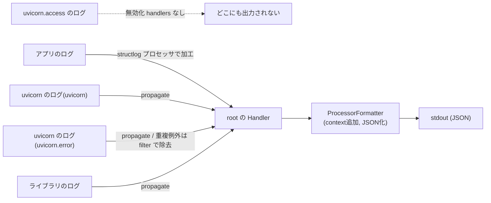

# Chapter 7: 構造化ログとエラーハンドリング

[<- 目次に戻る](../../README.md)

## この章のゴール

- **構造化ログ (Structured Logging)** がなぜ必要かを理解する
- **structlog** で JSON 形式のログを出力する
- **リクエスト ID** をミドルウェアで自動付与し、全ログとレスポンスヘッダに含める
- **エラーハンドリング** を整備し、500 エラー時にスタックトレースをログに残しつつユーザーには安全なレスポンスを返す
- ログに **何を出力すべきか** の指針(高カーディナリティ・高ディメンション)を学ぶ

## スタート地点

```bash
git checkout chapter07-start
```

## 完成形

```bash
git checkout chapter08-start
```

---

## はじめに

Chapter 6 までで、認証・認可付きの CRUD API が動く状態になりました。しかし現状では：

- ログが `print()` レベル(構造がバラバラ、検索しづらい)
- エラー発生時にスタックトレースがそのままレスポンスに含まれることがある
- **「どのリクエストで何が起きたか」を後から追跡する手段がない**

本番運用に耐えるためには「**構造化されたログ**」と「**統一的なエラーハンドリング**」の 2 つが不可欠です。

---

## 1. なぜ構造化ログが必要か

### 従来のログの問題

```python
import logging
logger = logging.getLogger(__name__)

logger.info(f"User {user.username} created item {item.id}")
```

出力：
```
INFO:app.routers:User yamada created item 42
```

人間が読むぶんには問題ないですが、**本番環境で数千万行のログから特定のリクエストを探す** 場面では致命的に非効率です。

問題点：
- **構造が自由形式** … `User yamada created item 42` を機械的にパースして `username=yamada`, `item_id=42` を取り出すのが困難
- **検索・集計ができない** … 「yamada が過去 1 時間に何件 item を作成したか」を調べようとしても、正規表現で頑張るしかない
- **コンテキストが欠落** … リクエスト ID、処理時間、ユーザー ID などの共通情報がログに含まれない

### 構造化ログ

```json
{
  "event": "item_created",
  "username": "yamada",
  "item_id": 42,
  "request_id": "550e8400-e29b-41d4-a716-446655440000",
  "timestamp": "2026-05-11T12:00:00.000Z",
  "level": "info"
}
```

- **JSON 形式** … 任意のフィールドでフィルタ・集計可能
- **構造が一定** … ログ基盤(CloudWatch Logs Insights, Datadog, Loki, Elasticsearch など)でそのまま検索できる
- **コンテキストを自動付与** … リクエスト ID、タイムスタンプ、ログレベルなどが毎行に含まれる

### ログに何を出力すべきか

ログに含める情報は「**後から調査するときに何が必要か**」から逆算します。オブザーバビリティの世界では以下の 2 つの性質が重要とされています。

#### 高カーディナリティ (High Cardinality)

**値のバリエーションが多い属性**。例：

- **リクエスト ID** (UUID) … リクエストごとに一意。「この 1 件のリクエストだけを追跡したい」ときに必須
- **ユーザー ID** … 「特定のユーザーに起きた問題を調べたい」ときに必要
- **Item ID** … 「特定のリソースに対する操作を追いたい」

「`level=info` で絞る」だけだと数百万件ヒットしますが、「`request_id=550e8400...` で絞る」と 1 件だけヒットします。高カーディナリティな値があるほど **ピンポイントで追跡できる** ということです。

#### 高ディメンション (High Dimensionality)

**属性(フィールド)の種類が多い**こと。例：

- `method`, `path`, `status_code`, `duration_ms`, `user_id`, `request_id`, `ip`, `user_agent`, ...

フィールドが多いほど「`status_code=500 AND path=/api/v1/items/ AND method=POST`」のような **多面的な検索** ができるようになります。

#### 本教材でログに含める情報

| フィールド | カーディナリティ | 用途 |
|---|---|---|
| `request_id` | 非常に高(UUID) | リクエスト単位の追跡 |
| `method` | 低(GET/POST/PATCH/DELETE) | HTTP メソッドでのフィルタ |
| `path` | 中 | どのエンドポイントが呼ばれたか |
| `status_code` | 低 | エラー率の監視 |
| `duration_ms` | 高 | パフォーマンス監視 |
| `user_id` | 高 | 特定ユーザーの問題追跡 |
| `level` | 低 | ログレベルでのフィルタ |
| `event` | 中 | 何が起きたかの説明 |

---

## 2. structlog のインストールと初期設定

### インストール

```bash
cd $PROJECT_DIR/backend
uv add 'structlog~=25.5.0'
```

コンテナ再起動

```bash
cd $PROJECT_DIR
docker compose down && docker compose up -d --build
```

backendコンテナのログを確認できるように、ログを tail しておきましょう

```bash
docker compose logs -f backend
```

### ログ設定ファイルを作成

アプリ・uvicorn・ライブラリのログを全部JSON形式に統一する設定を実装します。

このコードでは **structlog** と **logging** 2つでログを出力しており、structlogで構造化ログを作り、loggingで出力管理を行います

- **structlog** ログを整える役割 (JSON化, context追加, 構造化)
- **logging** ログを運ぶ役割 (Logger -> Handler -> Formatterの運搬, 出力先管理)


> [!TIP] 公式ドキュメント:
> - [logging | Python 3.12](https://docs.python.org/ja/3.12/library/logging.html)
> - [structlog](https://www.structlog.org/en/stable/index.html)

アプリのログ、uvicornのログ, その他ライブラリのログ出力も整理しておきます。




```bash
touch $PROJECT_DIR/backend/app/logging_config.py
```

```python
# backend/app/logging_config.py
"""structlog の設定。アプリ起動時に 1 回呼ぶ。"""
import logging.config

import structlog


class _DropASGIErrorFilter(logging.Filter):
    """uvicorn が出す "Exception in ASGI application" ログを落とすフィルタ。

    未処理例外は exception handler が request_id 付きで JSON 出力する。
    uvicorn の同じ例外ログは重複になるため、ここで取り除く。
    """

    def filter(self, record: logging.LogRecord) -> bool:
        # uvicorn のメッセージは末尾に改行を含む ("Exception in ASGI application\n") ため
        # 完全一致ではなく前方一致で判定する
        return not record.getMessage().startswith("Exception in ASGI application")


# structlog 由来のログと、標準 logging (uvicorn など) 由来のログの両方に通す共通プロセッサ
shared_processors: list = [
    # contextvars の値 (リクエスト ID など) を自動でイベントにマージ
    structlog.contextvars.merge_contextvars,
    # ログレベルを付与
    structlog.stdlib.add_log_level,
    # タイムスタンプを ISO 8601 形式 + UTC で付与 (タイムゾーン非依存で時系列が揃う)
    structlog.processors.TimeStamper(fmt="iso", utc=True),
    # スタック情報があれば付与 (例外の整形は最終のレンダラ側に任せる)
    structlog.processors.StackInfoRenderer(),
]


def setup_logging() -> None:
    """structlog を設定し、uvicorn のログも JSON に統合する。"""
    # --- アプリのログ(structlog) の設定 ---
    structlog.configure(
        # 末尾の wrap_for_formatter で structlog から logging に橋渡し。ログの出力はloggingが行う。
        processors=shared_processors + [structlog.stdlib.ProcessorFormatter.wrap_for_formatter],
        # structlog のロガーを標準 logging 上に構築する
        logger_factory=structlog.stdlib.LoggerFactory(),
        wrapper_class=structlog.stdlib.BoundLogger,
        # キャッシュ有効化(パフォーマンス)
        cache_logger_on_first_use=True,
    )

    # 出力レンダラ (JSON は例外を文字列化する format_exc_info とセットで使う)
    renderer_chain = [
        structlog.processors.format_exc_info,
        structlog.processors.JSONRenderer(),
    ]

    # --- loggingの設定: アプリのログ(structlog)と uvicorn のログの出力先を設定 ---
    logging.config.dictConfig(
        {
            "version": 1,
            "disable_existing_loggers": False,
            "filters": {
                "drop_asgi_error": {   # 未処理例外の再ログを落とすフィルタ
                    "()": _DropASGIErrorFilter
                },
            },
            "formatters": {  # ログの整形設定
                # structlog 由来も uvicorn 由来も、この formatter で同じ形に整形する
                "structured": {

                    "()": structlog.stdlib.ProcessorFormatter,  # この Factory を呼び出す
                    "foreign_pre_chain": shared_processors,     # Factory の引数に渡る
                    "processors": [                             # Factory の引数に渡る
                        structlog.stdlib.ProcessorFormatter.remove_processors_meta,
                        *renderer_chain,
                    ],
                },
            },
            "handlers": {  # 出力先の設定
                "default": {
                    "class": "logging.StreamHandler",  # 標準ストリームへ出力
                    "formatter": "structured",         # formatter は structured を利用
                },
            },
            # 出力は root に集約する。各 logger は自前ハンドラを持たず root に伝播させる。
            # 例外的に「無効化したいもの」「フィルタを足したいもの」だけここで上書きする
            "loggers": {
                "uvicorn": { # root へ伝播
                    "handlers": [],
                    "level": "INFO",
                    "propagate": True,
                },
                "uvicorn.error": { # 例外ログ ("Exception in ASGI application") だけフィルタ。それ以外は root へ伝播
                    "handlers": [],
                    "level": "INFO",
                    "propagate": True,
                    "filters": ["drop_asgi_error"],
                },
                "uvicorn.access": { # アクセスログは RequestLoggingMiddleware が出すので無効化
                    "handlers": [],
                    "propagate": False,
                },
            },
            "root": {  # アプリ (structlog)、uvicorn、全てのログがここに集約される
                "handlers": ["default"],
                "level": "INFO",
            },
        }
    )
```


### main.py で呼ぶ

```python
# backend/app/main.py (冒頭に追加)
from app.logging_config import setup_logging

setup_logging()

# ... 以降は既存のコード ...
```

---

## 3. リクエスト ID の付与

### 3.1 ミドルウェアの実装

「リクエストごとに一意の ID を生成して、全ログとレスポンスヘッダに含める」ミドルウェアを実装します。

```bash
touch $PROJECT_DIR/backend/app/middleware.py
```

```python
# backend/app/middleware.py
"""カスタムミドルウェア。"""
import time
import uuid

import structlog
from fastapi import Request, Response
from starlette.middleware.base import BaseHTTPMiddleware, RequestResponseEndpoint
from starlette.types import ASGIApp


logger = structlog.get_logger()


class RequestLoggingMiddleware(BaseHTTPMiddleware):
    """リクエストごとにリクエスト ID を付与し、アクセスログを出力する。"""

    def __init__(self, app: ASGIApp) -> None:
        super().__init__(app)

    async def dispatch(
        self, request: Request, call_next: RequestResponseEndpoint
    ) -> Response:
        # リクエストごとにランダムな UUID を生成 (高カーディナリティで追跡に最適)
        request_id = str(uuid.uuid4())

        # FastAPI (uvicorn) はリクエストを処理する worker を再利用するため、 前のリクエストの contextvars を消去する
        structlog.contextvars.clear_contextvars()

        # contextvars にバインドした値は、 このリクエスト処理中のあらゆるログに自動でマージされる
        # (エンドポイント内で logger.info("something") を呼んでも request_id が自動で含まれる)
        structlog.contextvars.bind_contextvars(request_id=request_id)

        # 処理時間の計測開始
        start_time = time.perf_counter()

        # リクエスト処理を実行
        response = await call_next(request)

        # 処理時間を計算 (パフォーマンス監視の基本。 レスポンスが遅いエンドポイントを特定するのに使う)
        duration_ms = round((time.perf_counter() - start_time) * 1000, 2)

        # レスポンスヘッダにリクエスト ID を追加。
        # フロントが「このリクエストでエラーが出た」と問い合わせるときに、 このヘッダの値を伝えれば
        # バックエンドのログをピンポイントで特定できる
        response.headers["X-Request-ID"] = request_id

        # アクセスログを出力
        await logger.ainfo(
            "request_completed",
            method=request.method,
            path=request.url.path,
            status_code=response.status_code,
            duration_ms=duration_ms,
        )

        return response
```

### 3.2 main.py に登録

```python
# backend/app/main.py (ミドルウェア登録を追加)
from app.middleware import RequestLoggingMiddleware

# ... setup_logging() の後、app.include_router() の前 ...

app.add_middleware(RequestLoggingMiddleware)
```

> [!NOTE] `contextvars` とは？
> Python 3.7 で標準ライブラリに追加された「**実行コンテキスト(リクエスト / async タスク)ごとに独立した値を保持する仕組み**」です。
>
> Web アプリで「リクエスト ID を全ログに含めたい」ときの問題：
> - 関数の引数でバケツリレーするのは面倒(呼び出し階層が深いと全関数に引数を足す必要がある)
> - グローバル変数に入れると、同時に処理される別リクエストの値と混ざってしまう
>
> `contextvars` は **「グローバル変数のように使えるが、リクエストごとに独立した値を持てる」** ことでこの問題を解決します。
>
> ```python
> # ミドルウェアでセット
> structlog.contextvars.bind_contextvars(request_id="aaa")
>
> # どの関数でも logger を呼ぶだけで request_id が自動で含まれる
> logger.info("user_created", user_id=1)
> # -> {"event": "user_created", "user_id": 1, "request_id": "aaa", ...}
> ```
>
> 同時に処理されるリクエスト B で `bind_contextvars(request_id="bbb")` を呼んでも、リクエスト A のログには `"aaa"` が付いたまま混ざりません。Python の `asyncio` でも `await` をまたいでコンテキストが維持されるので、FastAPI の async エンドポイント内でも正しく動作します。

### 3.3 確認

curl で backend の APIをコールしてみましょう。  
レスポンスヘッダには `x-request-id` が追加されているはずです。


```bash
curl -i "http://backend:8000/"
# HTTP/1.1 200 OK
# date: Sun, 21 Jun 2026 05:46:33 GMT
# server: uvicorn
# content-length: 25
# content-type: application/json
# x-request-id: 1e3b21e9-6d44-49a3-aa1b-1a837e7ad491   # <- x-request-id ヘッダがが追加されている
```

コンテナのログには以下のようなログが表示されるはずです。

```json
{
    "method": "GET",
    "path": "/",
    "status_code": 200,
    "duration_ms": 1.03,
    "event": "request_completed",
    "request_id": "956680d0-6ac6-4eb5-83b1-bf28e487437a",
    "level": "info",
    "timestamp": "2026-06-21T05:33:20.207832Z"
}
```

---

## 4. アプリケーション内でのログ出力

エンドポイントやサービスロジックの中でもログを出力できます。`request_id` は `contextvars` 経由で **自動的に含まれる** ので、わざわざ引数で渡す必要がありません。

```python
# backend/app/routers.py (例: create_user 内)
import structlog

logger = structlog.get_logger()


@router.post("/users/", response_model=UserRead, status_code=status.HTTP_201_CREATED)
def create_user(
    data: UserCreate,
    session: Session = Depends(get_session),
    current_user: User = Depends(require_permissions([PermissionType.USER_CREATE])),
) -> User:
    # ... 既存の実装 ...

    session.add(user)
    session.commit()
    session.refresh(user)

    # ビジネスイベントのログ
    logger.info("user_created", user_id=user.id, username=user.username)

    return user
```

### 確認
curl で backend の APIをコールしてみましょう。

```bash
TOKEN=$(
    curl -s -X POST "http://backend:8000/api/v1/login" -H 'Content-Type: application/json' -d '{"username": "sys_admin", "password": "admin"}' |
    jq -r .access_token
)
curl -s -X POST "http://backend:8000/api/v1/users/" \
  -H "Authorization: Bearer $TOKEN" \
  -H 'Content-Type: application/json' \
  -d '{"username": "midorikawa", "password": "mypasswd", "avatar_url": "http://example.com/", "role_ids": [1, 2]}'
```

コンテナのログには以下のようなログが表示されるはずです。

```json
{
    "user_id": 4,
    "username": "midorikawa",
    "event": "user_created",
    "request_id": "f2319bf5-a922-42ff-8710-9a8585df2596",
    "level": "info",
    "timestamp": "2026-06-21T05:40:53.398238Z"
}
```

`request_id` を明示的に渡していないのに含まれている点に注目してください。これが `contextvars` の力です。

### ログレベルの使い分け

| レベル | 用途 | 例 |
|---|---|---|
| **`debug`** | 開発時のデバッグ情報。本番では通常出力しない | 「SQL が何件 SELECT した」 |
| **`info`** | 正常系のビジネスイベント | 「ユーザーが作成された」「ログインした」 |
| **`warning`** | 異常だが回復可能な事象 | 「リクエストが rate limit に近づいている」 |
| **`error`** | エラー。人間の対応が必要な可能性がある | 「外部 API 呼び出しがタイムアウトした」 |
| **`critical`** | 致命的エラー。サービスが停止する可能性 | 「DB 接続プールが枯渇した」 |

> [!NOTE] ログを出しすぎない
> ログは出せば出すほどコスト(ストレージ、ネットワーク、分析負荷)がかかります。「**この情報が無いと問題を調査できない**」という情報だけを `info` 以上で出し、詳細は `debug` に留めるのが運用のコツです。

---

## 5. エラーハンドリング

### 5.1 現状の問題

FastAPI のデフォルトでは：

- **`HTTPException` を raise** -> `{"detail": "..."}` が返る(これは良い)
- **未処理の例外(バグ)** -> スタックトレースがそのままレスポンスに含まれることがある(**セキュリティ上NG**)
- **例外の詳細がログに残らない** -> 「何が起きたか分からない」

### 5.2 カスタム例外ハンドラの実装

未処理の例外(500 Internal Server Error)をキャッチし、**ログにスタックトレースを残しつつ、ユーザーには安全なレスポンスを返す** ハンドラを実装します。

- [Install custom exception handlers | FastAPI](https://fastapi.tiangolo.com/tutorial/handling-errors/#install-custom-exception-handlers)

```bash
touch $PROJECT_DIR/backend/app/exception_handlers.py
```

```python
# backend/app/exception_handlers.py
"""グローバルな例外ハンドラ。"""
import structlog
from fastapi import FastAPI, Request
from fastapi.responses import JSONResponse


logger = structlog.get_logger()


def register_exception_handlers(app: FastAPI) -> None:
    """FastAPI アプリにカスタム例外ハンドラを登録する。"""

    # FastAPI の他のハンドラ (HTTPException 用など) で 処理されなかった全ての例外をキャッチする
    @app.exception_handler(Exception)
    async def unhandled_exception_handler(request: Request, exc: Exception) -> JSONResponse:
        """未処理の例外をキャッチし、500 を返す。

        - ユーザーには汎用メッセージだけ返す(スタックトレースを漏らさない)
        - ログにはスタックトレース含む詳細を残す
        """
        logger.error(
            "unhandled_exception",
            exc_type=type(exc).__name__,
            exc_message=str(exc),
            exc_info=exc,  # structlog がスタックトレースを整形して JSON に含めてくれる
        )
        # レスポンスは汎用メッセージだけ。 攻撃者にバグの詳細 (ファイルパス・変数の値など) を教えない
        return JSONResponse(
            status_code=500,
            content={"detail": "Internal Server Error"},
        )
```

### 5.3 main.py に登録

```python
# backend/app/main.py
from app.exception_handlers import register_exception_handlers

# ... app = FastAPI() の後 ...

# カスタム例外ハンドラ (補足されていないエラーが発生した際に、ログを出しつつ安全なレスポンスを返す)
register_exception_handlers(app)
```

### 確認

エンドポイント内に意図的に例外を発生させるAPIを追加します。

```python
# 一時的に routers.py に追加(確認後削除)
@router.get("/test-error")
def test_error():
    raise RuntimeError("This is a test error")
```

APIをコールしてみましょう

```bash
curl -s "http://backend:8000/api/v1/test-error"
# {"detail": "Internal Server Error"}
```

コンテナのログには以下のようなログが表示されるはずです。

```json
{
    "exc_type": "RuntimeError",
    "exc_message": "This is a test error",
    "event": "unhandled_exception",
    "request_id": "aa35bade-1b43-4757-a15b-95dd78d75234",
    "level": "error",
    "timestamp": "2026-06-21T05:43:30.848111Z",
    "exception": "Traceback (mo...",
}
```

ユーザーにはスタックトレースが**一切漏れていません**が、ログには**完全なトレース**が残っています。これが理想的なエラーハンドリングです。運用チームはリクエスト ID でログを引けば詳細を確認できます。

---

## 6. 開発 / 本番のログフォーマット切り替え

開発環境では JSON ログは読みにくいので、**人間が読みやすいカラー出力** に切り替えられるようにします。

### config.py に追加

```python
# backend/app/config.py (追記)

class Environment(BaseSettings):
    # ... 既存のフィールド ...

    # ログフォーマット
    log_format: str = "json"  # "json" or "console"
```

### logging_config.py を修正

変更点は**レンダラの選択だけ**です。`ProcessorFormatter` や uvicorn の統合といった他の設定はそのままにします。

`setup_logging()` 内の `renderer_chain` を、固定の JSON から**環境変数による切り替え**に変更します。

```python
# backend/app/logging_config.py (setup_logging 内)
from app.config import env  # <- 追加: 環境変数の読み込み

# ... 略 ...

def setup_logging() -> None:

    # ... 略 ...

    # 出力レンダラを環境変数で切り替え (開発: console / 本番: json)
    if env.log_format == "console":
        # 開発環境: カラー付きで読みやすい (ConsoleRenderer が例外も整形する)
        renderer_chain: list = [structlog.dev.ConsoleRenderer()]
    else:
        # 本番環境: JSON (format_exc_info で例外を文字列化してから JSON 化)
        renderer_chain = [
            structlog.processors.format_exc_info,
            structlog.processors.JSONRenderer(),
        ]

    # ... 略 ...
```

### .env.sample に追加

```bash
# backend/.env.sample

# ... 略 ...

# 開発は console (カラー出力)、本番は json
LOG_FORMAT=console
```

開発環境では `LOG_FORMAT=console` にしておくと、ターミナルでのログが格段に読みやすくなります。

---

## 7. main.py の全体像

ここまでの変更を反映した `main.py` の全体像：

```python
# backend/app/main.py
from fastapi import FastAPI

from app.logging_config import setup_logging
from app.exception_handlers import register_exception_handlers
from app.middleware import RequestLoggingMiddleware
from app.routers import router

# ログ設定(最初に呼ぶ)
setup_logging()

app = FastAPI()

# カスタム例外ハンドラ (補足されていないエラーが発生した際に、ログを出しつつ安全なレスポンスを返す)
register_exception_handlers(app)

# ミドルウェア: リクエストごとにリクエスト ID を付与し、アクセスログを出力する
app.add_middleware(RequestLoggingMiddleware)

# /api/v1 プレフィックスでルーターを登録
app.include_router(router, prefix="/api/v1")


@app.get("/")
def read_root():
    return {"message": "Hello World"}
```

### 確認

```bash
# .env を再作成
cp $PROJECT_DIR/backend/.env.sample $PROJECT_DIR/backend/.env

# コンテナ再起動
cd $PROJECT_DIR
docker compose down && docker compose up -d --build
```

ログをtail


```bash
docker compose logs -f backend
```

curlでAPIをコールしてみましょう。

```bash
curl -i "http://backend:8000/"
```

ログのフォーマットがjsonからテキストに変わっているはずです。

```
2026-06-21T05:54:19.271968Z [info     ] request_completed              duration_ms=0.89 method=GET path=/ request_id=6cfb62de-c1d0-495f-ba26-d9318fc7ccd7 status_code=200
```
---

## まとめ

この章では以下を学びました：

- **構造化ログの必要性**: JSON 形式にすることで検索・集計・監視が可能に
- **高カーディナリティ / 高ディメンション**: ログに何を含めるべきかの指針
- **structlog**: Python の構造化ログライブラリ。プロセッサチェーンで加工、`contextvars` でリクエストスコープの値を自動付与
- **リクエスト ID**: UUID をミドルウェアで生成し、全ログ + レスポンスヘッダ `X-Request-ID` に含める。問題追跡の要
- **エラーハンドリング**: 未処理例外をキャッチし、ログにスタックトレースを残しつつユーザーには安全なレスポンスを返す
- **開発 / 本番切り替え**: `LOG_FORMAT` 環境変数で JSON / カラーコンソールを切り替え

次章では、ここまで実装した API の **自動テスト (pytest)** を書いていきます。

---

## 次の章

[Chapter 8: API テスト (pytest) ->](../chapter08/README.md)
