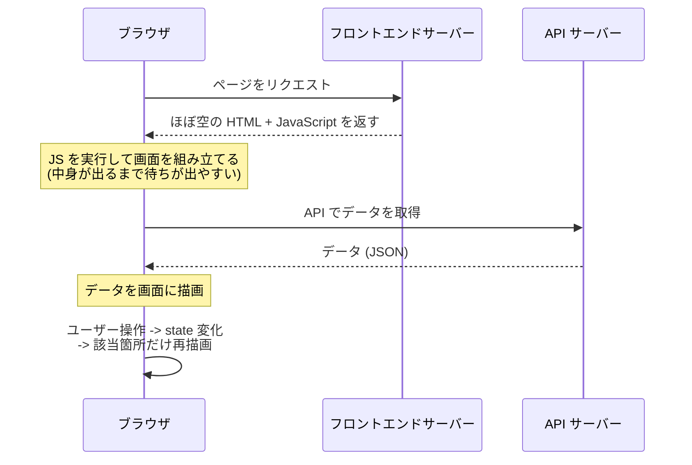
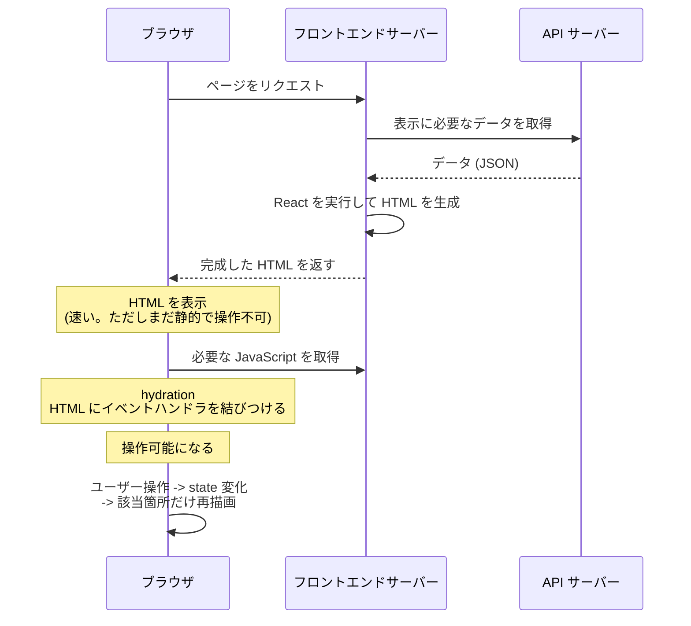

# Chapter 9: React / Next.js の基礎

[<- 目次に戻る](../../README.md)

## この章について

Chapter 10 以降では **Next.js (TypeScript)** でフロントエンドを実装します。Next.js は **React** をベースにしたフレームワークなので、手を動かす前に **React と、その土台にある考え方** を最低限つかんでおくと、以降の章がぐっと読みやすくなります。

この章は **JavaScript / TypeScript の文法はある程度わかるが、React は未経験** の方に向けた読み物です。実際のアプリのコードを書く章ではありませんが、概念を腹落ちさせるための **短いサンプルコード** をところどころに置いています。

この章で扱うのは次の 3 つです。

1. Web アプリの **レンダリング方式** (SSR と SPA) と、その処理の流れ
2. React の基礎 (コンポーネント / JSX / props / state)
3. よく使う **hook** (`useState` / `useEffect`)

> [!NOTE] すでに React / Next.js の経験がある方
> この章はスキップして [Chapter 10](../chapter10/README.md) に進んでください。

---

## 推奨する学習リソース

文法そのものに不安がある場合や、より深く学びたい場合は以下が参考になります。

### TypeScript
- [サバイバル TypeScript](https://typescriptbook.jp/): 日本語で最も網羅的な TypeScript 入門
- [TypeScript 公式 Handbook](https://www.typescriptlang.org/docs/handbook/intro.html): 公式のリファレンス

### JavaScript
- [MDN Web Docs - JavaScript](https://developer.mozilla.org/ja/docs/Web/JavaScript): Mozilla の公式リファレンス
- [JavaScript.info](https://ja.javascript.info/): モダンなJSのチュートリアル

### React
- [React 公式チュートリアル](https://ja.react.dev/learn): 公式チュートリアル
- [React 公式 - Thinking in React](https://ja.react.dev/learn/thinking-in-react): Reactの考え方を学ぶ
- [Next.js - React Foundations](https://nextjs.org/learn/react-foundations): Next.js公式が提供するReactの基礎コース

### Next.js
- [Next.js - Learn (Dashboard App)](https://nextjs.org/learn/dashboard-app): Next.js 公式のチュートリアル
- [Next.js 公式ドキュメント](https://nextjs.org/docs): 公式ドキュメント

---

## 1. レンダリング方式 (SSR と SPA)

Web アプリの情報を調べると **SSR** と **SPA** という用語が頻出します。両者の違いは「**HTML をどこで組み立てるか**」です。この違いを押さえておくと、ネットの情報から必要なものを取捨選択できるようになります。

- **SPA** (Single Page Application): ブラウザが JavaScript で HTML を組み立てる
- **SSR** (Server-Side Rendering): フロントエンドサーバーが HTML を組み立ててから返す

> [!NOTE] ポイント解説: 登場する 2 種類のサーバー
> 以降の図には 2 つのサーバーが出てきます。本チュートリアルの構成に対応します。
> - **フロントエンドサーバー**: 画面 (HTML) を返す担当 (Next.js)
> - **API サーバー**: データ (JSON) を返す担当 (本書のバックエンド)
>
> SPA でも SSR でも、データは **API サーバー** から取得します。両者の違いは「**HTML を組み立てるのがブラウザか、フロントエンドサーバーか**」です。

### 1.1 SPA の流れ

SPA では、フロントエンドサーバーは最初に **ほぼ空の HTML と JavaScript** を返し、ブラウザ側で JavaScript が画面を組み立てます。



初回読み込みのあとは差分だけを描き替えるので操作は軽快ですが、最初に JavaScript を実行し終えるまで中身が表示されないため、**初回表示と SEO に弱点** があります。

### 1.2 SSR の流れ

SSR では、フロントエンドサーバーが API サーバーからデータを取得し、React を実行して **完成した HTML** を返します。ブラウザはそれをすぐ表示でき、その後 JavaScript を読み込んで操作可能にします。



完成した HTML がすぐ届くので **初回表示が速く SEO に強い** 一方、リクエストごとにフロントエンドサーバーで HTML を生成する処理が必要です。

ここで鍵になるのが **hydration (ハイドレーション)** という段階です。

> [!NOTE] ポイント解説: hydration とは
> [Next.js 公式](https://nextjs.org/docs/app/getting-started/server-and-client-components) の用語集では、hydration を次のように説明しています。
>
> > Hydration is React's process of attaching event handlers to the DOM to make server-rendered static HTML interactive.
> > (hydration とは、サーバーが描いた静的な HTML にイベントハンドラを結びつけ、操作可能にする React の処理です)
>
> 「サーバーで描いた HTML」と「ブラウザで動く JavaScript」を **後から接続する** のが hydration です。これによって、初回表示は速いまま (HTML がすぐ届く)、その後はボタン操作などに反応できるようになります。

> [!NOTE] ポイント解説: 本アプリが使う方式
> 本チュートリアルで作るのは **ログインを伴う動的なアプリ** です。初回表示の速さと SEO の利点から、**フロントエンドサーバー側で HTML を作る SSR を中心** に使います。具体的に「どのファイルがサーバーで動き、どれがブラウザで動くか」は、実装と合わせて Chapter 10 で確認します。

操作可能になった後は、サーバーに戻らずに **ブラウザの中だけで画面を更新** できます。これを実現しているのが React です。次は React の基礎を、実際に手を動かしながら見ていきます。

## 2. React の基礎(ブラウザで動かしながら学ぶ)

React の概念は、読むより **実際に動かす** ほうが圧倒的に腹落ちします。ここでは **ビルドも Next.js も使わず**、CDN から React を読み込む 1 枚の HTML ファイルを少しずつ育てながら、コンポーネント・JSX・props・state を体験します。

> [!TIP] 公式ドキュメント:
> - [React Foundations: Getting Started with React | Next.js](https://nextjs.org/learn/react-foundations/getting-started-with-react)

### 2.1 動かす環境を用意する

学習用のディレクトリと HTML ファイルを作ります。

```bash
mkdir -p $PROJECT_DIR/react-playground
touch $PROJECT_DIR/react-playground/index.html
```

`index.html` に次を書きます。

```html
<!-- react-playground/index.html -->
<!DOCTYPE html>
<html lang="ja">
  <head>
    <meta charset="utf-8" />
    <title>React playground</title>
  </head>
  <body>
    <!-- React が描画する先 -->
    <div id="app"></div>

    <!-- React 本体 -->
    <script src="https://unpkg.com/react@18.3/umd/react.development.js"></script>
    <!-- React をブラウザの DOM へ描画する ReactDOM -->
    <script src="https://unpkg.com/react-dom@18.3/umd/react-dom.development.js"></script>
    <!-- JSX をブラウザ内で JavaScript に変換する Babel -->
    <script src="https://unpkg.com/@babel/standalone@7.26/babel.min.js"></script>

    <!-- type="text/babel" にすると、この中身を Babel が変換してから実行する -->
    <script type="text/babel">
      const root = ReactDOM.createRoot(document.getElementById("app"));
      root.render(<h1>Hello, React!</h1>);
    </script>
  </body>
</html>
```

`ReactDOM.createRoot(...)` で描画先の DOM 要素を指定し、`root.render(...)` に表示したい内容を渡します。

このファイルを簡易 Web サーバーで配信します。

```bash
# react-playground を簡易 Web サーバーで配信する (ポート 8090)
cd $PROJECT_DIR/react-playground && python3 -m http.server 8090
```

ブラウザで http://localhost:8090 を開き、**Hello, React!** が表示されれば成功です。

> [!WARNING] これは学習専用の構成です
> ブラウザ内で Babel が JSX を変換するこの方式は手軽ですが、非常に遅いため本番では使いません。

### 2.2 JSX とブラウザ内変換

`root.render(...)` に渡した `<h1>Hello, React!</h1>` のような、JavaScript の中に書く HTML に似た記法が **JSX** です。`{}` で囲むと、その中に **JavaScript の式** を埋め込めます。`text/babel` ブロックを次のように変えてみます。

```jsx
const name = "React";
const root = ReactDOM.createRoot(document.getElementById("app"));
root.render(<h1>Hello, {name}!</h1>); // {} の中は JavaScript の式
```

> [!NOTE] ポイント解説: ブラウザは JSX をそのまま読めない
> JSX は JavaScript の標準仕様ではないため、ブラウザはそのままでは解釈できません。この HTML では **Babel** を読み込み、`type="text/babel"` のブロックを **JavaScript に変換してから** 実行しています。本アプリではこの変換を Next.js のビルドが担います。

> [!TIP] 公式ドキュメント:
> - [Writing Markup with JSX | React](https://react.dev/learn/writing-markup-with-jsx)
> - [JavaScript in JSX with Curly Braces | React](https://react.dev/learn/javascript-in-jsx-with-curly-braces)

### 2.3 コンポーネント

React では、画面を **コンポーネント** という部品に分けて作ります。コンポーネントは **JSX を返す関数** です。先ほどの `<h1>` を `Greeting` コンポーネントに切り出します。

```jsx
function Greeting() {
  return <h1>Hello, React!</h1>;
}

const root = ReactDOM.createRoot(document.getElementById("app"));
root.render(<Greeting />); // 自作コンポーネントを <Greeting /> のように使える
```

### 2.4 props

コンポーネントに **props**(引数)を渡すと、同じ部品を異なるデータで使い回せます。`Greeting` が名前を受け取るようにして、2 つ並べてみます。

```jsx
function Greeting({ name }) {
  return <h1>Hello, {name}!</h1>;
}

const root = ReactDOM.createRoot(document.getElementById("app"));
root.render(
  <div>
    <Greeting name="Alice" />
    <Greeting name="Bob" />
  </div>
);
```

画面に **Hello, Alice!** と **Hello, Bob!** が並べば成功です。

### 2.5 state と再描画

最後に、**ユーザー操作で画面が変わる** 仕組みを動かします。コンポーネントが内部に持つ書き換え可能な値を **state** と呼び、state を持たせるには `useState` を使います。`text/babel` ブロックを次のように変えます。

```jsx
const { useState } = React;

// ボタンで表示/非表示を切り替えるトグル
function Toggle() {
  // open: 現在の値 / setOpen: 更新用の関数
  const [open, setOpen] = useState(false);

  return (
    <div>
      <button onClick={() => setOpen(!open)}>
        {open ? "閉じる" : "開く"}
      </button>
      {open && <p>本文が表示されています</p>}
    </div>
  );
}

const root = ReactDOM.createRoot(document.getElementById("app"));
root.render(<Toggle />);
```

ボタンを押すと `setOpen` が state を変え、その瞬間 React が `Toggle` を描き直します。その結果、ボタンの文言と本文の表示が切り替わります。

> [!NOTE] ポイント解説: `{}` には JSX をネストできる
> `{}` は JavaScript の式を埋め込む事ができます。 **JSX 要素自体も式**なので、`{}` の中に JSX をネストできます。

> [!NOTE] ポイント解説: React の中核となる考え方
> **state が変わると、その state を使っているコンポーネントが自動で再描画される。** この一点が、ユーザー操作に応じて画面が変わる仕組みの土台です。

props と state は対比で覚えると整理できます。

| | props | state |
| :--- | :--- | :--- |
| 値の出どころ | 親から渡される (外から決まる) | コンポーネント自身が持つ |
| 書き換え | 受け取った側からは変えない | 専用の関数で書き換える |
| 変化したとき | 親が渡す値が変われば再描画 | state を更新すると再描画 |

> [!NOTE] ポイント解説: import の書き方
> UMD で読み込んだここでは `const { useState } = React;` と書きますが、本アプリ(ビルドあり)では `import { useState } from "react";` と書きます。

## 3. よく使う hook

### 3.1 hook とは

hook は、関数コンポーネントの中で **state や副作用** といった React の機能を使うための仕組みで、慣習として名前が `use` で始まります。 先程の `useState` も **hook** の一つです。

hook には  があります。

> [!NOTE] ポイント解説: hook の呼び出しルール
> hookは以下でのみ呼び出すことができます。 ( [呼び出しルール](https://react.dev/reference/rules/rules-of-hooks) )
> - **Reactの関数コンポーネントのトップレベル**
> - **Reactのカスタムhook内のトップレベル**
> 
> ループ、条件分岐、ネストした関数、`try/cache/finally` ブロック からは呼び出すことができません。

> [!NOTE] ポイント解説: Next.js で state やイベントを扱うとき
> Next.js では、`useState` やイベント (`onClick` など) を使うコンポーネントには、先頭に `"use client"` という宣言が必要になります。その意味と使い分けは、実装と合わせて [Chapter 10](../chapter10/README.md) で扱います。

### 3.2 useEffect

`useEffect` は **副作用(データ取得、購読、DOM操作など)** を扱います。レンダリング後に実行され、第2引数の**依存配列**で実行タイミングを制御します。空配列ならマウント時のみ、値を入れるとその値が変わったときに実行されます。

```tsx
import { useEffect } from "react";

useEffect(() => {
  // 毎回のレンダー後に実行
});

useEffect(() => {
  // マウント時 (最初の表示時) に 1 回だけ実行
}, []);

useEffect(() => {
  // a か b が前回から変わったときに実行
}, [a, b]);
```

React には `useState` / `useEffect` 以外にも hook がありますが (`useRef` / `useMemo` / `useContext` など)、本チュートリアルでは **必要になった章でそのつど紹介** します。まずはこの 2 つを押さえれば十分です。

> [!TIP] 公式ドキュメント:
> - [Built-in React Hooks | React](https://react.dev/reference/react/hooks)
>   - [useState | React](https://react.dev/reference/react/useState)
>   - [useEffect | React](https://react.dev/reference/react/useEffect)

## まとめ

この章では、Chapter 10 以降の実装を読み進めるための React / Next.js の基礎を整理しました。

- **レンダリング方式**: SSR と SPA は「HTML をどこで組み立てるか」の違い。本アプリは **SSR** を中心に使う
- **SSR の流れ**: フロントエンドサーバーが API サーバーからデータ取得 -> HTML を生成 -> 表示 -> **hydration** で操作可能化 -> state 変化で再描画
- **React の基礎**: 画面を **コンポーネント** に分け、**JSX** で書き、**props** でデータを渡し、**state** が変わると再描画される
- **hook**: `useState` で state を持ち、`useEffect` で副作用を扱う

次の章からは、これらを **実際に手を動かしながら** Next.js で体験していきます。

## 次の章

[Chapter 10: Next.js 入門 + Tailwind CSS 基礎 ->](../chapter10/README.md)
