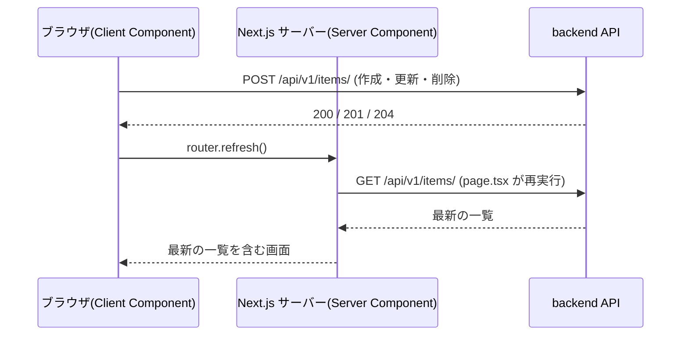

# Chapter 12: CRUD 画面の実装

[<- 目次に戻る](../../README.md)

## この章のゴール

- shadcn/ui の **[Dialog](https://ui.shadcn.com/docs/components/base/dialog)** / **[AlertDialog](https://ui.shadcn.com/docs/components/base/alert-dialog)** / **[Table](https://ui.shadcn.com/docs/components/base/table)** でアイテムの一覧・作成・編集・削除画面を作れます
- **Server Component で一覧データを取得**し、Client Component に props で渡す構成を実装できます
- Client Component から **backend を直接呼んで**作成・編集・削除を行えます
- 変更後は **[`router.refresh()`](https://nextjs.org/docs/app/api-reference/functions/use-router#refresh)** で一覧を最新化できます
- 学んだ CRUD パターンを **ユーザー管理画面に応用**できます(ロール複数選択・読み取り専用フィールド)

## スタート地点

```bash
git checkout chapter12-start
```

## 完成形

```bash
git checkout chapter13-start
```

---

## はじめに

Chapter 11 で、Cookie ベースの認証と `(authenticated)` レイアウトが整いました。この章では、認証済みユーザーが実際にデータを操作する **CRUD 画面**(Create / Read / Update / Delete)を作ります。

題材は Chapter 5 で作った **Item**(`title` / `content` を持つ)の管理画面です。一覧表示・作成・編集・削除を、すべて一覧ページ上の **Dialog(モーダル)** で完結させます。後半では同じパターンを **User 管理画面**に応用します。

この章の主役は、**Server Component と Client Component の役割分担**です。一覧の取得は Server Component、作成・編集・削除の操作は Client Component が担当し、操作が終わったら `router.refresh()` で一覧を最新の状態に更新します。仕組みは「3. 一覧取得とミューテーションの方針」でまとめて説明します。

### この章で作る・変えるファイル

```
backend/
└── app/routers.py                       # GET /api/v1/roles/ を追加(ロール選択肢用)

frontend/src/
├── app/                                 # 画面(描画 = .tsx をルートにコロケーション)
│   ├── layout.tsx                        # <Toaster> を追加(変更)
│   └── (authenticated)/
│       ├── page.tsx                      # /items へリダイレクト(変更)
│       ├── about/page.tsx                # 削除
│       ├── app-sidebar.tsx               # メニューを Items / Users に整理(変更)
│       ├── items/
│       │   ├── page.tsx                  # 新規: Server Component(一覧を直接取得)
│       │   ├── items-view.tsx            # 新規: 一覧(描画)
│       │   ├── item-form-dialog.tsx      # 新規: 作成/編集 Dialog(描画 + 送信処理)
│       │   └── delete-item-dialog.tsx    # 新規: 削除確認 Dialog(描画 + 削除処理)
│       └── users/
│           ├── page.tsx                  # 新規
│           ├── users-view.tsx            # 新規
│           ├── user-form-dialog.tsx      # 新規(ロール複数選択・username 読み取り専用)
│           └── delete-user-dialog.tsx    # 新規
├── feature/                             # 機能ごとの処理(.ts)
│   ├── items/
│   │   └── api.ts                        # 新規: API 呼び出し関数(IO)
│   └── users/
│       └── api.ts                        # 新規
└── lib/                                 # 横断的に使う共通コード
    └── api/                              # API 基盤(全 feature 共通, Chapter 11)
        ├── client.ts                     # (既存)
        └── schema.ts                     # (既存・gen:api で更新)
```

> [!NOTE] ポイント解説:
> ディレクトリは **役割で 3 つ**に分けます。  
> - **`app/`** : 画面(描画する `.tsx` をルートにコロケーション)
> - **`feature/<機能名>/`** : 機能ごとの処理(`.ts`。backend を叩く API 関数)
> - **`lib/`** : 複数機能で使う共通コード(API クライアント基盤など)です。
>
> 「描画」と「処理」を分けておくと、機能が複雑化しても処理の置き場所に困りません。

---

## 1. backend に「ロール一覧」エンドポイントを追加する

先に backend を 1 か所だけ変更します。後半のユーザー管理画面で「ロールを複数選択」するために、選択肢となる**ロール一覧**(id と名前)を取得する API が必要だからです。

`backend/app/routers.py` の import に `RoleRead` を追加します。

```python
# backend/app/routers.py
from app.schemas import (
    UserCreate, UserRead, UserUpdate, UserLogin,
    ItemCreate, ItemRead, ItemUpdate, RoleRead,  # RoleRead を追加
)
```

`read_users` のすぐ下に、ロール一覧を返すエンドポイントを追加します。

```python
# backend/app/routers.py (read_users の直後あたりに追加)
@router.get("/roles/", response_model=list[RoleRead])
def read_roles(
    session: Session = Depends(get_session),
    # ロール情報は管理者向けなので USER_READ 権限を要求する
    _: User = Depends(require_permissions([PermissionType.USER_READ])),
) -> list[Role]:
    """ロール一覧を返す。ユーザー作成・編集の役割選択肢として使う。"""
    roles = session.execute(
        select(Role).order_by(Role.id)
    ).scalars().all()
    return list(roles)
```

> [!NOTE] ポイント解説:
> `Role` と `require_permissions` / `PermissionType` は既に `routers.py` で import 済みです(`RoleRead` だけ追加すれば済みます)。

backend はホットリロードされます。Swagger UI(`http://localhost:8000/docs`)に `GET /api/v1/roles/` が出ていれば成功です。

## 2. OpenAPI から TypeScript 型を再生成する

backend のエンドポイントが増えたので、Chapter 11「1.3 型を生成する」と同じ手順で frontend の型を再生成します。`pnpm gen:api` は **backend の `/openapi.json` を HTTP で取得する** ので、まず backend が起動している必要があります。

```bash
cd $PROJECT_DIR

# Step 1 の backend 変更を反映するため、再ビルドして起動
docker compose down && docker compose up -d --build

# backend の OpenAPI 仕様が取得できることを確認(roles が含まれる)
curl -s http://backend:8000/openapi.json | jq '.paths | keys' | grep roles
# "/api/v1/roles/"
```

backend が応答したら、devcontainer 上で型生成を実行します。

```bash
cd $PROJECT_DIR/frontend

# Chapter 11 で登録済みの gen:api スクリプトを実行
pnpm gen:api
# ✨ openapi-typescript 7.13.0
# 🚀 http://backend:8000/openapi.json -> src/lib/api/schema.ts [...ms]
```

`src/lib/api/schema.ts` に `/api/v1/roles/` のパスと `RoleRead` 型が追加されます。これで frontend から `apiClient.GET("/api/v1/roles/")` を型安全に呼べるようになりました。**backend の変更がコマンド 1 つで TypeScript に反映される**のが OpenAPI 駆動の利点です(Chapter 11 参照)。

> [!NOTE] ポイント解説:
> `pnpm gen:api` を 2 回続けて実行しても差分が出ないことを確認してください。差分が出るなら backend の起動 or 型生成が中途半端です。`schema.ts` は生成物ですが、Chapter 11 と同様コミット推奨です(CI で差分が出ないことを確認する運用は Chapter 14 で扱います)。

## 3. 一覧取得とミューテーションの方針

### 3.1 一覧の取得: Server Component からそのまま fetch する

Chapter 11 のログイン画面と同じく、この章の CRUD 画面でも **Server Component から直接 backend を呼ぶ**方針で一覧を取得します。特別な仕組みは不要で、`page.tsx` を `async function` にして `await` するだけです。

```tsx
// イメージ (実際のコードは 5.1 で作成)
export default async function ItemsPage() {
  const items = await fetchItems(); // Server Component からそのまま await
  return <ItemsView items={items} />; // 取得結果を props で渡す
}
```

### 3.2 変更後の一覧更新が難しい理由

一覧の表示だけならこれで十分ですが、**ユーザー操作で変化するデータ**を扱うと問題が出ます。

```
作成ボタンを押す -> POST /items/ -> 一覧を最新化したい
                                 ^^^^^^^^^^^^^^^^^
                                     ここが問題
```

`page.tsx` が取得したデータは、そのリクエストの処理中に確定したものです。ブラウザ側の Dialog で「作成」を実行しても、`page.tsx` の中の `items` 変数が自動で書き換わるわけではありません。**もう一度 `page.tsx` を実行し直してもらう**必要があります。

### 3.3 `router.refresh()` でルートを再実行する

Next.js の **[`useRouter`](https://nextjs.org/docs/app/api-reference/functions/use-router)** フックが返す `router.refresh()` は、**現在のルートを Next.js サーバーにもう一度リクエストし直す** Client Component 用の関数です。

```tsx
"use client";
import { useRouter } from "next/navigation";

function Example() {
  const router = useRouter();

  const handleAfterMutation = async () => {
    await fetch("/api/v1/items/", { method: "POST", /* ... */ });
    router.refresh(); // 現在のルートの Server Component を再実行する
  };
  // ...
}
```

`router.refresh()` を呼ぶと、`items/page.tsx` が **サーバーで再実行**され、最新の `fetchItems()` の結果を含んだ画面が返ってきます。React は再実行結果を既存のツリーに反映しますが、Dialog の開閉状態のような Client Component 側の `useState` は保持されるので、画面がちらつくことはありません。

> [!NOTE] ポイント解説: なぜキャッシュを気にしなくてよいのか
> Next.js の `fetch` には **Data Cache** という仕組みがあり、既定では結果をキャッシュしようとします。ただし `items/page.tsx` は `cookies()`(Chapter 11 の認証情報の取得)を読んでいるため **Dynamic API を使っているルート**と判定され、キャッシュされず**毎リクエストでサーバー側の処理が実行**されます。そのため `router.refresh()` を呼べば、必ず最新のデータが返ってきます。

つまり、この章の CRUD は次の 3 ステップの繰り返しでできています。



| 役割 | 担当 |
| :--- | :--- |
| 一覧の取得(初回表示) | Server Component が `await` で直接取得 |
| 作成・編集・削除 | Client Component が `apiClient` で backend を直接呼ぶ |
| 一覧の更新 | Client Component が操作後に `router.refresh()` を呼ぶ |

### 3.4 shadcn/ui のコンポーネントを追加する

この章で使う **Table** / **Dialog** / **AlertDialog** / **Checkbox** と、作成・更新・削除の結果を知らせるトースト **[sonner](https://ui.shadcn.com/docs/components/base/sonner)** をまとめて追加します。

```bash
cd $PROJECT_DIR/frontend
pnpm dlx 'shadcn@^4.7.0' add table dialog alert-dialog sonner checkbox --yes
```

### 3.5 Root layout にトーストの表示先を追加する

`src/app/layout.tsx` に、sonner のトーストが表示される場所 `<Toaster />` を置きます。

```tsx
// src/app/layout.tsx (抜粋・変更点のみ)
import { Toaster } from "@/components/ui/sonner";  // <- 追加

// ...フォント定義・metadata は変更なし...

export default function RootLayout({
  children,
}: {
  children: React.ReactNode;
}) {
  return (
    <html
      lang="ja"
      className={`${inter.variable} ${notoSansJP.variable} ${geistMono.variable}`}
    >
      <body>
        {children}
        {/* トーストの表示先。アプリのどこから toast(...) を呼んでもここに出る */}
        <Toaster />  {/* <- 追加 */}
      </body>
    </html>
  );
}
```

これで CRUD 画面を作る土台が整いました。

## 4. アイテムの処理を feature にまとめる

ここから「処理」を `feature/items/api.ts` に置いていきます。backend を叩く関数(取得・作成・更新・削除)をこの 1 ファイルに集約し、画面(`.tsx`)からはこの関数を直接呼ぶだけにします。

```bash
mkdir -p $PROJECT_DIR/frontend/src/feature/items
touch $PROJECT_DIR/frontend/src/feature/items/api.ts
```

```ts
// src/feature/items/api.ts
import { apiClient } from "@/lib/api/client";
import type { components } from "@/lib/api/schema";

// schema.ts から型を借りる(backend の型と常に一致する)
export type Item = components["schemas"]["ItemRead"];
export type ItemInput = components["schemas"]["ItemCreate"]; // { title, content }
export type ItemUpdateInput = components["schemas"]["ItemUpdate"]; // { title?, content? }

/**
 * アイテム一覧を取得する。
 * - サーバー実行時(Server Component): cookie を引数で受け取りヘッダに載せる
 * - クライアント実行時: cookie は undefined。apiClient が credentials:"include" で自動送信する
 */
export async function fetchItems(cookie?: string): Promise<Item[]> {
  const { data, error } = await apiClient.GET("/api/v1/items/", {
    headers: cookie ? { Cookie: cookie } : undefined,
  });
  if (error) throw new Error("アイテム一覧の取得に失敗しました");
  return data;
}

export async function createItem(input: ItemInput): Promise<Item> {
  const { data, error } = await apiClient.POST("/api/v1/items/", { body: input });
  if (error) throw new Error("アイテムの作成に失敗しました");
  return data;
}

export async function updateItem(id: number, input: ItemUpdateInput): Promise<Item> {
  const { data, error } = await apiClient.PATCH("/api/v1/items/{item_id}", {
    params: { path: { item_id: id } },
    body: input,
  });
  if (error) throw new Error("アイテムの更新に失敗しました");
  return data;
}

export async function deleteItem(id: number): Promise<void> {
  const { error } = await apiClient.DELETE("/api/v1/items/{item_id}", {
    params: { path: { item_id: id } },
  });
  if (error) throw new Error("アイテムの削除に失敗しました");
}
```

> [!NOTE] ポイント解説:
> `fetchItems` だけ Cookie を引数で受け取る理由は、**Server Component からも呼ぶ**からです。サーバー側では `credentials: "include"` が効かないので、明示的に Cookie をヘッダにセットして API を呼び出す必要があります(Chapter 11 の `apiClient` 解説を参照)。

## 5. 一覧ページ(Server Component + Client Component)

いよいよ画面です。一覧ページは **Server Component**(`page.tsx`)と **Client Component**(`items-view.tsx`)に分けます。

### 5.1 Server Component(一覧を直接取得)

```bash
mkdir -p $PROJECT_DIR/frontend/src/app/\(authenticated\)/items
touch $PROJECT_DIR/frontend/src/app/\(authenticated\)/items/page.tsx
```

```tsx
// src/app/(authenticated)/items/page.tsx
import { cookies } from "next/headers";
import type { Metadata } from "next";

import { fetchItems } from "@/feature/items/api";

import { ItemsView } from "./items-view";

export const metadata: Metadata = {
  title: "アイテム管理 | Web Tutorial v2",
};

export default async function ItemsPage() {
  // Next.js 16 では cookies() は非同期。await が必要
  const cookie = (await cookies()).toString();
  const items = await fetchItems(cookie);

  return <ItemsView items={items} />;
}
```

### 5.2 Client Component(一覧表示)

まずは一覧と各ボタンの「ガワ」だけです(Dialog の中身は次節以降)。一覧は `page.tsx` から受け取った `items` を props として描画するだけで、自前で取得し直す処理は持ちません。

```bash
touch $PROJECT_DIR/frontend/src/app/\(authenticated\)/items/items-view.tsx
```

```tsx
// src/app/(authenticated)/items/items-view.tsx
"use client";

import { useState } from "react";
import { Pencil, Plus, Trash2 } from "lucide-react";

import type { Item } from "@/feature/items/api";
import { Button } from "@/components/ui/button";
import {
  Table,
  TableBody,
  TableCell,
  TableHead,
  TableHeader,
  TableRow,
} from "@/components/ui/table";

import { ItemFormDialog } from "./item-form-dialog";
import { DeleteItemDialog } from "./delete-item-dialog";

export function ItemsView({ items }: { items: Item[] }) {
  const [createOpen, setCreateOpen] = useState(false);
  // 編集・削除の対象(null = Dialog を閉じている)
  const [editing, setEditing] = useState<Item | null>(null);
  const [deleting, setDeleting] = useState<Item | null>(null);

  return (
    <div className="space-y-4">
      <div className="flex items-center justify-between">
        <h1 className="text-2xl font-bold">アイテム管理</h1>
        <Button onClick={() => setCreateOpen(true)}>
          <Plus />
          新規作成
        </Button>
      </div>

      <Table>
        <TableHeader>
          <TableRow>
            <TableHead className="w-16">ID</TableHead>
            <TableHead>タイトル</TableHead>
            <TableHead>内容</TableHead>
            <TableHead className="w-32 text-right">操作</TableHead>
          </TableRow>
        </TableHeader>
        <TableBody>
          {items.length === 0 && (
            <TableRow>
              <TableCell colSpan={4} className="text-center text-muted-foreground">
                アイテムがありません
              </TableCell>
            </TableRow>
          )}
          {items.map((item) => (
            <TableRow key={item.id}>
              <TableCell>{item.id}</TableCell>
              <TableCell>{item.title}</TableCell>
              <TableCell>{item.content}</TableCell>
              <TableCell className="space-x-2 text-right">
                <Button
                  variant="outline"
                  size="icon"
                  aria-label="編集"
                  onClick={() => setEditing(item)}
                >
                  <Pencil />
                </Button>
                <Button
                  variant="destructive"
                  size="icon"
                  aria-label="削除"
                  onClick={() => setDeleting(item)}
                >
                  <Trash2 />
                </Button>
              </TableCell>
            </TableRow>
          ))}
        </TableBody>
      </Table>

      {/* 作成 Dialog */}
      <ItemFormDialog mode="create" open={createOpen} onOpenChange={setCreateOpen} />

      {/* 編集 Dialog(editing が null でなければ開く) */}
      <ItemFormDialog
        mode="edit"
        item={editing ?? undefined}
        open={editing !== null}
        onOpenChange={(open) => !open && setEditing(null)}
      />

      {/* 削除確認 Dialog */}
      <DeleteItemDialog
        item={deleting}
        onOpenChange={(open) => !open && setDeleting(null)}
      />
    </div>
  );
}
```

この時点ではまだ `ItemFormDialog` / `DeleteItemDialog` が無いのでコンパイルが通りません。次節で作ります。

## 6. 作成・編集(Dialog + controlled component)

作成と編集はフォームの中身がほぼ同じなので、**1 つの Dialog コンポーネントを `mode` で共用**します。フォームの入力値管理・バリデーション・送信処理は Chapter 11 のログインフォームと同じ組み方です(`useState` + Zod の `safeParse`)。

### 6.1 base-ui の Dialog とアンマウント

shadcn/ui の `Dialog` は内部で **base-ui** を使っており、`keepMounted` を指定しない限り、**Dialog が閉じている間はその中身をアンマウントします**。この性質を利用すると、「Dialog を開くたびにフォームの値を初期状態に戻す」処理を `useEffect` なしで書けます。フォームの入力値を持つコンポーネントを Dialog の中身として切り出しておけば、**開くたびにそのコンポーネントが新しくマウントされ**、`useState` の初期値がそのまま「リセットされた状態」になります。

```bash
touch $PROJECT_DIR/frontend/src/app/\(authenticated\)/items/item-form-dialog.tsx
```

```tsx
// src/app/(authenticated)/items/item-form-dialog.tsx
"use client";

import { useState, type SubmitEvent } from "react";
import { useRouter } from "next/navigation";
import { toast } from "sonner";
import { z } from "zod";

import { createItem, updateItem } from "@/feature/items/api";
import type { Item } from "@/feature/items/api";
import { Button } from "@/components/ui/button";
import { Input } from "@/components/ui/input";
import {
  Field,
  FieldError,
  FieldGroup,
  FieldLabel,
} from "@/components/ui/field";
import {
  Dialog,
  DialogContent,
  DialogFooter,
  DialogHeader,
  DialogTitle,
} from "@/components/ui/dialog";

// backend の ItemCreate / ItemUpdate に合わせた入力ルール
const itemSchema = z.object({
  title: z.string().min(1, "タイトルは必須です").max(64, "64 文字以内で入力してください"),
  content: z.string().min(1, "内容は必須です").max(128, "128 文字以内で入力してください"),
});

type ItemFormValues = z.infer<typeof itemSchema>;
type FieldErrors = Partial<Record<keyof ItemFormValues, string>>;

type Props = {
  mode: "create" | "edit";
  item?: Item; // edit のとき必須
  open: boolean;
  onOpenChange: (open: boolean) => void;
};

// Dialog が閉じている間、base-ui は DialogContent の中身をアンマウントする。
// そのため ItemForm は開くたびに新しくマウントされ、useState の初期値が
// そのまま「編集対象の値にリセットされた状態」になる
export function ItemFormDialog({ mode, item, open, onOpenChange }: Props) {
  return (
    <Dialog open={open} onOpenChange={onOpenChange}>
      <DialogContent>
        <DialogHeader>
          <DialogTitle>
            {mode === "create" ? "アイテムを作成" : "アイテムを編集"}
          </DialogTitle>
        </DialogHeader>
        <ItemForm mode={mode} item={item} onOpenChange={onOpenChange} />
      </DialogContent>
    </Dialog>
  );
}

function ItemForm({
  mode,
  item,
  onOpenChange,
}: {
  mode: "create" | "edit";
  item?: Item;
  onOpenChange: (open: boolean) => void;
}) {
  const router = useRouter();

  const [values, setValues] = useState<ItemFormValues>({
    title: item?.title ?? "",
    content: item?.content ?? "",
  });
  const [fieldErrors, setFieldErrors] = useState<FieldErrors>({});
  const [submitError, setSubmitError] = useState<string | null>(null);
  const [isSubmitting, setIsSubmitting] = useState(false);

  const handleSubmit = async (e: SubmitEvent<HTMLFormElement>) => {
    e.preventDefault();
    setSubmitError(null);

    const result = itemSchema.safeParse(values);
    if (!result.success) {
      const errors: FieldErrors = {};
      for (const issue of result.error.issues) {
        errors[issue.path[0] as keyof ItemFormValues] = issue.message;
      }
      setFieldErrors(errors);
      return;
    }
    setFieldErrors({});

    setIsSubmitting(true);
    try {
      if (mode === "create") {
        await createItem(result.data);
        toast.success("アイテムを作成しました");
      } else {
        await updateItem(item!.id, result.data);
        toast.success("アイテムを更新しました");
      }
      // Server Component (items/page.tsx) を再実行させ、一覧を最新化する
      router.refresh();
      onOpenChange(false);
    } catch (err) {
      setSubmitError(err instanceof Error ? err.message : "保存に失敗しました");
    } finally {
      setIsSubmitting(false);
    }
  };

  return (
    <form onSubmit={handleSubmit} className="space-y-4" noValidate>
      <FieldGroup>
        <Field data-invalid={!!fieldErrors.title}>
          <FieldLabel htmlFor="item-title">タイトル</FieldLabel>
          <Input
            id="item-title"
            aria-invalid={!!fieldErrors.title}
            value={values.title}
            onChange={(e) => setValues((v) => ({ ...v, title: e.target.value }))}
          />
          {fieldErrors.title && <FieldError errors={[{ message: fieldErrors.title }]} />}
        </Field>
        <Field data-invalid={!!fieldErrors.content}>
          <FieldLabel htmlFor="item-content">内容</FieldLabel>
          <Input
            id="item-content"
            aria-invalid={!!fieldErrors.content}
            value={values.content}
            onChange={(e) => setValues((v) => ({ ...v, content: e.target.value }))}
          />
          {fieldErrors.content && <FieldError errors={[{ message: fieldErrors.content }]} />}
        </Field>
      </FieldGroup>

      {submitError && (
        <p className="text-sm text-red-600" role="alert">
          {submitError}
        </p>
      )}

      <DialogFooter>
        <Button type="submit" disabled={isSubmitting}>
          {isSubmitting ? "送信中..." : "保存"}
        </Button>
      </DialogFooter>
    </form>
  );
}
```

> [!NOTE] ポイント解説:
> - **`ItemFormDialog` と `ItemForm` を分ける理由**: フォームの状態(`useState`)を Dialog の外側(`ItemFormDialog`)に置くと、Dialog を開閉してもコンポーネント自体はアンマウントされないため、前回の入力値が残ってしまいます。フォームの状態は **Dialog の中身としてマウント/アンマウントされる `ItemForm` 側**に置くことで、開くたびに初期値からやり直せます。
> - **`router.refresh()` が成功時の最後の一手**: `createItem` / `updateItem` が完了したら `router.refresh()` を呼ぶだけで、一覧側の Server Component が再実行され最新のデータが表示されます。
> - 作成・編集で `mode` を渡し分けるだけなので、フォームのコードは 1 つで済みます。

ここまでで作成・編集が動きます。一覧で「新規作成」を押してアイテムを追加すると、Dialog が閉じた直後に一覧へ反映されます。

## 7. 削除(AlertDialog)

削除は確認ダイアログで「削除」を押した瞬間にダイアログを閉じ、バックグラウンドで backend の削除リクエストを送って `router.refresh()` を呼ぶ、というシンプルな流れで実装します。

```bash
touch $PROJECT_DIR/frontend/src/app/\(authenticated\)/items/delete-item-dialog.tsx
```

```tsx
// src/app/(authenticated)/items/delete-item-dialog.tsx
"use client";

import { useRouter } from "next/navigation";
import { toast } from "sonner";

import { deleteItem } from "@/feature/items/api";
import type { Item } from "@/feature/items/api";
import {
  AlertDialog,
  AlertDialogAction,
  AlertDialogCancel,
  AlertDialogContent,
  AlertDialogDescription,
  AlertDialogFooter,
  AlertDialogHeader,
  AlertDialogTitle,
} from "@/components/ui/alert-dialog";

export function DeleteItemDialog({
  item,
  onOpenChange,
}: {
  item: Item | null;
  onOpenChange: (open: boolean) => void;
}) {
  const router = useRouter();

  const handleDelete = async () => {
    if (!item) return;
    onOpenChange(false);
    try {
      await deleteItem(item.id);
      toast.success("アイテムを削除しました");
      router.refresh();
    } catch {
      toast.error("削除に失敗しました");
    }
  };

  return (
    <AlertDialog open={item !== null} onOpenChange={onOpenChange}>
      <AlertDialogContent>
        <AlertDialogHeader>
          <AlertDialogTitle>アイテムを削除しますか？</AlertDialogTitle>
          <AlertDialogDescription>
            「{item?.title}」を削除します。この操作は取り消せません。
          </AlertDialogDescription>
        </AlertDialogHeader>
        <AlertDialogFooter>
          <AlertDialogCancel>キャンセル</AlertDialogCancel>
          <AlertDialogAction onClick={handleDelete}>削除</AlertDialogAction>
        </AlertDialogFooter>
      </AlertDialogContent>
    </AlertDialog>
  );
}
```

## 8. ナビゲーションを CRUD 画面中心に整える

Chapter 10・11 で置いた Home / About はデモ用のページでした。この章で実アプリの形になったので、ナビゲーションを **Items / Users 中心**に整理します。

1. サイドバーのメニューを Items / Users だけにする
2. トップ(`/`)にアクセスしたら `/items` へリダイレクトする
3. 不要になった About ページを削除する

### 8.1 サイドバーのメニューを差し替える

`src/app/(authenticated)/app-sidebar.tsx` のメニュー配列を Items / Users に置き換えます。

```tsx
// src/app/(authenticated)/app-sidebar.tsx (抜粋・変更点のみ)
import { Package, Users, type LucideIcon } from "lucide-react";  // <- 変更

const items: MenuItem[] = [
  // { title: "Home", url: "/", icon: Home },        // <- 削除
  // { title: "About", url: "/about", icon: Info },  // <- 削除
  { title: "Items", url: "/items", icon: Package },  // <- 追加
  { title: "Users", url: "/users", icon: Users },    // <- 追加
];
```

不要になった `Home` / `Info` の import は削除します。

### 8.2 トップを `/items` へリダイレクトする

`src/app/(authenticated)/page.tsx` を、`/items` へのリダイレクトだけを行う Server Component に置き換えます。

```tsx
// src/app/(authenticated)/page.tsx
import { redirect } from "next/navigation";

export default function HomePage() {
  // 認証済みユーザーのトップはアイテム管理画面とする
  redirect("/items");
}
```

> [!NOTE] ポイント解説:
> ヘッダーのアプリ名は `<Link href="/">` のままです。`/` が `/items` へリダイレクトするので、アプリ名クリックで自然と一覧へ戻ります。`(authenticated)` レイアウトの認証ガードは `/` にも効くため、未ログインなら `/items` に届く前に `/login` へ送られます。

### 8.3 About ページを削除する

```bash
rm $PROJECT_DIR/frontend/src/app/\(authenticated\)/about/page.tsx
```

これで Item の CRUD とナビゲーションが一通り完成しました。

### 8.4 アプリを起動して動作確認する

この章で shadcn コンポーネントを追加したので、frontend を **再ビルドして起動**します。

```bash
cd $PROJECT_DIR

# コンテナを破棄して --build 付きで作り直す(追加した依存を反映)
# db -> migrate(マイグレーション+シード) -> backend の順で起動する
docker compose down && docker compose up -d --build

# 環境変数の読み込み(psql 接続用)
export $(grep -v '^#' $PROJECT_DIR/backend/.env | xargs)

# ユーザーが入っていることを確認(migrate が seed を実行済み)
PGPASSWORD=$DB_PASSWORD psql -h $DB_HOST -p $DB_PORT -U $DB_USER -d $DB_NAME -c "SELECT username FROM users;"
#  username
# -----------
#  sys_admin
#  loc_admin
#  loc_operator
# (3 rows)
```

> [!NOTE] ポイント解説:
> devcontainer 上で `pnpm add` した依存は frontend コンテナ内の `node_modules` には自動では入りません。`docker compose ... --build` で作り直すと、更新後の `package.json` をもとに依存がインストールされます(`src/` 以下はホストをマウントしているのでコード編集はホットリロードで反映)。マイグレーションと seed は、ログイン用ユーザー(`sys_admin` など)と、ユーザー管理画面の選択肢になるロールを用意するために必要です(どちらも冪等)。

ブラウザで `http://localhost:8080`(nginx 経由)を開き、ログインして Item の操作を確認します(Item はどのユーザーでも操作できます)。

1. トップ(`/`)が `/items` にリダイレクトされ、一覧が表示される
2. 「新規作成」 -> タイトル・内容を入力 -> 保存 -> 一覧に反映され、トーストが出る
3. 行の「編集」 -> 値を変更 -> 保存 -> 一覧に反映
4. 行の「削除」 -> 確認 -> 行が消える

ここまで動けば Item 側は完成です。続けて、同じパターンを User 管理画面に応用します。

## 9. ユーザー管理画面(応用)

ここからは同じパターンを **User 管理画面**に応用します。構成(Server Component での取得 + Dialog + `router.refresh()`)は Item と同じなので、**Item と違う点だけ**を説明します。

User 管理は `USER_READ` 権限が必要です。**`sys_admin` / `admin` でログイン**して操作してください(Item は誰でも自分のぶんを操作できますが、User 一覧は管理者専用です)。

User の Item との違い:

| 観点 | Item | User |
| :--- | :--- | :--- |
| 作成フィールド | title, content | username, password, ロール(複数選択) |
| 編集時の username | — | **読み取り専用**(変更不可) |
| 編集時の password | — | **空なら変更なし** |
| ロール | なし | チェックボックスで複数選択(`GET /roles/` の結果が選択肢) |

### 9.1 API 関数(api.ts)

items と同じ構成です。ユーザーに加えて、選択肢になる**ロール一覧**も取得します。ユーザーは作成と編集でリクエストの形が違う(作成は `username`+`password`+`role_ids`、編集は変更したい項目だけ)ので、`UserCreate` / `UserUpdate` の型をそのまま使います。

```bash
mkdir -p $PROJECT_DIR/frontend/src/feature/users
touch $PROJECT_DIR/frontend/src/feature/users/api.ts
```

```ts
// src/feature/users/api.ts
import { apiClient } from "@/lib/api/client";
import type { components } from "@/lib/api/schema";

export type User = components["schemas"]["UserRead"];
export type Role = components["schemas"]["RoleRead"];
export type UserCreate = components["schemas"]["UserCreate"];
export type UserUpdate = components["schemas"]["UserUpdate"];

// ---- backend を叩く関数(IO) ----

export async function fetchUsers(cookie?: string): Promise<User[]> {
  const { data, error } = await apiClient.GET("/api/v1/users/", {
    headers: cookie ? { Cookie: cookie } : undefined,
  });
  if (error) throw new Error("ユーザー一覧の取得に失敗しました");
  return data;
}

export async function fetchRoles(cookie?: string): Promise<Role[]> {
  const { data, error } = await apiClient.GET("/api/v1/roles/", {
    headers: cookie ? { Cookie: cookie } : undefined,
  });
  if (error) throw new Error("ロール一覧の取得に失敗しました");
  return data;
}

export async function createUser(body: UserCreate): Promise<User> {
  const { data, error } = await apiClient.POST("/api/v1/users/", { body });
  if (error) {
    // backend は重複ユーザー名などを detail(文字列)で返す
    throw new Error(
      typeof error.detail === "string" ? error.detail : "ユーザーの作成に失敗しました",
    );
  }
  return data;
}

export async function updateUser(id: number, body: UserUpdate): Promise<User> {
  const { data, error } = await apiClient.PATCH("/api/v1/users/{user_id}", {
    params: { path: { user_id: id } },
    body,
  });
  if (error) throw new Error("ユーザーの更新に失敗しました");
  return data;
}

export async function deleteUser(id: number): Promise<void> {
  const { error } = await apiClient.DELETE("/api/v1/users/{user_id}", {
    params: { path: { user_id: id } },
  });
  if (error) throw new Error("ユーザーの削除に失敗しました");
}
```

### 9.2 Server Component(2 つの一覧を並行取得)

ユーザー一覧とロール一覧を **`Promise.all`** で並行取得します。

```bash
mkdir -p $PROJECT_DIR/frontend/src/app/\(authenticated\)/users
touch $PROJECT_DIR/frontend/src/app/\(authenticated\)/users/page.tsx
```

```tsx
// src/app/(authenticated)/users/page.tsx
import { cookies } from "next/headers";
import type { Metadata } from "next";

import { fetchUsers, fetchRoles } from "@/feature/users/api";

import { UsersView } from "./users-view";

export const metadata: Metadata = {
  title: "ユーザー管理 | Web Tutorial v2",
};

export default async function UsersPage() {
  const cookie = (await cookies()).toString();
  // ユーザー一覧とロール一覧を並行取得
  const [users, roles] = await Promise.all([fetchUsers(cookie), fetchRoles(cookie)]);

  return <UsersView users={users} roles={roles} />;
}
```

### 9.3 一覧表示

ロールは名前を `, ` でつないで表示します。ロールの選択肢(`roles`)は `UserFormDialog` に渡すため、そのまま props として受け取ります。

```bash
touch $PROJECT_DIR/frontend/src/app/\(authenticated\)/users/users-view.tsx
```

```tsx
// src/app/(authenticated)/users/users-view.tsx
"use client";

import { useState } from "react";
import { Pencil, Plus, Trash2 } from "lucide-react";

import type { User, Role } from "@/feature/users/api";
import { Button } from "@/components/ui/button";
import {
  Table,
  TableBody,
  TableCell,
  TableHead,
  TableHeader,
  TableRow,
} from "@/components/ui/table";

import { UserFormDialog } from "./user-form-dialog";
import { DeleteUserDialog } from "./delete-user-dialog";

export function UsersView({ users, roles }: { users: User[]; roles: Role[] }) {
  const [createOpen, setCreateOpen] = useState(false);
  const [editing, setEditing] = useState<User | null>(null);
  const [deleting, setDeleting] = useState<User | null>(null);

  return (
    <div className="space-y-4">
      <div className="flex items-center justify-between">
        <h1 className="text-2xl font-bold">ユーザー管理</h1>
        <Button onClick={() => setCreateOpen(true)}>
          <Plus />
          新規作成
        </Button>
      </div>

      <Table>
        <TableHeader>
          <TableRow>
            <TableHead className="w-16">ID</TableHead>
            <TableHead>ユーザー名</TableHead>
            <TableHead>ロール</TableHead>
            <TableHead className="w-32 text-right">操作</TableHead>
          </TableRow>
        </TableHeader>
        <TableBody>
          {users.map((user) => (
            <TableRow key={user.id}>
              <TableCell>{user.id}</TableCell>
              <TableCell>{user.username}</TableCell>
              <TableCell>{user.roles.map((r) => r.name).join(", ")}</TableCell>
              <TableCell className="space-x-2 text-right">
                <Button
                  variant="outline"
                  size="icon"
                  aria-label="編集"
                  onClick={() => setEditing(user)}
                >
                  <Pencil />
                </Button>
                <Button
                  variant="destructive"
                  size="icon"
                  aria-label="削除"
                  onClick={() => setDeleting(user)}
                >
                  <Trash2 />
                </Button>
              </TableCell>
            </TableRow>
          ))}
        </TableBody>
      </Table>

      <UserFormDialog mode="create" roles={roles} open={createOpen} onOpenChange={setCreateOpen} />
      <UserFormDialog
        mode="edit"
        roles={roles}
        user={editing ?? undefined}
        open={editing !== null}
        onOpenChange={(open) => !open && setEditing(null)}
      />
      <DeleteUserDialog user={deleting} onOpenChange={(open) => !open && setDeleting(null)} />
    </div>
  );
}
```

### 9.4 作成・編集 Dialog(ロール複数選択・username 読み取り専用)

Item との違いは、**バリデーションが mode で変わる**点と、**ロールをチェックボックスで複数選択**する点です。ロールの選択肢は `roles` props として渡され、選択状態は `role_ids: number[]` として `values` の一部に持たせます。

```bash
touch $PROJECT_DIR/frontend/src/app/\(authenticated\)/users/user-form-dialog.tsx
```

```tsx
// src/app/(authenticated)/users/user-form-dialog.tsx
"use client";

import { useState, type SubmitEvent } from "react";
import { useRouter } from "next/navigation";
import { toast } from "sonner";
import { z } from "zod";

import { createUser, updateUser } from "@/feature/users/api";
import type { User, Role } from "@/feature/users/api";
import { Button } from "@/components/ui/button";
import { Input } from "@/components/ui/input";
import { Checkbox } from "@/components/ui/checkbox";
import {
  Field,
  FieldError,
  FieldGroup,
  FieldLabel,
} from "@/components/ui/field";
import {
  Dialog,
  DialogContent,
  DialogFooter,
  DialogHeader,
  DialogTitle,
} from "@/components/ui/dialog";

// mode によってルールが変わる:
// - create: username 必須 / password 8 文字以上
// - edit  : username は読み取り専用なので検証しない / password は空なら変更なし
function buildSchema(mode: "create" | "edit") {
  return z.object({
    username:
      mode === "create"
        ? z.string().min(1, "ユーザー名は必須です")
        : z.string(),
    password:
      mode === "create"
        ? z.string().min(8, "パスワードは 8 文字以上で入力してください")
        : z
            .string()
            .refine(
              (v) => v === "" || v.length >= 8,
              "パスワードは 8 文字以上で入力してください",
            ),
    role_ids: z.array(z.number()).min(1, "ロールを 1 つ以上選択してください"),
  });
}

type UserFormValues = z.infer<ReturnType<typeof buildSchema>>;
type FieldErrors = Partial<Record<keyof UserFormValues, string>>;

type Props = {
  mode: "create" | "edit";
  roles: Role[];
  user?: User; // edit のとき必須
  open: boolean;
  onOpenChange: (open: boolean) => void;
};

// Dialog が閉じている間、base-ui は DialogContent の中身をアンマウントする。
// そのため UserForm は開くたびに新しくマウントされ、useState の初期値が
// そのまま「編集対象の値にリセットされた状態」になる
export function UserFormDialog({ mode, roles, user, open, onOpenChange }: Props) {
  return (
    <Dialog open={open} onOpenChange={onOpenChange}>
      <DialogContent>
        <DialogHeader>
          <DialogTitle>
            {mode === "create" ? "ユーザーを作成" : "ユーザーを編集"}
          </DialogTitle>
        </DialogHeader>
        <UserForm mode={mode} roles={roles} user={user} onOpenChange={onOpenChange} />
      </DialogContent>
    </Dialog>
  );
}

function UserForm({
  mode,
  roles,
  user,
  onOpenChange,
}: {
  mode: "create" | "edit";
  roles: Role[];
  user?: User;
  onOpenChange: (open: boolean) => void;
}) {
  const router = useRouter();

  const [values, setValues] = useState<UserFormValues>({
    username: user?.username ?? "",
    password: "",
    role_ids: user?.roles.map((r) => r.id) ?? [],
  });
  const [fieldErrors, setFieldErrors] = useState<FieldErrors>({});
  const [submitError, setSubmitError] = useState<string | null>(null);
  const [isSubmitting, setIsSubmitting] = useState(false);

  // チェックボックスの選択状態を role_ids 配列に反映する
  const toggleRole = (roleId: number, checked: boolean) => {
    setValues((v) => ({
      ...v,
      role_ids: checked
        ? [...v.role_ids, roleId]
        : v.role_ids.filter((id) => id !== roleId),
    }));
  };

  const handleSubmit = async (e: SubmitEvent<HTMLFormElement>) => {
    e.preventDefault();
    setSubmitError(null);

    const result = buildSchema(mode).safeParse(values);
    if (!result.success) {
      const errors: FieldErrors = {};
      for (const issue of result.error.issues) {
        errors[issue.path[0] as keyof UserFormValues] = issue.message;
      }
      setFieldErrors(errors);
      return;
    }
    setFieldErrors({});

    setIsSubmitting(true);
    try {
      if (mode === "create") {
        await createUser({
          username: result.data.username,
          password: result.data.password,
          role_ids: result.data.role_ids,
        });
        toast.success("ユーザーを作成しました");
      } else {
        // 編集: username は変更不可。password は入力があるときだけ送る
        await updateUser(user!.id, {
          role_ids: result.data.role_ids,
          ...(result.data.password ? { password: result.data.password } : {}),
        });
        toast.success("ユーザーを更新しました");
      }
      router.refresh();
      onOpenChange(false);
    } catch (err) {
      setSubmitError(err instanceof Error ? err.message : "保存に失敗しました");
    } finally {
      setIsSubmitting(false);
    }
  };

  return (
    <form onSubmit={handleSubmit} className="space-y-4" noValidate>
      <FieldGroup>
        <Field data-invalid={!!fieldErrors.username}>
          <FieldLabel htmlFor="user-username">ユーザー名</FieldLabel>
          <Input
            id="user-username"
            // 編集時は username を変更させない
            disabled={mode === "edit"}
            aria-invalid={!!fieldErrors.username}
            value={values.username}
            onChange={(e) => setValues((v) => ({ ...v, username: e.target.value }))}
          />
          {fieldErrors.username && <FieldError errors={[{ message: fieldErrors.username }]} />}
        </Field>

        <Field data-invalid={!!fieldErrors.password}>
          <FieldLabel htmlFor="user-password">
            パスワード
            {mode === "edit" && "(変更する場合のみ入力)"}
          </FieldLabel>
          <Input
            id="user-password"
            type="password"
            autoComplete="new-password"
            aria-invalid={!!fieldErrors.password}
            value={values.password}
            onChange={(e) => setValues((v) => ({ ...v, password: e.target.value }))}
          />
          {fieldErrors.password && <FieldError errors={[{ message: fieldErrors.password }]} />}
        </Field>

        <Field data-invalid={!!fieldErrors.role_ids}>
          <FieldLabel>ロール</FieldLabel>
          <div className="space-y-2">
            {roles.map((role) => {
              const checked = values.role_ids.includes(role.id);
              return (
                <label key={role.id} className="flex items-center gap-2">
                  <Checkbox
                    checked={checked}
                    onCheckedChange={(c) => toggleRole(role.id, c === true)}
                  />
                  <span>{role.name}</span>
                </label>
              );
            })}
          </div>
          {fieldErrors.role_ids && <FieldError errors={[{ message: fieldErrors.role_ids }]} />}
        </Field>
      </FieldGroup>

      {submitError && (
        <p className="text-sm text-red-600" role="alert">
          {submitError}
        </p>
      )}

      <DialogFooter>
        <Button type="submit" disabled={isSubmitting}>
          {isSubmitting ? "送信中..." : "保存"}
        </Button>
      </DialogFooter>
    </form>
  );
}
```

### 9.5 削除

Item の削除と同じパターンです。

```bash
touch $PROJECT_DIR/frontend/src/app/\(authenticated\)/users/delete-user-dialog.tsx
```

```tsx
// src/app/(authenticated)/users/delete-user-dialog.tsx
"use client";

import { useRouter } from "next/navigation";
import { toast } from "sonner";

import { deleteUser } from "@/feature/users/api";
import type { User } from "@/feature/users/api";
import {
  AlertDialog,
  AlertDialogAction,
  AlertDialogCancel,
  AlertDialogContent,
  AlertDialogDescription,
  AlertDialogFooter,
  AlertDialogHeader,
  AlertDialogTitle,
} from "@/components/ui/alert-dialog";

export function DeleteUserDialog({
  user,
  onOpenChange,
}: {
  user: User | null;
  onOpenChange: (open: boolean) => void;
}) {
  const router = useRouter();

  const handleDelete = async () => {
    if (!user) return;
    onOpenChange(false);
    try {
      await deleteUser(user.id);
      toast.success("ユーザーを削除しました");
      router.refresh();
    } catch {
      toast.error("削除に失敗しました");
    }
  };

  return (
    <AlertDialog open={user !== null} onOpenChange={onOpenChange}>
      <AlertDialogContent>
        <AlertDialogHeader>
          <AlertDialogTitle>ユーザーを削除しますか？</AlertDialogTitle>
          <AlertDialogDescription>
            「{user?.username}」を削除します。この操作は取り消せません。
          </AlertDialogDescription>
        </AlertDialogHeader>
        <AlertDialogFooter>
          <AlertDialogCancel>キャンセル</AlertDialogCancel>
          <AlertDialogAction onClick={handleDelete}>削除</AlertDialogAction>
        </AlertDialogFooter>
      </AlertDialogContent>
    </AlertDialog>
  );
}
```

> [!NOTE] ポイント解説:
> ログイン中の自分自身を削除すると、次回のリクエストで認証が通らなくなります。動作確認では `sys_admin` 以外のユーザーを対象にしてください。

## 10. 動作確認(ユーザー管理)

ブラウザで `http://localhost:8080`(nginx 経由)を開きます。User 管理は `USER_READ` 権限が必要なので **`sys_admin` / `admin` でログイン**して確認します。

1. サイドバー「Users」 -> seed 済みの 3 ユーザーが表示される
2. 「新規作成」 -> ロール未選択で保存 -> エラーが表示される -> ユーザー名・パスワード(8 文字以上)・ロールを選択 -> 保存 -> 一覧に反映される
3. 「編集」 -> ユーザー名が**グレーアウト(変更不可)**であることを確認 -> パスワードは空のまま保存 -> パスワードが変わらないことを確認
4. 「削除」 -> 確認 -> 消える

---

## まとめ

この章では、Server Component と Client Component の役割分担で Item / User の CRUD 画面を実装しました。

- **一覧の取得**: Server Component (`page.tsx`) が `fetchItems` / `fetchUsers` を直接 `await` し、結果を props で Client Component に渡します。
- **作成・編集・削除**: Client Component から `apiClient` で backend を直接呼びます(nginx 経由の同一オリジンなので Cookie は自動送信されます)。
- **一覧の更新**: 変更が成功したら **`router.refresh()`** を呼びます。一覧ページは `cookies()` を使う Dynamic なルートなので、`router.refresh()` のたびにサーバーで最新のデータが取得されます。
- **フォームの状態リセット**: base-ui の Dialog は閉じている間中身をアンマウントする性質があるので、フォームの `useState` を Dialog の子コンポーネントに置くだけで、開くたびに初期値からやり直せます(`useEffect` は不要)。
- **描画と処理の分離(ディレクトリ構成)**: 画面(`.tsx`)は `app/`、機能ごとの処理(`.ts`)は `feature/<機能名>/` に分けました。`api.ts` に backend を叩く関数を集約し、`.tsx` はその関数を呼んで描画するだけにしました。横断的な共通コードは `lib/` に置きます。
- **CRUD パターンの応用**: User 管理は Item と同じ骨格で、ロールの複数選択・読み取り専用フィールド・条件付きバリデーションだけが差分でした。

## 次の章

[Chapter 13: E2E テスト (Playwright) ->](../chapter13/README.md)

Chapter 13 では、ここまで作ったログイン〜CRUD のフローを **Playwright** で E2E テストし、ブラウザ操作を自動で検証できるようにしていきます。
