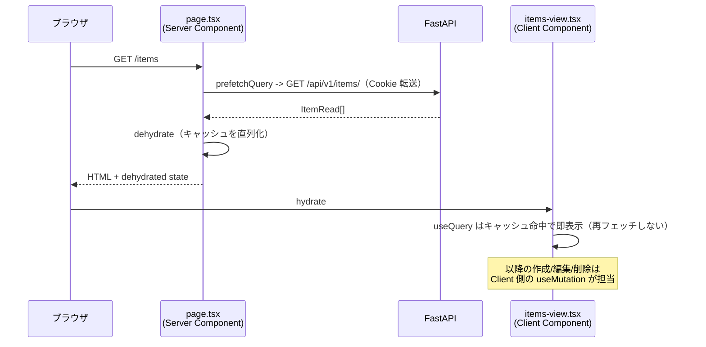
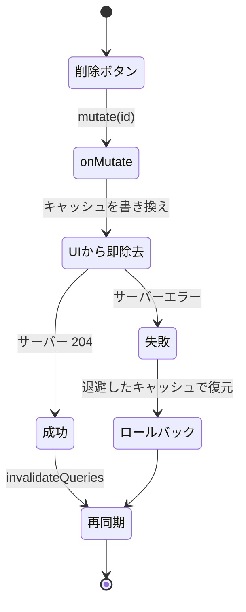

# Chapter 12: CRUD 画面の実装

[<- 目次に戻る](../README.md)

## この章のゴール

- **[TanStack Query](https://tanstack.com/query/latest)** を導入し、サーバー状態（API のデータ）をキャッシュ・再取得・更新できます
- **Server Component で初期データを prefetch** し、**[HydrationBoundary](https://tanstack.com/query/latest/docs/framework/react/guides/advanced-ssr)** で Client Component に引き渡す公式推奨の SSR 構成を実装できます
- shadcn/ui の **[Dialog](https://ui.shadcn.com/docs/components/base/dialog)** / **[AlertDialog](https://ui.shadcn.com/docs/components/base/alert-dialog)** / **[Table](https://ui.shadcn.com/docs/components/base/table)** でアイテムの一覧・作成・編集・削除画面を作れます
- mutation 後の **`invalidateQueries` による再取得**と、削除での **楽観的更新（optimistic update）** を使い分けられます
- 学んだ CRUD パターンを **ユーザー管理画面に応用**できます（ロール複数選択・読み取り専用フィールド）

## スタート地点

```bash
git checkout chapter12-start
```

## 完成形

```bash
git checkout chapter12-end
```

---

## はじめに

Chapter 11 で、Cookie ベースの認証と `(authenticated)` レイアウトが整いました。この章では、認証済みユーザーが実際にデータを操作する **CRUD 画面**（Create / Read / Update / Delete）を作ります。

題材は Chapter 5 で作った **Item**（`title` / `content` を持つ）の管理画面です。一覧表示・作成・編集・削除を、すべて一覧ページ上の **Dialog（モーダル）** で完結させます。後半では同じパターンを **User 管理画面**に応用します。

この章の主役は **[TanStack Query](https://tanstack.com/query/latest)**（サーバー状態を扱うライブラリ）です。導入の背景・仕組み・用語は「3. TanStack Query を導入する」でまとめて説明します。

### この章で作る・変えるファイル

```
backend/
└── app/routers.py                       # GET /api/v1/roles/ を追加（ロール選択肢用）

frontend/src/
├── app/                                 # 画面（描画 = .tsx をルートにコロケーション）
│   ├── layout.tsx                        # <Providers> でラップ + <Toaster> 追加（変更）
│   ├── providers.tsx                     # 新規: QueryClientProvider
│   └── (authenticated)/
│       ├── page.tsx                      # /items へリダイレクト（変更）
│       ├── about/page.tsx                # 削除
│       ├── app-sidebar.tsx               # メニューを Items / Users に整理（変更）
│       ├── items/
│       │   ├── page.tsx                  # 新規: Server Component（prefetch + Hydration）
│       │   ├── items-view.tsx            # 新規: 一覧（描画）
│       │   ├── item-form-dialog.tsx      # 新規: 作成/編集 Dialog（描画）
│       │   └── delete-item-dialog.tsx    # 新規: 削除確認 Dialog（描画）
│       └── users/
│           ├── page.tsx                  # 新規
│           ├── users-view.tsx            # 新規
│           ├── user-form-dialog.tsx      # 新規（ロール複数選択・username 読み取り専用）
│           └── delete-user-dialog.tsx    # 新規
├── feature/                             # 機能ごとの処理（.ts）
│   ├── items/
│   │   ├── api.ts                        # 新規: queryKey + API 関数（IO）
│   │   └── use-items.ts                  # 新規: useQuery / useMutation フック
│   └── users/
│       ├── api.ts                        # 新規
│       └── use-users.ts                  # 新規
└── lib/                                 # 横断的に使う共通コード
    ├── query/get-query-client.ts         # 新規: QueryClient の生成
    └── api/                              # API 基盤（全 feature 共通, Chapter 11）
        ├── client.ts                     # （既存）
        └── schema.ts                     # （既存・gen:api で更新）
```

> [!NOTE] ポイント解説:
> ディレクトリは **役割で 3 つ**に分けます。  
> - **`app/`** : 画面（描画する `.tsx` をルートにコロケーション）
> - **`feature/<機能名>/`** : 機能ごとの処理（`.ts`。API 呼び出しや TanStack Query のフック）
> - **`lib/`** : 複数機能で使う共通コード（API クライアント基盤など）です。
>
> 「描画」と「処理」を分けておくと、機能が複雑化しても処理の置き場所に困りません。

---

## 1. backend に「ロール一覧」エンドポイントを追加する

先に backend を 1 か所だけ変更します。後半のユーザー管理画面で「ロールを複数選択」するために、選択肢となる**ロール一覧**（id と名前）を取得する API が必要だからです。

`backend/app/routers.py` の import に `RoleRead` を追加します。

```python
# backend/app/routers.py
from app.schemas import (
    UserCreate, UserRead, UserUpdate, UserLogin,
    ItemCreate, ItemRead, ItemUpdate, RoleRead,  # RoleRead を追加
)
```

`read_users` のすぐ下に、ロール一覧を返すエンドポイントを追加します。

```python
# backend/app/routers.py （read_users の直後あたりに追加）
@router.get("/roles/", response_model=list[RoleRead])
def read_roles(
    session: Session = Depends(get_session),
    # ロール情報は管理者向けなので USER_READ 権限を要求する
    _: User = Depends(require_permissions([PermissionType.USER_READ])),
) -> list[Role]:
    """ロール一覧を返す。ユーザー作成・編集の役割選択肢として使う。"""
    roles = session.execute(
        select(Role).order_by(Role.id)
    ).scalars().all()
    return list(roles)
```

> [!NOTE] ポイント解説:
> `Role` と `require_permissions` / `PermissionType` は既に `routers.py` で import 済みです（`RoleRead` だけ追加すれば済みます）。

backend はホットリロードされます。Swagger UI（`http://localhost:8000/docs`）に `GET /api/v1/roles/` が出ていれば成功です。

## 2. OpenAPI から TypeScript 型を再生成する

backend のエンドポイントが増えたので、Chapter 11「1.3 型を生成する」と同じ手順で frontend の型を再生成します。`pnpm gen:api` は **backend の `/openapi.json` を HTTP で取得する** ので、まず backend が起動している必要があります。

```bash
cd $PROJECT_DIR

# Step 1 の backend 変更を反映するため、再ビルドして起動
docker compose down && docker compose up -d --build

# backend の OpenAPI 仕様が取得できることを確認（roles が含まれる）
curl -s http://backend:8000/openapi.json | jq '.paths | keys' | grep roles
# "/api/v1/roles/"
```

backend が応答したら、devcontainer 上で型生成を実行します。

```bash
cd $PROJECT_DIR/frontend

# Chapter 11 で登録済みの gen:api スクリプトを実行
pnpm gen:api
# ✨ openapi-typescript 7.13.0
# 🚀 http://backend:8000/openapi.json -> src/lib/api/schema.ts [...ms]
```

`src/lib/api/schema.ts` に `/api/v1/roles/` のパスと `RoleRead` 型が追加されます。これで frontend から `apiClient.GET("/api/v1/roles/")` を型安全に呼べるようになりました。**backend の変更がコマンド 1 つで TypeScript に反映される**のが OpenAPI 駆動の利点です（Chapter 11 参照）。

> [!NOTE] ポイント解説:
> `pnpm gen:api` を 2 回続けて実行しても差分が出ないことを確認してください。差分が出るなら backend の起動 or 型生成が中途半端です。`schema.ts` は生成物ですが、Chapter 11 と同様コミット推奨です（CI で差分が出ないことを確認する運用は Chapter 14 で扱います）。

## 3. TanStack Query を導入する

### 3.1 なぜ TanStack Query を導入するのか

Chapter 11 までは、Server Component で `await fetch(...)` して表示するだけでした。これは「表示」には十分ですが、**ユーザー操作で変化するデータ**を扱うと途端につらくなります。

```
作成ボタンを押す -> POST /items/ -> 一覧を最新化したい
                                 ^^^^^^^^^^^^^^^^^
                                     ここが問題
```

Server Component が取得したデータはサーバーで確定済みなので、ブラウザ側で「作成したから一覧をもう一度取り直す」を素直に書けません。`router.refresh()` でページ全体を再取得する手もありますが、

- 「どのデータが古くなったか」を画面側が毎回手で管理する
- ローディング・エラー・再試行を mutation のたびに自前で書く
- 楽観的更新（サーバー応答を待たずに UI を先に更新）が難しい

といった課題が残ります。

### 3.2 TanStack Query とは

**[TanStack Query](https://tanstack.com/query/latest)** は、API から取ってくるデータ（=サーバー状態）の取得・キャッシュ・再取得・更新を専門に扱うライブラリです。`useState` / `useEffect` で fetch を手書きすると毎回付いて回る「ローディング・エラー・キャッシュ・再取得」を、宣言的に書けるようにします。

中心となる考え方は **「`queryKey` ごとにデータをキャッシュし、古くなったら（invalidate されたら）自動で取り直す」** ことです。以下、TODO アプリを例に基本パターンを見ます（本章のコードではないイメージ用サンプルです）。

#### 読み取り: `useQuery`

`useQuery` は取得処理を `queryKey`（キャッシュの識別子）と `queryFn`（実際の取得関数）で宣言します。戻り値の `isPending`（取得中）/ `error`（失敗）/ `data`（成功）で **3 つの状態を分岐**できるので、ローディングとエラー処理を自前の `useState` 無しで書けます。

```tsx
function TodoList() {
  const { data, isPending, error } = useQuery({
    queryKey: ["todos"], // このデータを識別するキー
    queryFn: () => fetch("/api/todos").then((r) => r.json()), // 取得処理
  });

  // 取得中（まだキャッシュにデータが無い）
  if (isPending) return <p>読み込み中...</p>;
  // 取得失敗（queryFn が投げた / fetch が reject した）
  if (error) return <p>エラー: {error.message}</p>;

  // 成功。data は queryFn の戻り値
  return (
    <ul>
      {data.map((todo) => (
        <li key={todo.id}>{todo.title}</li>
      ))}
    </ul>
  );
}
```

> [!TIP] 公式ドキュメント:
> - [Queries | TANSTACK QUERY](https://tanstack.com/query/v5/docs/framework/react/guides/queries)
> - [Query Keys | TANSTACK QUERY](https://tanstack.com/query/v5/docs/framework/react/guides/query-keys)
> - [Query Functions | TANSTACK QUERY](https://tanstack.com/query/v5/docs/framework/react/guides/query-functions)
> - API Reference
>   - [useQuery | TANSTACK QUERY](https://tanstack.com/query/v5/docs/framework/react/reference/useQuery)


#### 変更と再取得: `useMutation` + `invalidateQueries`

データを変更する操作（追加・更新・削除）は `useMutation` です。`mutate()` を呼ぶと `mutationFn` が走り、`isPending` で送信中、`onSuccess` で成功後の処理を書けます。**追加が成功したら一覧を最新化したい** ので、`onSuccess` の中で `queryClient.invalidateQueries` を呼び、`["todos"]` のキャッシュを「古い」とマークします。すると、その `queryKey` を使っている `useQuery`（上の `TodoList`）が **自動で再取得**します。

```tsx
function AddTodoButton() {
  // どのキャッシュを無効化するか指示するために QueryClient を取り出す
  const queryClient = useQueryClient();

  const mutation = useMutation({
    mutationFn: (title: string) =>
      fetch("/api/todos", {
        method: "POST",
        body: JSON.stringify({ title }),
      }).then((r) => r.json()),
    onSuccess: () => {
      // "todos" を古いとマーク -> TodoList の useQuery が自動で再取得する
      queryClient.invalidateQueries({ queryKey: ["todos"] });
    },
  });

  return (
    <button
      disabled={mutation.isPending} // 送信中は二重実行を防ぐ
      onClick={() => mutation.mutate("牛乳を買う")} // mutationFn の引数を渡して実行
    >
      {mutation.isPending ? "追加中..." : "追加"}
    </button>
  );
}
```

> [!NOTE] ポイント解説:
> 「一覧を手で差し替える」のではなく「`queryKey` を古いとマークするだけ」で再取得が走るのが TanStack Query の肝です。**変更系（`useMutation`）と読み取り系（`useQuery`）は同じ `queryKey` を介して間接的につながり**、画面のどこで変更しても一覧が追従します。

> [!TIP] 公式ドキュメント:
> - [Mutations | TANSTACK QUERY](https://tanstack.com/query/v5/docs/framework/react/guides/mutations)
> - [Query Invalidation | TANSTACK QUERY](https://tanstack.com/query/v5/docs/framework/react/guides/query-invalidation)
> - [Invalidations from Mutations | TANSTACK QUERY](https://tanstack.com/query/v5/docs/framework/react/guides/invalidations-from-mutations)
> - API Reference
>   - [useQueryClient | TANSTACK QUERY](https://tanstack.com/query/v5/docs/framework/react/reference/useQueryClient)
>   - [useMutation | TANSTACK QUERY](https://tanstack.com/query/v5/docs/framework/react/reference/useMutation)

#### サーバー側での先読み: `prefetchQuery`

`useQuery` はブラウザで動くため、初回表示時に一瞬データが空になります。これを避けるため、Server Component で **先にサーバー側のキャッシュへ入れておく**のが `prefetchQuery` です。`useQuery` と **同じ `queryKey` / `queryFn`** を使うのがポイントです（後でクライアントのキャッシュと繋ぐため）。

```tsx
// Server Component（イメージ）。表示前にサーバーで取得してキャッシュに載せる
const queryClient = getQueryClient();
await queryClient.prefetchQuery({
  queryKey: ["todos"], // useQuery と同じキーにする
  queryFn: () => fetch("...").then((r) => r.json()),
});
// この後 dehydrate して <HydrationBoundary> でクライアントへ引き渡す
// （実際の組み立ては「5. 一覧ページ」で説明します）
```

> [!TIP] 公式ドキュメント
> - [Prefetching & Router Integration | TANSTACK QUERY](https://tanstack.com/query/v5/docs/framework/react/guides/prefetching)
> - API Reference
>   - [usePrefetchQuery | TANSTACK QUERY](https://tanstack.com/query/v5/docs/framework/react/reference/usePrefetchQuery)


#### 本章での役割分担は次のとおりです。

| 役割 | 担当 |
| :--- | :--- |
| 初期データの取得（SSR で速く表示） | Server Component が `prefetchQuery` |
| 画面上での一覧・再取得・作成・更新・削除 | Client Component が `useQuery` / `useMutation` |

### 3.3 インストール

devcontainer 上で、frontend に TanStack Query を追加します。

```bash
cd $PROJECT_DIR/frontend
pnpm add '@tanstack/react-query@^5.100.14'
```

### 3.4 QueryClient を生成する関数

`QueryClient` はキャッシュの本体です。**サーバーとブラウザで作り方を変える**必要があります。

- **サーバー**: リクエストごとに新しい `QueryClient` を作る（リクエスト間でキャッシュを共有すると別ユーザーのデータが混ざる）
- **ブラウザ**: 1 つを使い回す（再レンダーのたびに作り直すとキャッシュが消える）

```bash
mkdir -p $PROJECT_DIR/frontend/src/lib/query
touch $PROJECT_DIR/frontend/src/lib/query/get-query-client.ts
```

```ts
// src/lib/query/get-query-client.ts
import { QueryClient, environmentManager } from "@tanstack/react-query";

function makeQueryClient() {
  return new QueryClient({
    defaultOptions: {
      queries: {
        // staleTime: 取得データを「新鮮 (fresh)」とみなす時間。
        // fresh の間は再マウント・タブの再フォーカス・再接続時の自動再取得を抑える。
        // 期限切れ (stale) になっても自動では API を叩かず、次のトリガー時に取り直すだけ。
        // 60 秒に設定し、prefetch 直後にブラウザで即再取得が走るのを防ぐ。
        staleTime: 60 * 1000,
      },
    },
  });
}

let browserQueryClient: QueryClient | undefined = undefined;

export function getQueryClient() {
  // サーバー実行かどうかを判定する
  if (environmentManager.isServer()) {
    // サーバー: 毎回新しいインスタンス
    return makeQueryClient();
  }
  // ブラウザ: シングルトン
  if (!browserQueryClient) browserQueryClient = makeQueryClient();
  return browserQueryClient;
}
```

> [!NOTE] ポイント解説:
> サーバー実行の判定には `@tanstack/react-query` の **`environmentManager.isServer()`** を使います。サーバーではリクエストごとに新しい `QueryClient` を、ブラウザでは 1 つのインスタンスを使い回します。

### 3.5 Provider を用意する

3.4 で作った `QueryClient`（キャッシュ本体）を、配下のどのコンポーネントからでも使えるように登録するのが **`QueryClientProvider`** です。ツリーの最上位に置いておくと、配下の `useQuery` / `useMutation` がすべて同じ `QueryClient`（＝同じキャッシュ）を共有します。これがあるおかげで、ある画面で更新したキャッシュを別の画面の `useQuery` がそのまま参照できます。

`QueryClientProvider` は **React Context** の Provider です。React Context は「上位コンポーネントで用意した値を、間のコンポーネントを飛ばして配下のどこのコンポーネントからでも読めるようにする」値の共有の仕組みで、ここでは、 共有する値が **`QueryClient`** で、読む側は **`useQuery`**, **`useMutation`** で **QueryClient** にアクセスします。

React Context はブラウザで動く React の機能なので、Provider は **Client Component**（`"use client"`）に置く必要があります。Root layout は Server Component に保ちたいので、Provider だけを `providers.tsx` に切り出します。

> [!NOTE] ポイント解説:
> - **React Context とは**  
>   階層ごとにpropsの受け渡しをすることなく、値をツリー全体で共有する仕組み。`createContext` でコンテキストを作成、 `useContext` でコンテキストを参照。  
>   (`createContext` `useContext` は Client Componentでのみ利用可能)  
>   実装イメージ:  
>   ```tsx
>   // 上位コンポーネント
>   "use client"
>   import { createContext, useState } from "react";
>   const ThemeContext = createContext()  // コンテキスト作成
>   function App() {
>     const [theme, setTheme] = useState("hoge");  // コンテキストに保存する値を定義
>     return (
>      {/* プロバイダでコンテキストに値を設定。は以下のコンポーネントでThemeContextを参照できるようになる */}
>       <ThemeContext value={{ theme, setTheme }}>
>         <Toolbar />
>       </ThemeContext>
>     );
>   }
>   ```
> 
>   ```tsx
>   //中間コンポーネント
>   "use client"
>   function Toolbar() {
>     return <ThemedButton />;
>   }
>   ```
> 
>   ```tsx
>   //下位コンポーネント
>   "use client"
>   import { useContext } from "react";
>   function ThemedButton() {
>     // ThemeContextの値を取得 (props経由で渡さなくても上位コンポーネントのcreateContextで登録した値を参照できる)
>     const { theme, setTheme } = useContext(ThemeContext);
>     return (
>       <p>現在のテーマ: {theme}</p>
>     );
>   }
>   ```

```bash
touch $PROJECT_DIR/frontend/src/app/providers.tsx
```

```tsx
// src/app/providers.tsx
"use client";

import { QueryClientProvider } from "@tanstack/react-query";

import { getQueryClient } from "@/lib/query/get-query-client";

export function Providers({ children }: { children: React.ReactNode }) {
  // getQueryClient はブラウザではシングルトンを返すので useState で固定する必要はない
  const queryClient = getQueryClient();

  return (
    // children のツリー全体で queryClient を参照できるになる
    <QueryClientProvider client={queryClient}>{children}</QueryClientProvider>
  );
}
```

> [!TIP] 公式ドキュメント:
> - [QueryClientProvider | TANSTACK QUERY](https://tanstack.com/query/latest/docs/framework/react/reference/QueryClientProvider)
> - [Passing Data Deeply with Context | React](https://react.dev/learn/passing-data-deeply-with-context)
> - [createContext | React](https://react.dev/reference/react/createContext)
> - [useContext | React](https://react.dev/reference/react/useContext)

### 3.6 トースト通知用の sonner を追加する

作成・更新・削除の結果を知らせるトーストに、shadcn/ui の **[sonner](https://ui.shadcn.com/docs/components/base/sonner)** を使います。あわせて、この章で使うコンポーネント（Table / Dialog / AlertDialog / Checkbox）もまとめて追加しておきます。

```bash
cd $PROJECT_DIR/frontend
pnpm dlx 'shadcn@^4.7.0' add table dialog alert-dialog sonner checkbox --yes
```

### 3.7 Root layout に組み込む

`src/app/layout.tsx` の `<body>` を `<Providers>` でラップし、トーストの表示先 `<Toaster />` を置きます。

```tsx
// src/app/layout.tsx （抜粋・変更点のみ）
import { Providers } from "./providers";  // <- 追加
import { Toaster } from "@/components/ui/sonner";  // <- 追加

// ...フォント定義・metadata は変更なし...

export default function RootLayout({
  children,
}: {
  children: React.ReactNode;
}) {
  return (
    <html
      lang="ja"
      className={`${inter.variable} ${notoSansJP.variable} ${geistMono.variable}`}
    >
      <body>
        {/* TanStack Query のキャッシュをアプリ全体で共有 */}
        <Providers>{children}</Providers>  {/* <- 追加 */}
        {/* トーストの表示先。アプリのどこから toast(...) を呼んでもここに出る */}
        <Toaster />  {/* <- 追加 */}
      </body>
    </html>
  );
}
```

これで TanStack Query を使う土台が整いました。

## 4. アイテムの処理を feature にまとめる

ここから「処理」を `feature/items/` に置いていきます。2 ファイルに分けます。

- **`api.ts`**: `queryKey` と **API 呼び出し関数（IO）**。backend と直接やり取りする部分。
- **`use-items.ts`**: その API 関数を `useQuery` / `useMutation` で包んだ **フック**。キャッシュ更新などの処理はここに集約。

画面（`.tsx`）はこのフックを呼ぶだけにし、描画に専念させます。

### 4.1 API 関数と queryKey（api.ts）

TanStack Query は **`queryKey`** でキャッシュを管理します。キーの文字列が散らばると事故のもとなので 1 か所に集約し、あわせて backend を叩く関数（取得・作成・更新・削除）を定義します。

```bash
mkdir -p $PROJECT_DIR/frontend/src/feature/items
touch $PROJECT_DIR/frontend/src/feature/items/api.ts
```

```ts
// src/feature/items/api.ts
import { queryOptions } from "@tanstack/react-query";

import { apiClient } from "@/lib/api/client";
import type { components } from "@/lib/api/schema";

// schema.ts から型を借りる（backend の型と常に一致する）
export type Item = components["schemas"]["ItemRead"];
export type ItemInput = components["schemas"]["ItemCreate"]; // { title, content }

// queryKey を 1 か所に集約。誤字や不一致を防ぐ
export const itemKeys = {
  all: ["items"] as const,
  list: () => [...itemKeys.all, "list"] as const,
};

// ---- backend を叩く関数（IO） ----

/**
 * アイテム一覧を取得する。
 * - サーバー実行時 (prefetch): cookie を引数で受け取りヘッダに載せる
 * - クライアント実行時: cookie は undefined。apiClient が credentials:"include" で自動送信する
 */
export async function fetchItems(cookie?: string): Promise<Item[]> {
  const { data, error } = await apiClient.GET("/api/v1/items/", {
    headers: cookie ? { Cookie: cookie } : undefined,
  });
  if (error) throw new Error("アイテム一覧の取得に失敗しました");
  return data;
}

export async function createItem(input: ItemInput): Promise<Item> {
  const { data, error } = await apiClient.POST("/api/v1/items/", { body: input });
  if (error) throw new Error("アイテムの作成に失敗しました");
  return data;
}

export async function updateItem(id: number, input: ItemInput): Promise<Item> {
  const { data, error } = await apiClient.PATCH("/api/v1/items/{item_id}", {
    params: { path: { item_id: id } },
    body: input,
  });
  if (error) throw new Error("アイテムの更新に失敗しました");
  return data;
}

export async function deleteItem(id: number): Promise<void> {
  const { error } = await apiClient.DELETE("/api/v1/items/{item_id}", {
    params: { path: { item_id: id } },
  });
  if (error) throw new Error("アイテムの削除に失敗しました");
}

// server / client 双方から使う queryOptions（queryKey を共有しつつ Cookie の渡し方を吸収）
export function itemsQueryOptions(cookie?: string) {
  return queryOptions({
    queryKey: itemKeys.list(),
    queryFn: () => fetchItems(cookie),
  });
}
```

> [!NOTE] ポイント解説:  
> - `fetchItems` だけ Cookie を引数で受け取る理由  
>    **Server Component の prefetch からも呼ぶ**からです。サーバー側では `credentials: "include"` が効かないので、明示的にcookieをheaderにセットしてAPIを呼び出す必要があります。

### 4.2 TanStack Query フック（use-items.ts）

`api.ts` の関数を `useQuery` / `useMutation` で包んだフックを用意します。画面側はこのフックを呼ぶだけになり、キャッシュの再取得などの処理はすべてここに集約されます。

```bash
touch $PROJECT_DIR/frontend/src/feature/items/use-items.ts
```

```ts
// src/feature/items/use-items.ts
import { useMutation, useQuery, useQueryClient } from "@tanstack/react-query";
import { toast } from "sonner";

import {
  itemKeys,
  itemsQueryOptions,
  createItem,
  updateItem,
  type ItemInput,
} from "./api";

// 一覧取得（prefetch 済みのキャッシュをそのまま使う）
export function useItems() {
  return useQuery(itemsQueryOptions());
}

// 作成・編集。mode で呼ぶ API を切り替え、成功したら一覧を再取得する
export function useSaveItem(args: {
  mode: "create" | "edit";
  itemId?: number;
  onSuccess?: () => void;
}) {
  const queryClient = useQueryClient();

  return useMutation({
    mutationFn: (input: ItemInput) =>
      args.mode === "create" ? createItem(input) : updateItem(args.itemId!, input),
    onSuccess: () => {
      // 一覧キャッシュを無効化 -> useItems が自動で再取得
      queryClient.invalidateQueries({ queryKey: itemKeys.list() });
      toast.success(args.mode === "create" ? "アイテムを作成しました" : "アイテムを更新しました");
      args.onSuccess?.();
    },
  });
}
```

> [!NOTE] ポイント解説:  
> - **「描画」と「処理」を分ける**  
>   `useSaveItem` のように **`useMutation` をフックに包んで `feature/` 側に置く**と、`.tsx`（画面）はこのフックを呼ぶだけになり、画面は描画に専念できます。  
>   (削除フック（`useDeleteItem`）は楽観的更新を扱うので「7. 削除」で追加します)

## 5. 一覧ページ（Server prefetch + HydrationBoundary）

いよいよ画面です。一覧ページは **Server Component**（`page.tsx`）と **Client Component**（`items-view.tsx`）に分けます。

### Server prefetch と HydrationBoundary とは

TanStack Query を Client Component だけで使うと、ブラウザが JS を読み込んでから初めて `useQuery` が走るため、**最初の一瞬だけデータが空**になります（ローディングのちらつき）。  
これを避けるため、Next.js App Router では次の流れでサーバー側に下準備をさせます。

| 用語 | 役割 |
| :--- | :--- |
| **`prefetchQuery`** | Server Component 側の `QueryClient` で、表示前に API を叩いてキャッシュへ入れておく |
| **`dehydrate`** | サーバー側キャッシュを、HTML と一緒に運べる **プレーンなデータ（直列化した状態）** に変換する。 |
| **`HydrationBoundary`** | 運ばれてきた dehydrate 済みデータを、ブラウザ側の `QueryClient` キャッシュへ **詰め直す（hydrate する）** |

> [!NOTE] ポイント解説:
> - **dehydrate（脱水）/ hydrate（加水）** は水分けのメタファー  
>   サーバーの `QueryClient` はメモリ上のオブジェクトで、関数なども含むため**そのままではブラウザへ渡せません**。  
>   `dehydrate` で「動く部分」を抜いて **乾いたデータ（JSON 化できるスナップショット）** にし、HTML と一緒にブラウザへ送ります。  
>   ブラウザでは `HydrationBoundary` が「水を戻す（hydrate）」ように、そのスナップショットを `QueryClient` のキャッシュへ復元します。

結果として、ブラウザの `useQuery` は最初からキャッシュ命中になり、**初期表示はサーバーで用意した状態のまま**・以降の操作（再取得・作成・削除）だけクライアントが担当する、という分担が成立します。`prefetchQuery` と `useQuery` は **同じ `queryKey` を使う**のがポイントです（キーが一致して初めてキャッシュが繋がります）。




### 5.1 Server Component（prefetch）

```bash
mkdir -p $PROJECT_DIR/frontend/src/app/\(authenticated\)/items
touch $PROJECT_DIR/frontend/src/app/\(authenticated\)/items/page.tsx
```

```tsx
// src/app/(authenticated)/items/page.tsx
import { cookies } from "next/headers";
import { dehydrate, HydrationBoundary } from "@tanstack/react-query";
import type { Metadata } from "next";

import { getQueryClient } from "@/lib/query/get-query-client";
import { itemsQueryOptions } from "@/feature/items/api";

import { ItemsView } from "./items-view";

export const metadata: Metadata = {
  title: "アイテム管理 | Web Tutorial v2",
};

export default async function ItemsPage() {
  // Next.js 16 では cookies() は非同期。await が必要
  const cookie = (await cookies()).toString();
  const queryClient = getQueryClient();

  // サーバー側で一覧を取得してキャッシュに載せる
  await queryClient.prefetchQuery(itemsQueryOptions(cookie));

  return (
    // dehydrate でキャッシュを直列化し、HydrationBoundary 経由でクライアントへ渡す
    <HydrationBoundary state={dehydrate(queryClient)}>
      <ItemsView />
    </HydrationBoundary>
  );
}
```

### 5.2 Client Component（一覧表示）

まずは一覧と各ボタンの「ガワ」だけです（Dialog の中身は次節以降）。

```bash
touch $PROJECT_DIR/frontend/src/app/\(authenticated\)/items/items-view.tsx
```

```tsx
// src/app/(authenticated)/items/items-view.tsx
"use client";

import { useState } from "react";
import { Pencil, Plus, Trash2 } from "lucide-react";

import { useItems } from "@/feature/items/use-items";
import type { Item } from "@/feature/items/api";
import { Button } from "@/components/ui/button";
import {
  Table,
  TableBody,
  TableCell,
  TableHead,
  TableHeader,
  TableRow,
} from "@/components/ui/table";

import { ItemFormDialog } from "./item-form-dialog";
import { DeleteItemDialog } from "./delete-item-dialog";

export function ItemsView() {
  // prefetch 済みなので初回はキャッシュから即座に返る（staleTime 経過後に裏で再取得）
  const { data: items, error } = useItems();

  const [createOpen, setCreateOpen] = useState(false);
  // 編集・削除の対象（null = Dialog を閉じている）
  const [editing, setEditing] = useState<Item | null>(null);
  const [deleting, setDeleting] = useState<Item | null>(null);

  return (
    <div className="space-y-4">
      <div className="flex items-center justify-between">
        <h1 className="text-2xl font-bold">アイテム管理</h1>
        <Button onClick={() => setCreateOpen(true)}>
          <Plus />
          新規作成
        </Button>
      </div>

      {error && (
        <p className="text-sm text-red-600" role="alert">
          {error.message}
        </p>
      )}

      <Table>
        <TableHeader>
          <TableRow>
            <TableHead className="w-16">ID</TableHead>
            <TableHead>タイトル</TableHead>
            <TableHead>内容</TableHead>
            <TableHead className="w-32 text-right">操作</TableHead>
          </TableRow>
        </TableHeader>
        <TableBody>
          {items?.length === 0 && (
            <TableRow>
              <TableCell colSpan={4} className="text-center text-muted-foreground">
                アイテムがありません
              </TableCell>
            </TableRow>
          )}
          {items?.map((item) => (
            <TableRow key={item.id}>
              <TableCell>{item.id}</TableCell>
              <TableCell>{item.title}</TableCell>
              <TableCell>{item.content}</TableCell>
              <TableCell className="space-x-2 text-right">
                <Button
                  variant="outline"
                  size="icon"
                  aria-label="編集"
                  onClick={() => setEditing(item)}
                >
                  <Pencil />
                </Button>
                <Button
                  variant="destructive"
                  size="icon"
                  aria-label="削除"
                  onClick={() => setDeleting(item)}
                >
                  <Trash2 />
                </Button>
              </TableCell>
            </TableRow>
          ))}
        </TableBody>
      </Table>

      {/* 作成 Dialog */}
      <ItemFormDialog mode="create" open={createOpen} onOpenChange={setCreateOpen} />

      {/* 編集 Dialog（editing が null でなければ開く） */}
      <ItemFormDialog
        mode="edit"
        item={editing ?? undefined}
        open={editing !== null}
        onOpenChange={(open) => !open && setEditing(null)}
      />

      {/* 削除確認 Dialog */}
      <DeleteItemDialog
        item={deleting}
        onOpenChange={(open) => !open && setDeleting(null)}
      />
    </div>
  );
}
```

この時点ではまだ `ItemFormDialog` / `DeleteItemDialog` が無いのでコンパイルが通りません。次節で作ります。

## 6. 作成・編集（Dialog + useSaveItem）

作成と編集はフォームの中身がほぼ同じなので、**1 つの Dialog コンポーネントを `mode` で共用**します。送信処理は 4.2 で作った **`useSaveItem` フック**を呼ぶだけです。フックの中で成功時に `invalidateQueries` が走り、一覧が自動で再取得されます。Dialog 側は **フォーム入力と描画に専念**します。

```bash
touch $PROJECT_DIR/frontend/src/app/\(authenticated\)/items/item-form-dialog.tsx
```

```tsx
// src/app/(authenticated)/items/item-form-dialog.tsx
"use client";

import { useEffect } from "react";
import { Controller, useForm } from "react-hook-form";
import { standardSchemaResolver } from "@hookform/resolvers/standard-schema";
import { z } from "zod";

import { useSaveItem } from "@/feature/items/use-items";
import type { Item } from "@/feature/items/api";
import { Button } from "@/components/ui/button";
import { Input } from "@/components/ui/input";
import {
  Field,
  FieldError,
  FieldGroup,
  FieldLabel,
} from "@/components/ui/field";
import {
  Dialog,
  DialogContent,
  DialogFooter,
  DialogHeader,
  DialogTitle,
} from "@/components/ui/dialog";

// backend の ItemCreate / ItemUpdate に合わせた入力ルール
const itemSchema = z.object({
  title: z.string().min(1, "タイトルは必須です").max(64, "64 文字以内で入力してください"),
  content: z.string().min(1, "内容は必須です").max(128, "128 文字以内で入力してください"),
});

type ItemFormValues = z.infer<typeof itemSchema>;

type Props = {
  mode: "create" | "edit";
  item?: Item; // edit のとき必須
  open: boolean;
  onOpenChange: (open: boolean) => void;
};

export function ItemFormDialog({ mode, item, open, onOpenChange }: Props) {
  const form = useForm<ItemFormValues>({
    resolver: standardSchemaResolver(itemSchema),
    defaultValues: { title: "", content: "" },
  });

  // Dialog を開くたびに、編集対象の値（or 空）をフォームへ流し込む
  useEffect(() => {
    if (open) {
      form.reset({ title: item?.title ?? "", content: item?.content ?? "" });
    }
  }, [open, item, form]);

  // 作成/編集の処理は feature のフックに集約。成功したら Dialog を閉じる
  const mutation = useSaveItem({
    mode,
    itemId: item?.id,
    onSuccess: () => onOpenChange(false),
  });

  return (
    <Dialog open={open} onOpenChange={onOpenChange}>
      <DialogContent>
        <DialogHeader>
          <DialogTitle>
            {mode === "create" ? "アイテムを作成" : "アイテムを編集"}
          </DialogTitle>
        </DialogHeader>

        <form
          onSubmit={form.handleSubmit((values) => mutation.mutate(values))}
          className="space-y-4"
          noValidate
        >
          <FieldGroup>
            <Controller
              control={form.control}
              name="title"
              render={({ field, fieldState }) => (
                <Field data-invalid={fieldState.invalid}>
                  <FieldLabel htmlFor="item-title">タイトル</FieldLabel>
                  <Input id="item-title" aria-invalid={fieldState.invalid} {...field} />
                  {fieldState.invalid && <FieldError errors={[fieldState.error]} />}
                </Field>
              )}
            />
            <Controller
              control={form.control}
              name="content"
              render={({ field, fieldState }) => (
                <Field data-invalid={fieldState.invalid}>
                  <FieldLabel htmlFor="item-content">内容</FieldLabel>
                  <Input id="item-content" aria-invalid={fieldState.invalid} {...field} />
                  {fieldState.invalid && <FieldError errors={[fieldState.error]} />}
                </Field>
              )}
            />
          </FieldGroup>

          {mutation.isError && (
            <p className="text-sm text-red-600" role="alert">
              {mutation.error.message}
            </p>
          )}

          <DialogFooter>
            <Button type="submit" disabled={mutation.isPending}>
              {mutation.isPending ? "送信中..." : "保存"}
            </Button>
          </DialogFooter>
        </form>
      </DialogContent>
    </Dialog>
  );
}
```

> [!NOTE] ポイント解説:  
> - **処理はフックに集約**: `useSaveItem` が返す `mutation` の `isPending` / `isError` / `error` を使い、Dialog は送信中の無効化やエラー表示だけ行います。API 呼び出しやキャッシュ無効化のコードは `.tsx` に出てきません。
> - **`invalidateQueries`（フック内）が肝**: 「一覧データはもう古い」と宣言するだけで、表示中の `useItems`（= `useQuery`）が自動で再取得します。手で一覧を差し替える必要はありません。
> - 作成・編集で `mode` を渡し分けるだけなので、フォームのコードは 1 つで済みます。

ここまでで作成・編集が動きます。一覧で「新規作成」を押してアイテムを追加すると、Dialog が閉じた直後に一覧へ反映されます。

## 7. 削除（AlertDialog + 楽観的更新）

削除は **[楽観的更新](https://tanstack.com/query/latest/docs/framework/react/guides/optimistic-updates)** で実装します。サーバーの応答を待たず、**先に一覧から消してしまう**ことで体感速度を上げ、もし失敗したら元に戻します。





### 7.1 削除フックを追加する（use-items.ts）

`use-items.ts` に、楽観的更新を行う `useDeleteItem` を追記します。まず import に `deleteItem` と型 `Item` を足します。

```ts
// src/feature/items/use-items.ts （import を更新）
import {
  itemKeys,
  itemsQueryOptions,
  createItem,
  updateItem,
  deleteItem,  // <- 追加
  type Item,  // <- 追加
  type ItemInput,
} from "./api";
```

続けて、ファイル末尾にフックを追記します。

```ts
// src/feature/items/use-items.ts

// （末尾に追記）

// 削除（楽観的更新: 応答を待たず一覧から消し、失敗したら戻す）
export function useDeleteItem() {
  const queryClient = useQueryClient();
  const listKey = itemKeys.list();

  return useMutation({
    mutationFn: deleteItem,

    // mutate(id) が呼ばれた直後（サーバー応答前）に実行される
    onMutate: async (id: number) => {
      // 進行中の再フェッチを止める（楽観的更新を上書きされないように）
      await queryClient.cancelQueries({ queryKey: listKey });
      // ロールバック用に現在のキャッシュを退避
      const previous = queryClient.getQueryData<Item[]>(listKey);
      // キャッシュから対象を除去 -> 一覧から即座に消える
      queryClient.setQueryData<Item[]>(listKey, (old) =>
        (old ?? []).filter((it) => it.id !== id),
      );
      // 戻り値は onError / onSettled の第 3 引数として受け取れる
      return { previous };
    },

    // 失敗したら、退避しておいたキャッシュで元に戻す
    onError: (_err, _id, ctx) => {
      if (ctx?.previous) queryClient.setQueryData(listKey, ctx.previous);
      toast.error("削除に失敗しました");
    },

    onSuccess: () => toast.success("アイテムを削除しました"),

    // 成功・失敗のどちらでも、最後にサーバーと再同期する
    onSettled: () => queryClient.invalidateQueries({ queryKey: listKey }),
  });
}
```

`onMutate` -> `onError`（失敗時のみ）-> `onSettled` の 3 段構成が楽観的更新の定石です。

| コールバック | タイミング | やること |
| :--- | :--- | :--- |
| `onMutate` | `mutate()` 直後（応答前） | `cancelQueries` -> キャッシュ退避 -> 楽観的にキャッシュ更新 |
| `onError` | 失敗時 | 退避したキャッシュでロールバック |
| `onSettled` | 成功・失敗どちらも最後 | `invalidateQueries` でサーバーと再同期 |

> [!NOTE] ポイント解説:
> - **作成・編集で楽観的更新を使わないのは**  
>   DBが自動採番する `id` などが必要で、推測値で UI を先行させる旨みが薄いからです。  
>   **「削除は楽観的更新、作成・更新は invalidate で再取得」**が無理のない使い分けです。

### 7.2 削除確認ダイアログ（delete-item-dialog.tsx）

ダイアログは `useDeleteItem` を呼ぶだけで、楽観的更新の中身は知りません（描画に専念）。

```bash
touch $PROJECT_DIR/frontend/src/app/\(authenticated\)/items/delete-item-dialog.tsx
```

```tsx
// src/app/(authenticated)/items/delete-item-dialog.tsx
"use client";

import { useDeleteItem } from "@/feature/items/use-items";
import type { Item } from "@/feature/items/api";
import {
  AlertDialog,
  AlertDialogAction,
  AlertDialogCancel,
  AlertDialogContent,
  AlertDialogDescription,
  AlertDialogFooter,
  AlertDialogHeader,
  AlertDialogTitle,
} from "@/components/ui/alert-dialog";

export function DeleteItemDialog({
  item,
  onOpenChange,
}: {
  item: Item | null;
  onOpenChange: (open: boolean) => void;
}) {
  const mutation = useDeleteItem();

  return (
    <AlertDialog open={item !== null} onOpenChange={onOpenChange}>
      <AlertDialogContent>
        <AlertDialogHeader>
          <AlertDialogTitle>アイテムを削除しますか？</AlertDialogTitle>
          <AlertDialogDescription>
            「{item?.title}」を削除します。この操作は取り消せません。
          </AlertDialogDescription>
        </AlertDialogHeader>
        <AlertDialogFooter>
          <AlertDialogCancel>キャンセル</AlertDialogCancel>
          <AlertDialogAction
            onClick={() => {
              if (item) mutation.mutate(item.id);
              onOpenChange(false);
            }}
          >
            削除
          </AlertDialogAction>
        </AlertDialogFooter>
      </AlertDialogContent>
    </AlertDialog>
  );
}
```

## 8. ナビゲーションを CRUD 画面中心に整える

Chapter 10・11 で置いた Home / About はデモ用のページでした。この章で実アプリの形になったので、ナビゲーションを **Items / Users 中心**に整理します。

1. サイドバーのメニューを Items / Users だけにする
2. トップ（`/`）にアクセスしたら `/items` へリダイレクトする
3. 不要になった About ページを削除する

### 8.1 サイドバーのメニューを差し替える

`src/app/(authenticated)/app-sidebar.tsx` のメニュー配列を Items / Users に置き換えます。

```tsx
// src/app/(authenticated)/app-sidebar.tsx （抜粋・変更点のみ）
import { Package, Users, type LucideIcon } from "lucide-react";  // <- 変更

const items: MenuItem[] = [
  // { title: "Home", url: "/", icon: Home },        // <- 削除
  // { title: "About", url: "/about", icon: Info },  // <- 削除
  { title: "Items", url: "/items", icon: Package },  // <- 追加
  { title: "Users", url: "/users", icon: Users },    // <- 追加
];
```

不要になった `Home` / `Info` の import は削除します。

### 8.2 トップを `/items` へリダイレクトする

`src/app/(authenticated)/page.tsx` を、`/items` へのリダイレクトだけを行う Server Component に置き換えます。

```tsx
// src/app/(authenticated)/page.tsx
import { redirect } from "next/navigation";

export default function HomePage() {
  // 認証済みユーザーのトップはアイテム管理画面とする
  redirect("/items");
}
```

> [!NOTE] ポイント解説:
> ヘッダーのアプリ名は `<Link href="/">` のままです。`/` が `/items` へリダイレクトするので、アプリ名クリックで自然と一覧へ戻ります。`(authenticated)` レイアウトの認証ガードは `/` にも効くため、未ログインなら `/items` に届く前に `/login` へ送られます。

### 8.3 About ページを削除する

```bash
rm $PROJECT_DIR/frontend/src/app/\(authenticated\)/about/page.tsx
```

これで Item の CRUD とナビゲーションが一通り完成しました。

### 8.4 アプリを起動して動作確認する

この章で新しいパッケージ（`@tanstack/react-query`）と shadcn コンポーネントを追加したので、frontend を **再ビルドして起動**し、DB の準備（マイグレーション + seed）を行います（Chapter 11「9.1 再起動と DB の準備」と同じ手順です）。

```bash
cd $PROJECT_DIR

# コンテナを破棄して --build 付きで作り直す（追加した依存を反映）
docker compose down && docker compose up -d --build

sleep 5

# 環境変数の読み込み（DB 接続用）
export $(grep -v '^#' $PROJECT_DIR/backend/.env | xargs)

cd $PROJECT_DIR/backend

# DB マイグレーションを適用（未適用ぶんだけ流れる）
uv run alembic upgrade head

# roles・確認用ユーザーの seed（Chapter 4 で作った冪等スクリプト）
uv run python -m app.seed

# ユーザーが入っていることを確認
PGPASSWORD=$DB_PASSWORD psql -h $DB_HOST -p $DB_PORT -U $DB_USER -d $DB_NAME -c "SELECT username FROM users;"
#  username
# -----------
#  sys_admin
#  loc_admin
#  loc_operator
# (3 rows)
```

> [!NOTE] ポイント解説:
> devcontainer 上で `pnpm add` した依存は frontend コンテナ内の `node_modules` には自動では入りません。`docker compose ... --build` で作り直すと、更新後の `package.json` をもとに依存がインストールされます（`src/` 以下はホストをマウントしているのでコード編集はホットリロードで反映）。マイグレーションと seed は、ログイン用ユーザー（`sys_admin` など）と、ユーザー管理画面の選択肢になるロールを用意するために必要です（どちらも冪等）。

ブラウザで `http://localhost:8080`（nginx 経由）を開き、ログインして Item の操作を確認します（Item はどのユーザーでも操作できます）。

1. トップ（`/`）が `/items` にリダイレクトされ、一覧が表示される
2. 「新規作成」 -> タイトル・内容を入力 -> 保存 -> 一覧に即追加され、トーストが出る
3. 行の「編集」 -> 値を変更 -> 保存 -> 一覧に反映
4. 行の「削除」 -> 確認 -> 行が即座に消える（楽観的更新）

ここまで動けば Item 側は完成です。続けて、同じパターンを User 管理画面に応用します。

## 9. ユーザー管理画面（応用）

ここからは同じパターンを **User 管理画面**に応用します。構成（Server prefetch + HydrationBoundary + Dialog）は Item と同じなので、**Item と違う点だけ**を説明します。

User 管理は `USER_READ` 権限が必要です。**`sys_admin` / `admin` でログイン**して操作してください（Item は誰でも自分のぶんを操作できますが、User 一覧は管理者専用です）。

User の Item との違い:

| 観点 | Item | User |
| :--- | :--- | :--- |
| 作成フィールド | title, content | username, password, ロール（複数選択） |
| 編集時の username | — | **読み取り専用**（変更不可） |
| 編集時の password | — | **空なら変更なし** |
| ロール | なし | チェックボックスで複数選択（`GET /roles/` の結果が選択肢） |

### 9.1 API 関数と queryKey（api.ts）

items と同じ構成です。ユーザーに加えて、選択肢になる**ロール一覧**も取得します。ユーザーは作成と編集でリクエストの形が違う（作成は `username`+`password`+`role_ids`、編集は変更したい項目だけ）ので、`UserCreate` / `UserUpdate` の型をそのまま使います。

```bash
mkdir -p $PROJECT_DIR/frontend/src/feature/users
touch $PROJECT_DIR/frontend/src/feature/users/api.ts
```

```ts
// src/feature/users/api.ts
import { queryOptions } from "@tanstack/react-query";

import { apiClient } from "@/lib/api/client";
import type { components } from "@/lib/api/schema";

export type User = components["schemas"]["UserRead"];
export type Role = components["schemas"]["RoleRead"];
export type UserCreate = components["schemas"]["UserCreate"];
export type UserUpdate = components["schemas"]["UserUpdate"];

export const userKeys = {
  all: ["users"] as const,
  list: () => [...userKeys.all, "list"] as const,
};

export const roleKeys = {
  all: ["roles"] as const,
  list: () => [...roleKeys.all, "list"] as const,
};

// ---- backend を叩く関数（IO） ----

export async function fetchUsers(cookie?: string): Promise<User[]> {
  const { data, error } = await apiClient.GET("/api/v1/users/", {
    headers: cookie ? { Cookie: cookie } : undefined,
  });
  if (error) throw new Error("ユーザー一覧の取得に失敗しました");
  return data;
}

export async function fetchRoles(cookie?: string): Promise<Role[]> {
  const { data, error } = await apiClient.GET("/api/v1/roles/", {
    headers: cookie ? { Cookie: cookie } : undefined,
  });
  if (error) throw new Error("ロール一覧の取得に失敗しました");
  return data;
}

export async function createUser(body: UserCreate): Promise<User> {
  const { data, error } = await apiClient.POST("/api/v1/users/", { body });
  if (error) {
    // backend は重複ユーザー名などを detail（文字列）で返す
    throw new Error(
      typeof error.detail === "string" ? error.detail : "ユーザーの作成に失敗しました",
    );
  }
  return data;
}

export async function updateUser(id: number, body: UserUpdate): Promise<User> {
  const { data, error } = await apiClient.PATCH("/api/v1/users/{user_id}", {
    params: { path: { user_id: id } },
    body,
  });
  if (error) throw new Error("ユーザーの更新に失敗しました");
  return data;
}

export async function deleteUser(id: number): Promise<void> {
  const { error } = await apiClient.DELETE("/api/v1/users/{user_id}", {
    params: { path: { user_id: id } },
  });
  if (error) throw new Error("ユーザーの削除に失敗しました");
}

export function usersQueryOptions(cookie?: string) {
  return queryOptions({ queryKey: userKeys.list(), queryFn: () => fetchUsers(cookie) });
}

export function rolesQueryOptions(cookie?: string) {
  return queryOptions({ queryKey: roleKeys.list(), queryFn: () => fetchRoles(cookie) });
}
```

### 9.2 フック（use-users.ts）

items と同じく、フックに処理を集約します。作成と編集でリクエストボディの組み立てが違うので、その分岐も**フックの中**に閉じ込めます（画面は値を渡すだけ）。

```bash
touch $PROJECT_DIR/frontend/src/feature/users/use-users.ts
```

```ts
// src/feature/users/use-users.ts
import { useMutation, useQuery, useQueryClient } from "@tanstack/react-query";
import { toast } from "sonner";

import {
  userKeys,
  usersQueryOptions,
  rolesQueryOptions,
  createUser,
  updateUser,
  deleteUser,
  type User,
} from "./api";

// フォームの入力値（作成・編集で共通の形）
export type UserFormValues = {
  username: string;
  password: string;
  role_ids: number[];
};

export function useUsers() {
  return useQuery(usersQueryOptions());
}

export function useRoles() {
  return useQuery(rolesQueryOptions());
}

// 作成・編集。mode でリクエストの形を組み立て分ける
export function useSaveUser(args: {
  mode: "create" | "edit";
  userId?: number;
  onSuccess?: () => void;
}) {
  const queryClient = useQueryClient();

  return useMutation({
    mutationFn: (values: UserFormValues) => {
      if (args.mode === "create") {
        return createUser({
          username: values.username,
          password: values.password,
          role_ids: values.role_ids,
        });
      }
      // 編集: username は変更不可。password は入力があるときだけ送る
      return updateUser(args.userId!, {
        role_ids: values.role_ids,
        ...(values.password ? { password: values.password } : {}),
      });
    },
    onSuccess: () => {
      queryClient.invalidateQueries({ queryKey: userKeys.list() });
      toast.success(args.mode === "create" ? "ユーザーを作成しました" : "ユーザーを更新しました");
      args.onSuccess?.();
    },
  });
}

// 削除（items と同じ楽観的更新パターン）
export function useDeleteUser() {
  const queryClient = useQueryClient();
  const listKey = userKeys.list();

  return useMutation({
    mutationFn: deleteUser,
    onMutate: async (id: number) => {
      await queryClient.cancelQueries({ queryKey: listKey });
      const previous = queryClient.getQueryData<User[]>(listKey);
      queryClient.setQueryData<User[]>(listKey, (old) =>
        (old ?? []).filter((u) => u.id !== id),
      );
      return { previous };
    },
    onError: (_err, _id, ctx) => {
      if (ctx?.previous) queryClient.setQueryData(listKey, ctx.previous);
      toast.error("削除に失敗しました");
    },
    onSuccess: () => toast.success("ユーザーを削除しました"),
    onSettled: () => queryClient.invalidateQueries({ queryKey: listKey }),
  });
}
```

### 9.3 Server Component（2 つのクエリを prefetch）

ユーザー一覧とロール一覧を**まとめて** prefetch します。

```bash
mkdir -p $PROJECT_DIR/frontend/src/app/\(authenticated\)/users
touch $PROJECT_DIR/frontend/src/app/\(authenticated\)/users/page.tsx
```

```tsx
// src/app/(authenticated)/users/page.tsx
import { cookies } from "next/headers";
import { dehydrate, HydrationBoundary } from "@tanstack/react-query";
import type { Metadata } from "next";

import { getQueryClient } from "@/lib/query/get-query-client";
import { usersQueryOptions, rolesQueryOptions } from "@/feature/users/api";

import { UsersView } from "./users-view";

export const metadata: Metadata = {
  title: "ユーザー管理 | Web Tutorial v2",
};

export default async function UsersPage() {
  const cookie = (await cookies()).toString();
  const queryClient = getQueryClient();

  // ユーザー一覧とロール一覧を並行で prefetch
  await Promise.all([
    queryClient.prefetchQuery(usersQueryOptions(cookie)),
    queryClient.prefetchQuery(rolesQueryOptions(cookie)),
  ]);

  return (
    <HydrationBoundary state={dehydrate(queryClient)}>
      <UsersView />
    </HydrationBoundary>
  );
}
```

### 9.4 一覧表示

ロールは名前を `, ` でつないで表示します。

```bash
touch $PROJECT_DIR/frontend/src/app/\(authenticated\)/users/users-view.tsx
```

```tsx
// src/app/(authenticated)/users/users-view.tsx
"use client";

import { useState } from "react";
import { Pencil, Plus, Trash2 } from "lucide-react";

import { useUsers } from "@/feature/users/use-users";
import type { User } from "@/feature/users/api";
import { Button } from "@/components/ui/button";
import {
  Table,
  TableBody,
  TableCell,
  TableHead,
  TableHeader,
  TableRow,
} from "@/components/ui/table";

import { UserFormDialog } from "./user-form-dialog";
import { DeleteUserDialog } from "./delete-user-dialog";

export function UsersView() {
  const { data: users, error } = useUsers();

  const [createOpen, setCreateOpen] = useState(false);
  const [editing, setEditing] = useState<User | null>(null);
  const [deleting, setDeleting] = useState<User | null>(null);

  return (
    <div className="space-y-4">
      <div className="flex items-center justify-between">
        <h1 className="text-2xl font-bold">ユーザー管理</h1>
        <Button onClick={() => setCreateOpen(true)}>
          <Plus />
          新規作成
        </Button>
      </div>

      {error && (
        <p className="text-sm text-red-600" role="alert">
          {error.message}
        </p>
      )}

      <Table>
        <TableHeader>
          <TableRow>
            <TableHead className="w-16">ID</TableHead>
            <TableHead>ユーザー名</TableHead>
            <TableHead>ロール</TableHead>
            <TableHead className="w-32 text-right">操作</TableHead>
          </TableRow>
        </TableHeader>
        <TableBody>
          {users?.map((user) => (
            <TableRow key={user.id}>
              <TableCell>{user.id}</TableCell>
              <TableCell>{user.username}</TableCell>
              <TableCell>{user.roles.map((r) => r.name).join(", ")}</TableCell>
              <TableCell className="space-x-2 text-right">
                <Button
                  variant="outline"
                  size="icon"
                  aria-label="編集"
                  onClick={() => setEditing(user)}
                >
                  <Pencil />
                </Button>
                <Button
                  variant="destructive"
                  size="icon"
                  aria-label="削除"
                  onClick={() => setDeleting(user)}
                >
                  <Trash2 />
                </Button>
              </TableCell>
            </TableRow>
          ))}
        </TableBody>
      </Table>

      <UserFormDialog mode="create" open={createOpen} onOpenChange={setCreateOpen} />
      <UserFormDialog
        mode="edit"
        user={editing ?? undefined}
        open={editing !== null}
        onOpenChange={(open) => !open && setEditing(null)}
      />
      <DeleteUserDialog
        user={deleting}
        onOpenChange={(open) => !open && setDeleting(null)}
      />
    </div>
  );
}
```

### 9.5 作成・編集 Dialog（ロール複数選択・username 読み取り専用）

Item との違いは、**バリデーションが mode で変わる**点と、**ロールをチェックボックスで複数選択**する点です。作成/編集でリクエストボディが違う処理は `useSaveUser`（9.2）に入れたので、ダイアログはフォーム入力と描画に専念します。

```bash
touch $PROJECT_DIR/frontend/src/app/\(authenticated\)/users/user-form-dialog.tsx
```

```tsx
// src/app/(authenticated)/users/user-form-dialog.tsx
"use client";

import { useEffect, useMemo } from "react";
import { Controller, useForm } from "react-hook-form";
import { standardSchemaResolver } from "@hookform/resolvers/standard-schema";
import { z } from "zod";

import { useRoles, useSaveUser } from "@/feature/users/use-users";
import type { User } from "@/feature/users/api";
import { Button } from "@/components/ui/button";
import { Input } from "@/components/ui/input";
import { Checkbox } from "@/components/ui/checkbox";
import {
  Field,
  FieldError,
  FieldGroup,
  FieldLabel,
} from "@/components/ui/field";
import {
  Dialog,
  DialogContent,
  DialogFooter,
  DialogHeader,
  DialogTitle,
} from "@/components/ui/dialog";

// mode によってルールが変わる:
// - create: username 必須 / password 8 文字以上
// - edit  : username は読み取り専用なので検証しない / password は空なら変更なし
function buildSchema(mode: "create" | "edit") {
  return z.object({
    username:
      mode === "create"
        ? z.string().min(1, "ユーザー名は必須です")
        : z.string(),
    password:
      mode === "create"
        ? z.string().min(8, "パスワードは 8 文字以上で入力してください")
        : z
            .string()
            .refine(
              (v) => v === "" || v.length >= 8,
              "パスワードは 8 文字以上で入力してください",
            ),
    role_ids: z.array(z.number()).min(1, "ロールを 1 つ以上選択してください"),
  });
}

type UserFormValues = z.infer<ReturnType<typeof buildSchema>>;

type Props = {
  mode: "create" | "edit";
  user?: User; // edit のとき必須
  open: boolean;
  onOpenChange: (open: boolean) => void;
};

export function UserFormDialog({ mode, user, open, onOpenChange }: Props) {
  // ロールの選択肢（page.tsx で prefetch 済み）
  const { data: roles } = useRoles();

  const schema = useMemo(() => buildSchema(mode), [mode]);
  const form = useForm<UserFormValues>({
    resolver: standardSchemaResolver(schema),
    defaultValues: { username: "", password: "", role_ids: [] },
  });

  useEffect(() => {
    if (open) {
      form.reset({
        username: user?.username ?? "",
        password: "",
        role_ids: user?.roles.map((r) => r.id) ?? [],
      });
    }
  }, [open, user, form]);

  // 作成/編集の処理（mode によるボディ組み立て含む）は feature のフックに集約
  const mutation = useSaveUser({
    mode,
    userId: user?.id,
    onSuccess: () => onOpenChange(false),
  });

  return (
    <Dialog open={open} onOpenChange={onOpenChange}>
      <DialogContent>
        <DialogHeader>
          <DialogTitle>
            {mode === "create" ? "ユーザーを作成" : "ユーザーを編集"}
          </DialogTitle>
        </DialogHeader>

        <form
          onSubmit={form.handleSubmit((values) => mutation.mutate(values))}
          className="space-y-4"
          noValidate
        >
          <FieldGroup>
            <Controller
              control={form.control}
              name="username"
              render={({ field, fieldState }) => (
                <Field data-invalid={fieldState.invalid}>
                  <FieldLabel htmlFor="user-username">ユーザー名</FieldLabel>
                  <Input
                    id="user-username"
                    // 編集時は username を変更させない
                    disabled={mode === "edit"}
                    aria-invalid={fieldState.invalid}
                    {...field}
                  />
                  {fieldState.invalid && <FieldError errors={[fieldState.error]} />}
                </Field>
              )}
            />

            <Controller
              control={form.control}
              name="password"
              render={({ field, fieldState }) => (
                <Field data-invalid={fieldState.invalid}>
                  <FieldLabel htmlFor="user-password">
                    パスワード
                    {mode === "edit" && "（変更する場合のみ入力）"}
                  </FieldLabel>
                  <Input
                    id="user-password"
                    type="password"
                    autoComplete="new-password"
                    aria-invalid={fieldState.invalid}
                    {...field}
                  />
                  {fieldState.invalid && <FieldError errors={[fieldState.error]} />}
                </Field>
              )}
            />

            <Controller
              control={form.control}
              name="role_ids"
              render={({ field, fieldState }) => (
                <Field data-invalid={fieldState.invalid}>
                  <FieldLabel>ロール</FieldLabel>
                  <div className="space-y-2">
                    {roles?.map((role) => {
                      const checked = field.value.includes(role.id);
                      return (
                        <label key={role.id} className="flex items-center gap-2">
                          <Checkbox
                            checked={checked}
                            onCheckedChange={(c) =>
                              field.onChange(
                                c === true
                                  ? [...field.value, role.id]
                                  : field.value.filter((id) => id !== role.id),
                              )
                            }
                          />
                          <span>{role.name}</span>
                        </label>
                      );
                    })}
                  </div>
                  {fieldState.invalid && <FieldError errors={[fieldState.error]} />}
                </Field>
              )}
            />
          </FieldGroup>

          {mutation.isError && (
            <p className="text-sm text-red-600" role="alert">
              {mutation.error.message}
            </p>
          )}

          <DialogFooter>
            <Button type="submit" disabled={mutation.isPending}>
              {mutation.isPending ? "送信中..." : "保存"}
            </Button>
          </DialogFooter>
        </form>
      </DialogContent>
    </Dialog>
  );
}
```

### 9.6 削除

Item の削除と同じ楽観的更新パターンです。処理は `useDeleteUser`（9.2）に入れてあるので、ダイアログはフックを呼ぶだけです。

```bash
touch $PROJECT_DIR/frontend/src/app/\(authenticated\)/users/delete-user-dialog.tsx
```

```tsx
// src/app/(authenticated)/users/delete-user-dialog.tsx
"use client";

import { useDeleteUser } from "@/feature/users/use-users";
import type { User } from "@/feature/users/api";
import {
  AlertDialog,
  AlertDialogAction,
  AlertDialogCancel,
  AlertDialogContent,
  AlertDialogDescription,
  AlertDialogFooter,
  AlertDialogHeader,
  AlertDialogTitle,
} from "@/components/ui/alert-dialog";

export function DeleteUserDialog({
  user,
  onOpenChange,
}: {
  user: User | null;
  onOpenChange: (open: boolean) => void;
}) {
  const mutation = useDeleteUser();

  return (
    <AlertDialog open={user !== null} onOpenChange={onOpenChange}>
      <AlertDialogContent>
        <AlertDialogHeader>
          <AlertDialogTitle>ユーザーを削除しますか？</AlertDialogTitle>
          <AlertDialogDescription>
            「{user?.username}」を削除します。この操作は取り消せません。
          </AlertDialogDescription>
        </AlertDialogHeader>
        <AlertDialogFooter>
          <AlertDialogCancel>キャンセル</AlertDialogCancel>
          <AlertDialogAction
            onClick={() => {
              if (user) mutation.mutate(user.id);
              onOpenChange(false);
            }}
          >
            削除
          </AlertDialogAction>
        </AlertDialogFooter>
      </AlertDialogContent>
    </AlertDialog>
  );
}
```

> [!NOTE] ポイント解説:
> ログイン中の自分自身を削除すると、次回のリクエストで認証が通らなくなります。動作確認では `sys_admin` 以外のユーザーを対象にしてください。

## 10. 動作確認（ユーザー管理 + SSR）

ブラウザで `http://localhost:8080`（nginx 経由）を開きます。User 管理は `USER_READ` 権限が必要なので **`sys_admin` / `admin` でログイン**して確認します。

**User**

1. サイドバー「Users」 -> seed 済みの 3 ユーザーが表示される
2. 「新規作成」 -> ユーザー名・パスワード（8 文字以上）・ロールを選択 -> 保存
3. 「編集」 -> ユーザー名が**グレーアウト（変更不可）**、パスワードは空のまま保存すると変わらない
4. 「削除」 -> 確認 -> 消える（楽観的更新）

**SSR の確認（任意）**

- `/items` を開いて「ページのソースを表示」すると、HTML 内に一覧データが含まれます（Server Component で prefetch されたため）。  
- ブラウザの Network タブを見ても、表示直後に `GET /api/v1/items/` が二重に走らないこと（`staleTime` 内なので再フェッチしない）が確認できます。

---

## まとめ

この章では、TanStack Query を導入して Item / User の CRUD 画面を実装しました。

- **TanStack Query** はサーバー状態を `queryKey` ごとにキャッシュします。`useQuery` で読み取り、`useMutation` で変更します。
- **Server prefetch + HydrationBoundary**: Server Component で `prefetchQuery` -> `dehydrate` し、`HydrationBoundary` でクライアントへ引き継ぎます。初期表示は SSR で速く、以降はクライアントの `useQuery` が一元管理します。`queryFn` の Cookie の渡し方だけ server/client で吸収し、`queryKey` は共有します。
- **更新の使い分け**: 作成・更新は `invalidateQueries` で「古くなった」と宣言し自動再取得。削除は `onMutate` / `onError` / `onSettled` の**楽観的更新**で即座に UI へ反映し、失敗時はロールバックします。
- **Dialog ベースの UI**: 一覧に留まったまま作成・編集・削除でき、TanStack Query の再取得・楽観的更新がそのまま画面に現れます。
- **描画と処理の分離（ディレクトリ構成）**: 画面（`.tsx`）は `app/`、機能ごとの処理（`.ts`）は `feature/<機能名>/` に分けました。`api.ts`（API 呼び出し）と `use-*.ts`（`useQuery` / `useMutation` を包んだフック）に処理を集約し、`.tsx` はフックを呼んで描画するだけにしました。横断的な共通コードは `lib/` に置きます。
- **CRUD パターンの応用**: User 管理は Item と同じ骨格で、ロールの複数選択・読み取り専用フィールド・条件付きバリデーションだけが差分でした。

## 次の章

[Chapter 13: E2E テスト (Playwright) ->](../chapter13/README.md)

Chapter 13 では、ここまで作ったログイン〜CRUD のフローを **Playwright** で E2E テストし、ブラウザ操作を自動で検証できるようにしていきます。
