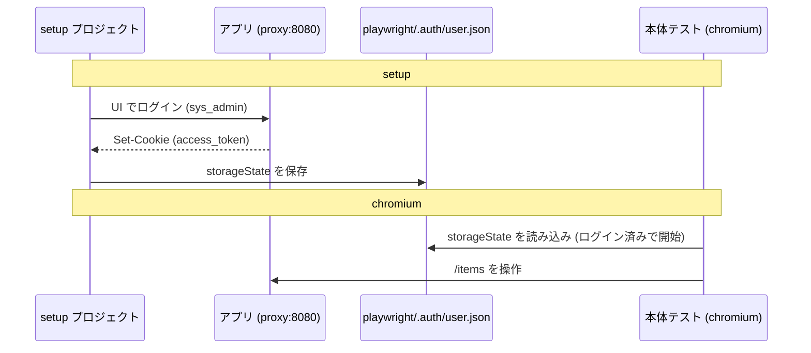

# Chapter 13: E2E テスト (Playwright)

[<- 目次に戻る](../../README.md)

## この章のゴール

- **[Playwright](https://playwright.dev/)** をリポジトリ直下の `e2e/` に導入し、**本物のブラウザ**を動かす E2E テストを書けます
- **[storageState](https://playwright.dev/docs/auth)** で一度だけ UI ログインし、認証状態を全テストで使い回せます
- **ログイン 〜 アイテムの作成・編集・削除** の一連の流れを E2E で自動検証できます
- **[ロケータ](https://playwright.dev/docs/locators)**(`getByRole` / `getByLabel`)で、ユーザー目線の壊れにくいテストを書けます

## スタート地点

```bash
git checkout chapter13-start
```

## 完成形

```bash
git checkout chapter14-start
```

---

## はじめに

ここまでで、backend には pytest(Chapter 8)、frontend は型安全なクライアントと CRUD 画面(Chapter 11・12)が揃いました。最後に、**ブラウザから見て「ログインして、アイテムを作って、編集して、削除する」が本当に通しで動くか**を自動で確認する **E2E(End-to-End)テスト**を追加します。

### E2E テストとは

テストはおおむね次の層に分かれます。

| 層 | 対象 | 例 |
| :--- | :--- | :--- |
| ユニットテスト | 関数・コンポーネント単体 | 1 つの関数の入出力 (主に純粋関数のビジネスロジックなど) |
| 結合テスト | 複数部品の組み合わせ | API + DB(Chapter 8 の pytest) |
| **E2E テスト** | **ユーザー操作の通し** | **ブラウザでログイン -> 画面操作 -> 結果確認** |

E2E は「実際にブラウザを操作して、フロント・backend・DB を**通しで**検証する」もっとも外側のテストです。フロントとバックの結合や、Cookie 認証・画面遷移といった「実際に使うときの流れ」が壊れていないかを守れます。

### Playwright とは

**[Playwright](https://playwright.dev/)** は Microsoft 製の E2E テストフレームワークです。実ブラウザ(Chromium / Firefox / WebKit)を起動し、クリックや入力を自動化してアサーションを書けます。本章で使う用語を先に整理します。

| 用語 | 意味 |
| :--- | :--- |
| **テストランナー** | `@playwright/test`。テストの実行・並列化・レポートを担う |
| **ロケータ (locator)** | 要素の指定方法。`getByRole` / `getByLabel` など**ユーザーに見える属性**で指定する |
| **`storageState`** | Cookie や localStorage を保存したファイル。ログイン状態の使い回しに使う |
| **プロジェクト (project)** | テストのグループ。依存関係(`dependencies`)を持てる。「先にログイン用プロジェクトを走らせる」等に使う |

### この章で作るファイル

E2E は backend / frontend とは独立した関心事なので、**リポジトリ直下に `e2e/` という専用プロジェクト**を作ります。

```
web-tutorial-v2/
└── e2e/                         # <- 今回新規 (独立した pnpm プロジェクト)
    ├── package.json
    ├── playwright.config.ts     # baseURL / プロジェクト構成
    ├── .gitignore
    └── tests/
        ├── auth.setup.ts        # ログインして認証状態を保存
        └── items.spec.ts        # アイテム CRUD のシナリオ
```

> [!NOTE] ポイント解説:
> E2E は「起動済みのアプリ全体」を相手にするので、`backend/` でも `frontend/` でもなく独立した場所に置きます。Chapter 14 で CI に載せるときも、この `e2e/` を 1 つのジョブとして扱えます。

---

## 1. 前提: アプリを起動しておく

E2E は**実際に動いているアプリ**を操作します。Chapter 10〜12 の構成(nginx + frontend + backend + db)を起動しておきます。

```bash
cd $PROJECT_DIR
# db -> migrate(マイグレーション+シード) -> backend -> frontend -> proxy の順で起動する
docker compose down && docker compose up -d --build
```

> [!NOTE] ポイント解説:
> Playwright は **devcontainer 上**で動かし、nginx(proxy) 経由の同一オリジン **`http://proxy:8080`** にアクセスします。Chapter 10 で `next.config.ts` に `allowedDevOrigins: ["proxy"]` を設定済みなので、この `http://proxy:8080` オリジンからでも Next.js dev のリソースが読めます。

---

## 2. e2e プロジェクトを作る

`e2e/` を作り、Playwright のテストランナーを追加します。

```bash
mkdir -p $PROJECT_DIR/e2e
cd $PROJECT_DIR/e2e

# package.json を作成
pnpm init

# Playwright テストランナーを追加
pnpm add -D '@playwright/test@^1.60.0'

# テスト用ブラウザ (Chromium) を取得
pnpm exec playwright install chromium

# クロスブラウザでテストしたい場合は必要なブラウザをインストールする必要がある
# pnpm exec playwright install firefox webkit
```

> [!TIP] 公式ドキュメント
> - [Install browsers | Playwright](https://playwright.dev/docs/browsers#install-browsers)

`package.json` の `scripts` に `test` を足しておきます。

```js
// e2e/package.json
{
  // ...
  "scripts": {
    "test": "playwright test"  // <- 変更
  },
  // ...
}
```

> [!NOTE] ポイント解説:
> `playwright install chromium` は Playwright 専用のブラウザをダウンロードします(OS のブラウザとは別物で、バージョン差異による不安定さを避けるため)。

---

## 3. playwright.config.ts を書く

```bash
touch $PROJECT_DIR/e2e/playwright.config.ts
```

```ts
// e2e/playwright.config.ts
import { defineConfig, devices } from "@playwright/test";

// devcontainer から見たアプリの入口は nginx (proxy サービス、コンテナ内ポート 8080)。
// 環境変数で上書き可能にしておく。
const baseURL = process.env.E2E_BASE_URL ?? "http://proxy:8080";

// TestConfig: https://playwright.dev/docs/api/class-testconfig
export default defineConfig({
  testDir: "./tests",
  fullyParallel: true,  // テストファイルを並列実行(単一ファイル内のテストは順番に実行)
  // レポーター: ターミナルに list 出力 + HTML レポート(playwright-report/)も生成。
  // open:"never" は実行後に自動でブラウザを開かない設定(devcontainer 向け。show-report で開く)
  reporter: [["list"], ["html", { open: "never" }]],
  use: {
    baseURL,
    trace: "retain-on-failure", // 失敗したテストのトレースを残す(デバッグ用)
  },
  projects: [
    // 1) ログインして storageState を保存する setup プロジェクト
    {
      name: "setup",
      testMatch: /.*\.setup\.ts/,  // このパターンにマッチするファイルが実行される
      // use を指定していないので既定のブラウザ(chromium)で動く。
      // ログインして Cookie を保存するだけなのでエンジンは問わない
    },
    // 2) 本体テスト。setup が保存した認証状態を使い回す
    {
      name: "chromium",
      use: {  // オプション設定
        ...devices["Desktop Chrome"],  // 利用するブラウザの設定: https://github.com/microsoft/playwright/blob/main/packages/playwright-core/src/server/deviceDescriptorsSource.json
        storageState: "playwright/.auth/user.json",  // setupで取得した認証情報が保存されているファイルを指定
      },
      dependencies: ["setup"],  // setupの後に実行される
    },
  ],
});
```

> [!NOTE] ポイント解説: 
> - **`baseURL`**: `page.goto("/items")` のように相対パスで書けるようになります。devcontainer からは `http://proxy:8080`。
> - **`reporter`** : デフォルトのレポーターは **`list`(ターミナル出力のみ)** ですが、 `["html", ...]` を追加するとHTMLでレポートを出力します。HTMLのレポートは `playwright show-report` でサーバーを起動して確認できます。
> - **`projects`**: `setup`(ログイン)-> `chromium`(本体)の順で動きます。`chromium` の `dependencies: ["setup"]` がこの順序を保証します。
> - **なぜ project 名が `chromium`?**: Playwright の project は本来 **同じテストを複数ブラウザで回す** ための仕組みで、慣例として**ブラウザ(エンジン)名**を付けます(`devices["Desktop Chrome"]` は Chromium エンジン)。
> - **クロスブラウザでの実行** : `firefox`(`devices["Desktop Firefox"]`)や `webkit`(`devices["Desktop Safari"]`)の project を足せば、同じ `tests/*.spec.ts` を複数ブラウザで実行できます。  
>   その場合は **ブラウザ本体の追加取得**(`pnpm exec playwright install firefox webkit`)も必要です。`devices[...]` は設定であって、ブラウザのダウンロードはしません。[deviceパラメータのレジストリ - playwright| GitHub](https://github.com/microsoft/playwright/blob/main/packages/playwright-core/src/server/deviceDescriptorsSource.json)


> [!TIP] 公式ドキュメント
> - [Projects | Playwright](https://playwright.dev/docs/test-projects)
> - [Devices - Emulation | Playwright](https://playwright.dev/docs/emulation#devices)
> - [Configure Browsers | Playwright](https://playwright.dev/docs/browsers#configure-browsers)
> - [Storage & Authentication | Playwright](https://playwright.dev/mcp/tools/storage#storage-state)
> - API Reference
>   - [TestConfig | Playwright](https://playwright.dev/docs/api/class-testconfig)
>     - [fullyParallel | Playwright](https://playwright.dev/docs/api/class-testconfig#test-config-fully-parallel)
>     - [use | Playwright](https://playwright.dev/docs/api/class-testproject#test-project-use)
>       - [baseURL | Playwright](https://playwright.dev/docs/api/class-testoptions#test-options-base-url)
>       - [storageState | Playwright](https://playwright.dev/docs/api/class-testoptions#test-options-storage-state)
>       - [trace | Playwright](https://playwright.dev/docs/api/class-testoptions#test-options-trace)
>     - [TestProject | Playwright](https://playwright.dev/docs/api/class-testproject)
>       - [TestMatch | Playwright](https://playwright.dev/docs/api/class-testproject#test-project-test-match)
>       - [dependencies | Playwright](https://playwright.dev/docs/api/class-testproject#test-project-dependencies)

---

## 4. Playwright テストの基本

実際のテストを書く前に、基本の形とよく使う API を押さえます。

### テストの形

```ts
import { test, expect } from "@playwright/test";

test("テストの説明", async ({ page }) => {
  await page.goto("/items"); // 操作(baseURL からの相対パス)
  // 検証(要素が見えるか)
  await expect(
    page.getByRole("heading", { name: "アイテム管理" }),
  ).toBeVisible();
});
```

- **`test(タイトル, async ({ page }) => {...})`** が 1 つのテスト。
- **`page`** は [fixture](https://playwright.dev/docs/test-fixtures)(テストごとに用意される新しいブラウザのページ)。引数の `{ page }` で受け取ります。
- 操作・検証は基本 **`await`** します。

### 要素を指す: ロケータ

[ロケータ](https://playwright.dev/docs/locators)は **ユーザーに見える属性**で指定するのが推奨です(実装変更に強い)。

| ロケータ | 用途 |
| :--- | :--- |
| `page.getByRole(role, { name: "..." })` | ボタン・見出し・行などを「役割 + 名前」で。**第一候補** |
| `page.getByLabel(text)` | `<label>` と結びついたフォーム入力。**入力欄はこれが推奨** |
| `page.getByText(text)` | 表示テキストで探す |
| `page.getByPlaceholder(text)` | プレースホルダで探す |
| `page.getByTestId(id)` | `data-testid` で探す(最後の手段) |

ロケータは **入れ子・絞り込み**できます。`row.getByRole("button", { name: "編集" })` のように、ある行の中のボタンだけを指せます。

#### `getByRole` の中身: ARIA ロール と アクセシブルネーム

`getByRole` は CSS セレクタや id ではなく、**ARIA ロール(第1引数)** と **アクセシブルネーム(第2引数)** の 2 つで要素を指します。順に見ていきます。

**(1) ARIA ロールとは(第1引数)**

要素の **「役割」** を表すラベルです(ボタン・見出し・入力欄 など)。タグ名そのものではありませんが、**正しいHTMLタグには役割が自動で付く**(暗黙ロール)ので、たいてい意識せず使えます。

| ロール | 主なタグ(暗黙ロール) |
| :--- | :--- |
| `button` | `<button>` |
| `heading` | `<h1>`〜`<h6>` |
| `link` | `<a href>` |
| `textbox` | `<input type="text">` / `password` |
| `checkbox` | `<input type="checkbox">` |
| `row` / `cell` | `<tr>` / `<td>` |
| `dialog` / `alertdialog` | モーダル(shadcn の Dialog / AlertDialog が付与) |

`<div>` でボタンを自作したときなど、タグだけでは役割が伝わらない場合に `role="button"` のように明示します。  
**[ARIA (Accessible Rich Internet Applications)](https://developer.mozilla.org/ja/docs/Web/Accessibility/ARIA)** とは W3C 仕様の名前で、role はその一部です

**(2) アクセシブルネームとは(第2引数 `{ name }`)**

**[Accessible name(読み上げ名)](https://developer.mozilla.org/ja/docs/Glossary/Accessible_name)** とは HTML の属性名ではなく、UI要素の名前です。次のように決まります。

| 名前の出どころ | 例 -> name |
| :--- | :--- |
| 表示テキスト | `<button>ログイン</button>` -> `"ログイン"` |
| `aria-label`(テキストが無いとき) | `<button aria-label="編集"><Pencil/></button>` -> `"編集"` |
| 紐づく `<label>` | `<label for="x">タイトル</label><input id="x">` -> `"タイトル"` |
| 行内セルの連結 | `<tr><td>5</td><td>hello</td></tr>` -> `"5 hello"` を含む |

既定は **部分一致・大文字小文字無視**(完全一致は `{ name: "...", exact: true }`)。

**③ なぜ「ロール」「名前」で指すのか**

> [!NOTE] ポイント解説:  
> ロールやアクセシブルネームは、もともと **支援技術** のための情報です。**支援技術**とは、障害のある人のコンピュータ利用を助けるツールの総称で、その代表例が **スクリーンリーダー**(画面の内容を音声で読み上げるソフト)です。
>
> 目で見える人はボタンの形・色・アイコンで「これは『ログイン』ボタンだ」と分かりますが、スクリーンリーダーは **見た目を読めない** ので、ページ側が「これはボタン(＝ロール)」「名前はログイン(＝アクセシブルネーム)」と **機械が読める形で伝える** 必要があります。
>
> `getByRole` はこの同じ情報で要素を探します。つまり **スクリーンリーダーと同じ見方** でテストするので、CSS クラスや id に依存せず実装変更に強く、アクセシビリティの目安にもなります。アイコンだけのボタン(Chapter 12 の編集・削除)に `aria-label="編集"` を付けたのは、テキストが無くてもアクセシブルネームを持たせ、`getByRole("button", { name: "編集" })` で指せるようにするためでした。

### よく使う操作(アクション)

| メソッド | 動作 |
| :--- | :--- |
| `page.goto(url)` | ページへ移動 |
| `locator.click()` | クリック |
| `locator.fill(value)` | 入力欄に値を入れる(既存値をクリアして入力) |
| `locator.press(key)` | キー入力(`"Enter"` など) |
| `locator.check()` / `uncheck()` | チェックボックス |
| `locator.selectOption(value)` | セレクトボックス |
| `page.waitForURL(pattern)` | URL の遷移を待つ |

### よく使う検証(アサーション)

`expect(...)` の **[web-first assertion](https://playwright.dev/docs/test-assertions)** は、条件が満たされるまで**自動でリトライ(待機)**します。

| アサーション | 検証内容 |
| :--- | :--- |
| `expect(locator).toBeVisible()` | 表示されている |
| `expect(locator).toHaveText(t)` / `toContainText(t)` | テキスト一致 / 部分一致 |
| `expect(locator).toHaveValue(v)` | 入力欄の値 |
| `expect(locator).toHaveCount(n)` | 要素の個数(`0` で「無い」を検証) |
| `expect(locator).toBeEnabled()` / `toBeDisabled()` | 活性 / 非活性 |
| `expect(page).toHaveURL(url)` | 現在の URL |
| `expect(page).toHaveTitle(t)` | ページタイトル |

> [!NOTE] ポイント解説:  
> Playwright は **自動待機(auto-waiting)** が肝です。`click()` は要素が出現してクリック可能になるまで、`expect(locator).toBeVisible()` は表示されるまで、自動で少し待ってリトライします。そのため `sleep` 的な固定待ちはほぼ不要で、「**こうなるはず**」という条件で書けば、非同期な画面更新(API 応答待ちなど)にも安定して追従します。

> [!TIP] 公式ドキュメント:  
> - [Writing tests | Playwright](https://playwright.dev/docs/writing-tests)
> - [Locators | Playwright](https://playwright.dev/docs/locators)
> - [Actions | Playwright](https://playwright.dev/docs/input)
> - [Assertions | Playwright](https://playwright.dev/docs/test-assertions)
> - [Auto-waiting | Playwright](https://playwright.dev/docs/actionability)

---

## 5. ログイン状態を準備する (storageState)

CRUD のテストは毎回「ログイン済み」で始めたいですが、テストごとに UI ログインを繰り返すと遅く冗長です。そこで **一度だけログインして Cookie を保存し、各テストで使い回します**。



`tests/auth.setup.ts` を作ります。

```bash
mkdir -p $PROJECT_DIR/e2e/tests
touch $PROJECT_DIR/e2e/tests/auth.setup.ts
```

```ts
// e2e/tests/auth.setup.ts
import { test as setup } from "@playwright/test";

const authFile = "playwright/.auth/user.json";

// 一度だけ UI ログインし、Cookie を含む storageState を保存する。
// 以降の本体テストはこの状態を読み込んでログイン済みで始まる。
setup("authenticate", async ({ page }) => {
  await page.goto("/login");

  // 入力欄は getByLabel が推奨
  await page.getByLabel("ユーザー名").fill("sys_admin");
  await page.getByLabel("パスワード").fill("admin");
  await page.getByRole("button", { name: "ログイン" }).click();

  // ログイン成功後、トップ(/)は /items へリダイレクトされる
  await page.waitForURL("**/items");

  // Cookieの情報をファイルに書き出す
  await page.context().storageState({ path: authFile });
});
```

> [!NOTE] ポイント解説:  
> - **フォーム入力欄は `getByRole` ではなく `getByLabel` が推奨**  
>   理由のひとつは **`<input type="password">` には `textbox` ロールが無い**こと(パスワードは読み上げ対象にしない仕様)。そのため `getByRole("textbox", { name: "パスワード" })` では要素が見つかりません。


---

## 6. アイテム CRUD のシナリオを書く

`tests/items.spec.ts` を作ります。`*.spec.ts` は `chromium` プロジェクトで動くので、`auth.setup.ts` の認証状態を読み込んだ**ログイン済み**の状態で始まります。

```bash
touch $PROJECT_DIR/e2e/tests/items.spec.ts
```

```ts
// e2e/tests/items.spec.ts
import { test, expect } from "@playwright/test";

test("ログイン済みでアイテム管理画面が表示される", async ({ page }) => {
  await page.goto("/items");
  await expect(
    page.getByRole("heading", { name: "アイテム管理" }),
  ).toBeVisible();
});

test("アイテムを作成・編集・削除できる", async ({ page }) => {
  // 他のテスト/データと衝突しないよう一意なタイトルにする
  const title = `E2E item ${Date.now()}`;
  const updatedContent = "updated content";

  await page.goto("/items");

  // --- 作成 ---
  await page.getByRole("button", { name: "新規作成" }).click();
  const dialog = page.getByRole("dialog");
  await dialog.getByLabel("タイトル").fill(title);
  await dialog.getByLabel("内容").fill("hello");
  await dialog.getByRole("button", { name: "保存" }).click();

  // 一覧に作成した行が出る
  const row = page.getByRole("row", { name: new RegExp(title) }); // 行を特定
  await expect(row).toBeVisible();
  await expect(row).toContainText("hello");

  // --- 編集 ---
  await row.getByRole("button", { name: "編集" }).click();  // 特定した行に対して編集操作
  const editDialog = page.getByRole("dialog");
  await editDialog.getByLabel("内容").fill(updatedContent);
  await editDialog.getByRole("button", { name: "保存" }).click();
  await expect(row).toContainText(updatedContent);

  // --- 削除 ---
  await row.getByRole("button", { name: "削除" }).click();  // 特定した行に対して削除操作
  
  await page
    .getByRole("alertdialog")  // 削除ダイアログの中の「削除」ボタンに絞り込んでいます(行のアイコンと文言が同じ「削除」なので)。
    .getByRole("button", { name: "削除" })
    .click();
  await expect(
    page.getByRole("row", { name: new RegExp(title) }),
  ).toHaveCount(0);
});
```

> [!NOTE] ポイント解説:
> - 作成 -> 一覧反映 -> 編集 -> 反映 -> 削除 -> 消滅、と**ユーザーの操作そのもの**を順に検証しています。
> - タイトルに `Date.now()` を付けて毎回ユニークにし、テスト内で削除まで行うことで、**実行のたびに DB を散らかさない**(後始末する)ようにしています。E2E は実 DB を触るので、テストデータの独立性・後始末を意識すると安定します。

---

## 7. テストを実行する

アプリが起動している状態で、`e2e/` から実行します。

```bash
cd $PROJECT_DIR/e2e
pnpm exec playwright test

# 1 つのファイルだけ実行
pnpm exec playwright test items
```

```
Running 3 tests using 2 workers

  ✓  [setup] › tests/auth.setup.ts:7:1 › authenticate
  ✓  [chromium] › tests/items.spec.ts:4:1 › ログイン済みでアイテム管理画面が表示される
  ✓  [chromium] › tests/items.spec.ts:11:1 › アイテムを作成・編集・削除できる

  3 passed
```

`reporter` に `html` を入れたので、実行後に **`playwright-report/`** に HTML レポートが生成されます。閲覧コマンド:

```bash
# 生成済みの HTML レポートをローカルサーバーで表示する (9323ポートのフォワーディングが必要)
pnpm exec playwright show-report --host 0.0.0.0 --port 9323

# 失敗時は test-results/ 配下にトレースが残るので、 show-traceコマンドで確認
pnpm exec playwright show-trace test-results/.../trace.zip
```

---

## まとめ

この章では、Playwright で E2E テストを追加しました。

- **E2E テスト**は、ブラウザを実際に操作して frontend・backend・DB を**通しで**検証する最も外側のテストです。
- **`e2e/`** をリポジトリ直下の独立プロジェクトとして作り、devcontainer から **`http://proxy:8080`**(nginx 単一オリジン)にアクセスします。
- **storageState + setup プロジェクト**: 一度だけ UI ログインして認証 Cookie を保存し、`dependencies: ["setup"]` で各テストがログイン済みから始まります。
- **ロケータ**は `getByRole` / `getByLabel` を使い、画面に見える文言で要素を指定しました。実装変更に強く、アクセシビリティの確認も兼ねます。
- ログイン 〜 アイテムの作成・編集・削除のシナリオを通しで自動検証できました。

## 次の章

[Chapter 14: GitHub Actions で CI ->](../chapter14/README.md)

Chapter 14 では、backend(lint / test)・frontend(型チェック / lint)・**この E2E** を **GitHub Actions** で自動実行し、PR ごとに品質を守る仕組みを作っていきます。
