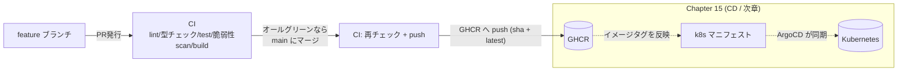
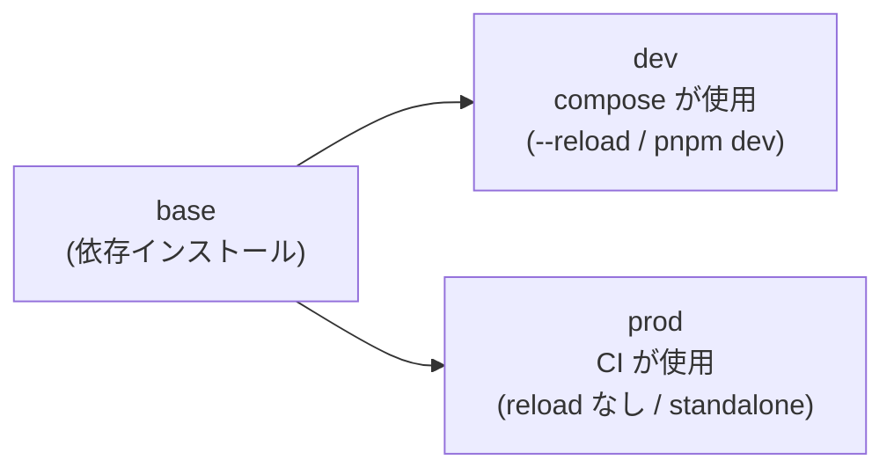
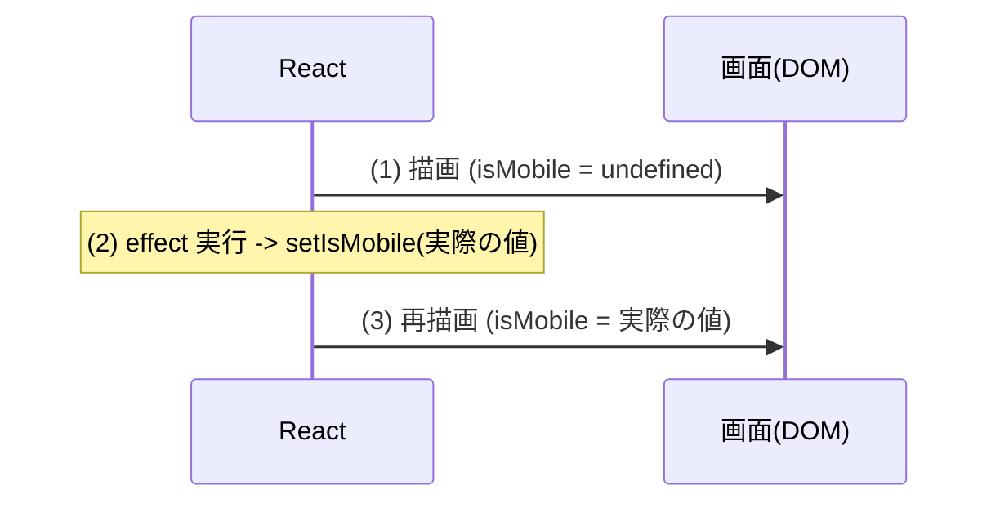
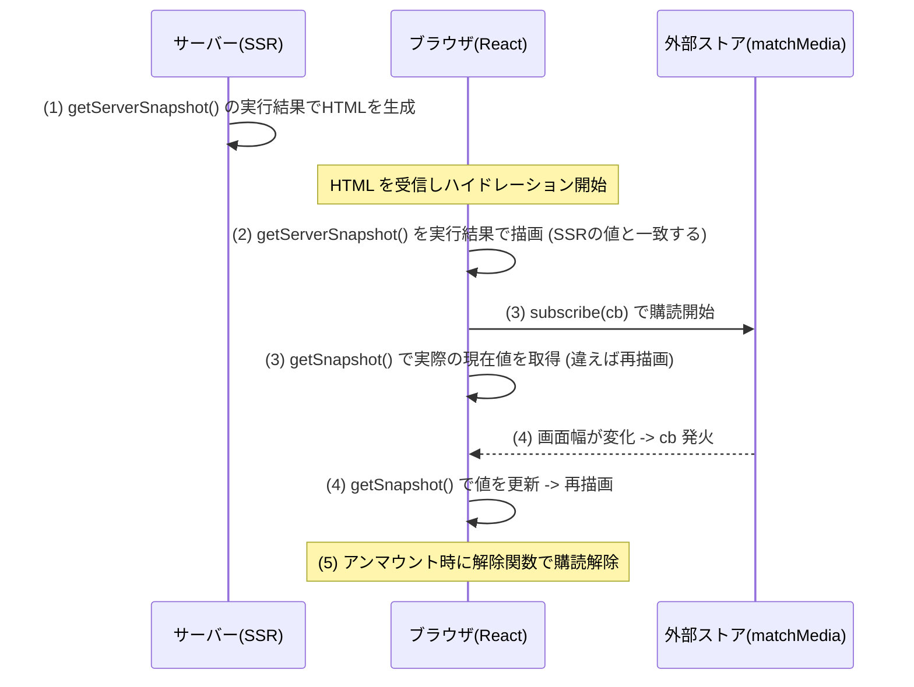
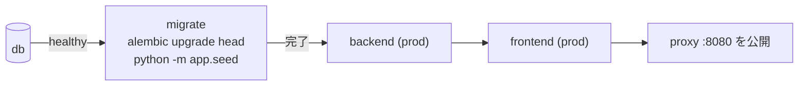
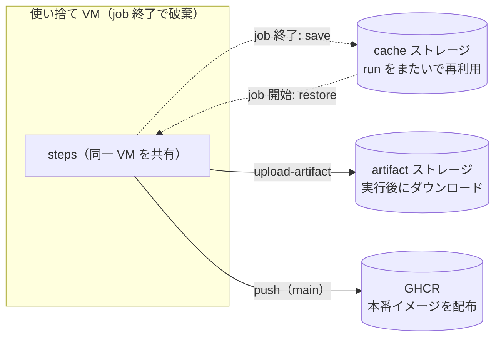
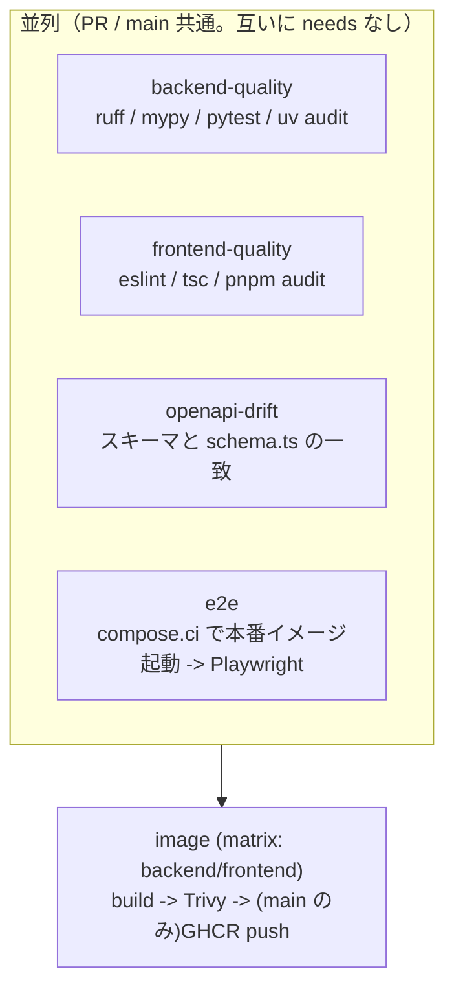

# Chapter 14: GitHub Actions で CI

[<- 目次に戻る](../README.md)

## この章のゴール

- **[GitHub Actions](https://docs.github.com/actions)** で、PR をきっかけに lint / 型チェック / テスト / E2E / 脆弱性スキャンを自動実行できます
- **本番用イメージ**を multi-stage Dockerfile でビルドし、main マージ時に **[GHCR](https://docs.github.com/packages/working-with-a-github-packages-registry/working-with-the-container-registry)（GitHub Container Registry）** へ push できます
- [**GitHub Flow**](https://docs.github.com/ja/get-started/using-github/github-flow)（main + feature ブランチ）に沿って「どのイベントで何が走るか」を理解できます
- CI/CD 全体像（次章の ArgoCD デプロイへどう繋がるか）を俯瞰できます

## スタート地点

```bash
git checkout chapter14-start
```

## 完成形

```bash
git checkout chapter14-end
```

---

## はじめに

ここまでで、backend には pytest（Chapter 8）、frontend には型安全なクライアントと CRUD 画面（Chapter 11・12）、そして通しの E2E テスト（Chapter 13）が揃いました。これらは**手元で**実行するものでした。

この章では、それらを **GitHub 上で自動実行**する仕組み（CI）を作ります。さらに、デプロイの土台として**本番用のコンテナイメージ**をビルドし、レジストリ（GHCR）へ公開するところまで進めます。

### CI / CD とは

| 用語 | 意味 |
| :--- | :--- |
| **CI**（Continuous Integration） | コードを変更するたびに、ビルド・テスト・検査を**自動で**回し、壊れていないことを継続的に確認する |
| **CD**（Continuous Delivery / Deployment） | 検査を通ったものを**自動で**リリース可能な状態にし、デプロイへ繋げる |

この章は **CI**（テスト + イメージ公開まで）を担当します。**CD**（公開したイメージを Kubernetes へデプロイ）は **Chapter 15** で扱います。

### CI/CD 全体フロー（この章 + 次章）



この章のゴールラインは **「PR で全チェックがグリーン -> main にマージ -> GHCR に本番イメージが push される」**まで（点線の部分は次章）です。

### ブランチ戦略（GitHub Flow）とトリガー

このプロジェクトは **[GitHub Flow](https://docs.github.com/get-started/using-github/github-flow)** を採用します。`main` を常にデプロイ可能に保ち、作業は feature ブランチ -> PR -> `main` マージの 1 本道で進めます。

CI は次のようにトリガーを分けます。

| イベント | 走るもの | GHCR へ push |
| :--- | :--- | :---: |
| **`pull_request`**（-> main） | 全 quality チェック + 本番イメージ build + E2E + Trivy | ❌（build のみ・検証用） |
| **`push`**（main） | 同上 + **GHCR へ push**（`sha-xxxxxxx` + `latest`） | ✅ |

> [!NOTE] ポイント解説:
> PR では build はしても push しません。**main にマージされたコミットだけ**が GHCR に乗ります。これにより「レビューを通ったものだけがデプロイ対象になる」を担保します。

---

## 1. 本番イメージ化（multi-stage Dockerfile）

CI でビルドして配布するのは**本番用イメージ**です。ところが現在の Dockerfile は開発用（backend は `--reload`、frontend は `pnpm dev`）です。そこで **[multi-stage build](https://docs.docker.com/build/building/multi-stage/)** を使い、1 つの Dockerfile に「開発用ステージ」と「本番用ステージ」を持たせます。



### 1.1 backend.Dockerfile

`docker/backend.Dockerfile` を multi-stage にします。

```dockerfile
# docker/backend.Dockerfile

# ===== base: dev / prod 共通。uv と依存定義をそろえる =====
FROM python:3.12-slim AS base

# uv をコンテナにインストール（バージョン固定）
COPY --from=ghcr.io/astral-sh/uv:0.11 /uv /uvx /bin/

WORKDIR /opt/backend

# 依存定義をコピー（レイヤキャッシュを効かせるため先にコピーする）
COPY backend/pyproject.toml backend/uv.lock backend/.python-version ./

# ===== dev: ホットリロード対応（compose.yaml が target: dev で使用）=====
FROM base AS dev
RUN uv sync --locked --no-install-project
COPY backend/app /opt/backend/app
COPY backend/alembic /opt/backend/alembic
COPY backend/alembic.ini /opt/backend/alembic.ini
CMD ["uv", "run", "uvicorn", "app.main:app", "--reload", "--host", "0.0.0.0", "--port", "8000"]

# ===== prod: 本番用。dev 依存を除き、reload なしで起動 =====
FROM base AS prod
# 本番依存のみインストール（pytest / ruff / mypy / jupyter を含めない）
RUN uv sync --locked --no-install-project --no-dev
COPY backend/app /opt/backend/app
COPY backend/alembic /opt/backend/alembic
COPY backend/alembic.ini /opt/backend/alembic.ini
CMD ["uv", "run", "uvicorn", "app.main:app", "--host", "0.0.0.0", "--port", "8000"]
```

> [!NOTE] ポイント解説:
> - **`--no-dev`** で本番イメージには pytest や ruff などの開発ツールを入れません。イメージが軽くなり、攻撃面も減ります。
> - **`alembic` 一式もコピー**します。あとで CI スタックがこのイメージを使って**マイグレーション**を実行するためです。

### 1.2 frontend.Dockerfile と standalone 出力

Next.js は **[`output: "standalone"`](https://nextjs.org/docs/app/api-reference/config/next-config-js/output)** を指定すると、必要な `node_modules` だけを同梱した自己完結サーバー（`.next/standalone`）を出力します。本番イメージを大幅に小さくできます。

まず `frontend/next.config.ts` に `output` を足します。

```typescript
// frontend/next.config.ts
const nextConfig: NextConfig = {
  reactCompiler: true,
  allowedDevOrigins: ["proxy", "localhost"],
  // 本番ビルドで .next/standalone（自己完結サーバー）を出力する
  output: "standalone",
};
```

次に `docker/frontend.Dockerfile` を multi-stage にします。

```dockerfile
# docker/frontend.Dockerfile

# ===== base: dev / build 共通。依存をインストールする =====
FROM node:22-bookworm-slim AS base
ENV CI=true
# corepack を有効化（pnpm のバージョンは package.json の "packageManager" に従う）
RUN corepack enable
WORKDIR /opt/frontend
COPY frontend/package.json frontend/pnpm-lock.yaml frontend/pnpm-workspace.yaml ./
RUN pnpm install --frozen-lockfile

# ===== dev: 開発サーバー（compose.yaml が target: dev で使用）=====
FROM base AS dev
COPY frontend ./
EXPOSE 3000
CMD ["pnpm", "dev", "--hostname", "0.0.0.0"]

# ===== build: 本番ビルド。.next/standalone を出力する =====
FROM base AS build
COPY frontend ./
# next build はサーバー側モジュール評価で env.INTERNAL_API_URL を参照・検証する。
# 実値は実行時に注入するため、ビルドを通すためのダミー値を渡す（実行時の環境変数で上書きされる）。
ENV INTERNAL_API_URL=http://localhost:8000
RUN pnpm build

# ===== prod: standalone を node で起動する最小ランタイム =====
FROM node:22-bookworm-slim AS prod
ENV NODE_ENV=production
ENV HOSTNAME=0.0.0.0
ENV PORT=3000
WORKDIR /opt/frontend
# standalone 本体 + 静的アセット + public を配置（server.js がこれらを配信する）
COPY --from=build /opt/frontend/.next/standalone ./
COPY --from=build /opt/frontend/.next/static ./.next/static
COPY --from=build /opt/frontend/public ./public
EXPOSE 3000
CMD ["node", "server.js"]
```

> [!NOTE] ポイント解説:
> - **[output: "standalone"](https://nextjs.org/docs/pages/api-reference/config/next-config-js/output#automatically-copying-traced-files)とは**  
>   `pnpm build` を実行すると `.next/standalone` が生成されるようになる。 `.next/standalone` はそれ単体で実行可能なフォルダとなっており、 `node_modules` を必要としない。  
>   ただし、`public` `.next/static` フォルダはstandaloneに自動で含まれないため手動でコピーする。 `cp -r public .next/standalone/ && cp -r .next/static .next/standalone/.next/`
> - `pnpm` のバージョンは `package.json` の `packageManager` フィールド（後述）に従わせます。
> - **なぜ build 時に `INTERNAL_API_URL` が要るのか**  
>   API クライアント（`src/lib/api/client.ts`）は**モジュール読み込み時に生成される singleton** のため、 `next build` で各ページのモジュールグラフが評価されるタイミングで `env.ts` が読み込まれ、 `INTERNAL_API_URL` が**検証**されます。ここで値が `undefined` だとビルドが失敗します。  
>   回避策として **build ステージにダミー値を渡し**、本番の実値は**実行時に**環境変数として注入します。(`INTERNAL_API_URL` はサーバー専用変数なので、ダミー値が JS バンドルに埋め込まれることはありません)

### 1.3 .dockerignore でビルドコンテキストを絞る

ビルドコンテキスト（リポジトリ直下）には `.env` やホストの `node_modules` も含まれます。これらを**イメージに焼き込まないよう**、リポジトリ直下に `.dockerignore` を作ります。

```bash
touch $PROJECT_DIR/.dockerignore
```

```gitignore
# .dockerignore

# 環境変数ファイル（実行時に注入するためイメージには含めない）
**/.env
**/.env.*

# 依存・ビルド生成物（イメージ内で生成し直す。ホストのものは持ち込まない）
**/node_modules
**/.next
**/.venv
**/__pycache__
**/*.pyc

# 各種キャッシュ
**/.pytest_cache
**/.ruff_cache
**/.mypy_cache

# バージョン管理・ツール
.git
.gitignore
.devcontainer

# イメージのビルドに不要なもの
docs
agent-tasks
e2e
tmp
```

> [!NOTE] ポイント解説:
> これが無いと、`COPY frontend ./` でホストの `frontend/.env` がビルドに入り、Next.js の standalone 出力がそれを**イメージに焼き込んで**しまいます。開発用の `.env` が本番イメージに混入するのは避けるべきです。秘密情報や環境差分は**実行時に環境変数で注入**します。

### 1.4 compose.yaml に `target: dev` を明記

開発スタック（`compose.yaml`）は今までどおり**開発用ステージ**を使うよう、`target: dev` を明記します。

```yaml
# compose.yaml
  backend:
    build:
      context: .
      dockerfile: docker/backend.Dockerfile
      target: dev                    # <- 追記: 開発用ステージ（ホットリロード）
  migrate:
    build:
      context: .
      dockerfile: docker/backend.Dockerfile
      target: dev                    # <- 追記: backend と同じ開発用ステージを使う
  # ...
  frontend:
    build:
      context: .
      dockerfile: docker/frontend.Dockerfile
      target: dev                    # <- 追記: 開発用ステージ（next dev）
```

確認します。今までどおり開発スタックが動けば OK です。

```bash
docker compose down && docker compose up -d --build
```

ビルド単体の確認もできます（本番ステージが通ること）。

```bash
docker build -f docker/backend.Dockerfile  --target prod -t bt-be:prod .
docker build -f docker/frontend.Dockerfile --target prod -t bt-fe:prod .
```

---

## 2. backend の品質チェック

CI で backend に対して走らせるのは **lint / 型チェック / テスト / 依存監査**です。lint と型チェックのツールをここで導入します。

### 2.1 ruff と mypy を導入

- **[ruff](https://docs.astral.sh/ruff/)**: 高速な Python リンタ（兼フォーマッタ）。バグになりやすい書き方やセキュリティ上の問題を検出します。
- **[mypy](https://mypy.readthedocs.io/)**: 静的型チェッカ。型の不整合を実行前に見つけます。

```bash
cd $PROJECT_DIR/backend
uv add --dev ruff mypy
```

`backend/pyproject.toml` に設定を追記します。

```toml
# backend/pyproject.toml

# --- ruff: リンタ ---
[tool.ruff]
# 学習用の Jupyter notebook と、自動生成される alembic マイグレーションは対象外にする
extend-exclude = ["chapter03", "alembic"]

[tool.ruff.lint]
# E/F: pycodestyle・Pyflakes（基本）, I: import 整列, B: bugbear（バグになりやすい書き方）, S: flake8-bandit（セキュリティ: ハードコードされたパスワードや危険な関数呼び出しなど）
select = ["E", "F", "I", "B", "S"]
# E501（行長）はフォーマッタに任せ、日本語コメントの折返しは強制しない
ignore = ["E501"]

[tool.ruff.lint.flake8-bugbear]
# FastAPI の依存注入( `Depends(...)` )は引数デフォルトに関数呼び出しを置くのが正式な書き方なので B008 の対象外にする。
# require_permissions は Depends(require_permissions([...])) で使うパラメータ付き依存ファクトリ。
extend-immutable-calls = [
    "fastapi.Depends",
    "fastapi.Query",
    "fastapi.Path",
    "fastapi.Body",
    "fastapi.Header",
    "fastapi.Cookie",
    "fastapi.Form",
    "fastapi.File",
    "app.permissions.require_permissions",
]

[tool.ruff.lint.per-file-ignores]
# テストでは assert（S101）を多用する。比較に使う "bearer" 等の文字列リテラル（S105/S106）も秘密情報ではない
"tests/**" = ["S101", "S105", "S106"]

# --- mypy: 静的型チェック ---
[tool.mypy]
python_version = "3.12"
plugins = ["pydantic.mypy"]      # pydantic v2 のモデルを型解析できるようにする
explicit_package_bases = true    # app/ を起点パッケージとして解決する
ignore_missing_imports = true    # 型スタブの無い外部ライブラリを無視する
files = ["app"]
```

> [!NOTE] ポイント解説:
> 「ルールは厳しめに入れて、正当な例外だけ設定で外す」方針です。


### 2.2 ruff(lint)の実行

**import の並び**は自動修正できます。

```bash
cd $PROJECT_DIR/backend
uv run ruff check --fix     # I001（import 整列）などを自動修正
```

残りは手で直します（いずれも小さな改善です）。

**`app/auth.py`（B904）**: `decode_access_token()` の `except` で送出する例外に `from None` を付けます。

```python
# app/auth.py
def decode_access_token(token: str) -> dict:
  """JWT を検証・デコードする。無効なら例外を投げる"""
    try:
        return jwt.decode(token, env.token_secret_key, algorithms=[env.token_algorithm])
    except jwt.ExpiredSignatureError:
        raise HTTPException(
            status_code=status.HTTP_401_UNAUTHORIZED,
            detail="Token has expired",
        ) from None      # ← from None を追加
    except jwt.InvalidTokenError:
        raise HTTPException(
            status_code=status.HTTP_401_UNAUTHORIZED,
            detail="Invalid token",
        ) from None      # ← from None を追加
```

**`app/routers.py`（E402）**: import の途中にある `logger = ...` を、import を全部終えた下へ移動します。

```python
# app/routers.py
import structlog

# logger = structlog.get_logger()  # <- 削除

from fastapi import APIRouter, Depends, HTTPException, Response, status
# ...（他の import が続く）
from app.session import get_session

logger = structlog.get_logger()  # <- ここに移動
```


**`app/config.py`（S105）**: `token_secret_key` と `token_algorithm` に `# noqa: S105  ...` を追記して警告を抑制します。

```python
# app/config.py
    # JWT 設定
    token_secret_key: str = "change-me-in-production"  # noqa: S105  開発用デフォルト。本番は環境変数で必ず上書きする
    token_algorithm: str = "HS256"  # noqa: S105  アルゴリズム名であり秘密情報ではない（誤検知の抑制）
```

> [!NOTE] ポイント解説:  
> - `S105`（flake8-bandit）は「パスワードらしき名前の変数に文字列リテラルを代入しているか」を検出します。`token_secret_key` の開発用デフォルトは**実際に注意すべき箇所**なので「本番は環境変数で上書きする」と明示し、`token_algorithm` は**完全な誤検知**なのでその旨をコメントに残します。セキュリティルールは「黙って無効化」せず、**なぜ安全か（または実行時にどう守るか）を残して抑制する**のが大切です。

直したら再実行して、ruff がグリーンになることを確認します。

```bash
uv run ruff check
# All checks passed!
```

### 2.3 mypy（型チェック）の実行

ruff は型を検査しません。型の問題は mypy で検出します。

```bash
cd $PROJECT_DIR/backend
uv run mypy
```

次のエラーが出ます。

```
app/seed.py:57: error: "str" has no attribute "value"  [attr-defined]
```

`seed_users()` の `test_users` は値の型が混在しており、`u["role"]` が `str | RoleType` と推論されるため `.value` が型エラーになります。`TypedDict` で 1 ユーザー分の型を固定して直します。

```python
# app/seed.py
from typing import TypedDict

# ...

class SeedUser(TypedDict):
    username: str
    password: str
    role: RoleType

# ...

def seed_users() -> None:
    test_users: list[SeedUser] = [  # <- 型ヒントを追加
        {"username": "sys_admin", "password": "admin", "role": RoleType.SYSTEM_ADMIN},
        # ...
    ]
```

直したら再実行して、mypy がグリーンになることを確認します。

```bash

cd $PROJECT_DIR/backend
uv run mypy
# Success: no issues found

uv run ruff check --fix
```

### 2.4 テストの実行

```bash
cd $PROJECT_DIR/backend

# 環境変数を export (テスト DB 作成に必要)
export $(grep -v '^#' $PROJECT_DIR/backend/.env | xargs)

uv run pytest
```

### 2.5 脆弱性チェックの実行 (実験的な機能)

```bash
cd $PROJECT_DIR/backend
uv audit --no-dev   # 依存パッケージの脆弱性監査 (--no-dev 本番依存のみ)
```

**[`uv audit`](https://docs.astral.sh/uv/)** は `uv.lock` を読み、既知の脆弱性がある依存を報告して**見つかれば失敗（非ゼロ終了）**します。

#### 1. 修正版があれば更新する

uv は依存ツリー全体を解決するため、**直接依存、推移的依存どちらのパッケージも `uv lock --upgrade-package` で直せます**。  
ただし、`pyproject.toml` に定義した範囲を超えてアップデートしたい場合は `pyproject.toml` を手で修正します。


```toml
# backend/pyproject.tml

[project]
# ...
dependencies = [
    # ...
    "pyjwt~=2.13.0",  # <- 2.13.0に更新
    # ...
]
```


```bash
cd $PROJECT_DIR/backend
# 直接依存で制約が修正版を弾く場合は、先に pyproject.toml の制約を緩める（例: pyjwt~=2.12.1 -> ~=2.13.0）
uv lock --upgrade-package pyjwt --upgrade-package starlette --upgrade-package idna --upgrade-package urllib3
uv sync              # lock を環境に反映
uv audit  --no-dev   # 本番依存の脆弱性をチェック
```

- まとめて上げるなら `uv lock --upgrade`（全パッケージ）。
- 更新後は破壊的変更に備え `uv run pytest` / `uv run mypy` を回して壊れていないか確認します。

#### 2. 修正版が無い / 誤検知なら、理由を添えて無視する

```bash
uv audit --ignore <GHSA-xxxx-xxxx-xxxx>              # 特定の脆弱性を無視
uv audit --ignore-until-fixed <GHSA-xxxx-xxxx-xxxx>  # 修正版が出るまでの間だけ無視（fix が出たら自動で復活）
```

`--ignore-until-fixed` は「今は直せないが修正版が出たら気づきたい」ときに便利です。

> [!NOTE] 補足:
> - `uv audit` は frontend の `pnpm audit --audit-level high` と違い **severity の閾値が無く、深刻度に関わらず失敗**します。
> - 「監査が指摘 -> 更新」という流れは、この後 Dependabot で自動化されます。

### 2.6 依存のクールダウン（exclude-newer）

アカウント乗っ取りや改ざんでマルウェア差し込まれた **悪意のあるバージョン** はサプライチェーン攻撃と言われ、「公開 -> 検知・削除」までの短い期間に集中します。

そこで、**公開からしばらく経った版だけを採用する**ことで、その間にコミュニティが対応する猶予を作ります。

uv では **[`exclude-newer`](https://docs.astral.sh/uv/reference/settings/#exclude-newer)** で、指定期間より新しい版を `uv lock` 時に除外します。

```toml
# backend/pyproject.toml
[tool.uv]
exclude-newer = "3 days"  # 公開後3日未満の版を採用しない
```

```bash
cd $PROJECT_DIR
uv lock
```

> [!NOTE] ポイント解説:
> - これは `uv lock`（依存の再解決）に効く設定です。確定済みの `uv.lock` をそのまま使う `uv sync --locked`（CI）は影響を受けないため、**ビルドの再現性は保たれます**。

---

## 3. frontend の品質チェック

frontend では **lint（eslint）/ 型チェック（tsc）/ 依存監査（pnpm audit）/ OpenAPI 型のドリフト検出**を走らせます。

### 3.1 type-check スクリプトと packageManager

`frontend/package.json` に、型チェック用スクリプトと、pnpm のバージョン固定（`packageManager`）を足します。

```json
// frontend/package.json （抜粋）
{
  "packageManager": "pnpm@11.5.1",
  "scripts": {
    "lint": "eslint",
    "type-check": "next typegen && tsc --noEmit",  // --noEmitで型チェックだけを行う
    "gen:api": "openapi-typescript http://backend:8000/openapi.json -o src/lib/api/schema.ts"
  }
}
```

> [!NOTE] ポイント解説（type-check）:
> - **`tsc --noEmit`**  
>   
> - **`next typegen && tsc --noEmit`**
>   Next.js16 は `next dev` や `next build` でルート用の型定義を `.next/types` に生成します。そのため `tsc --noEmit` だけを実行してもルートの型チェックが行われない問題がありました。  
>   なので、 **[`next typegen`](https://nextjs.org/docs/app/api-reference/cli/next#next-typegen-options)** で先にルート型を生成してから `tsc` を走らせます。
> - **`"packageManager": "pnpm@11.5.1`**  
>   **[Corepack](https://nodejs.org/api/corepack.html)（Node 同梱のパッケージマネージャ管理機能）と各ツールが読む「pnpm バージョンのSSoT」**です。これを明示しておくと **手元・CI・Docker のすべてが同じ pnpm バージョン**にそろいます。  
>   - **再現性**: pnpm のメジャー/マイナーが違うと lockfile の形式や install 挙動が変わり得ます。版を固定して「環境によって挙動が違う」を防ぎます。
>   - **CI**: `ci.yml` の `pnpm/action-setup` は**バージョンを指定していません**。このフィールドから pnpm の版を解決してインストールします。
>   - **Docker**: `frontend.Dockerfile` は `corepack enable` だけ（`corepack prepare pnpm@x` を書かない）。Corepack がこのフィールドを読んで同じ版を使います。


### 3.2 lint の実行


```bash
cd $PROJECT_DIR/frontend
pnpm lint
```

`shadcn add sidebar`（Chapter 11）で生成された `src/hooks/use-mobile.ts` が 1 件指摘されます。

```
/workspaces/web-tutorial-v2/frontend/src/hooks/use-mobile.ts
  14:5  error  Error: Calling setState synchronously within an effect can trigger cascading renders

Effects are intended to synchronize state between React and external systems such as manually updating the DOM, state management libraries, or other platform APIs. In general, the body of an effect should do one or both of the following:
* Update external systems with the latest state from React.
* Subscribe for updates from some external system, calling setState in a callback function when external state changes.

Calling setState synchronously within an effect body causes cascading renders that can hurt performance, and is not recommended. (https://react.dev/learn/you-might-not-need-an-effect).

/workspaces/web-tutorial-v2/frontend/src/hooks/use-mobile.ts:14:5
  12 |     }
  13 |     mql.addEventListener("change", onChange)
> 14 |     setIsMobile(window.innerWidth < MOBILE_BREAKPOINT)
     |     ^^^^^^^^^^^ Avoid calling setState() directly within an effect
  15 |     return () => mql.removeEventListener("change", onChange)
  16 |   }, [])
  17 |  react-hooks/set-state-in-effect

✖ 1 problem (1 error, 0 warnings)
```

以下のように修正してください

```ts
// src/hooks/use-mobile.ts
import * as React from "react"

const MOBILE_BREAKPOINT = 768

// メディアクエリの変化を購読する（変化時に callback を呼び、解除関数を返す）
function subscribe(callback: () => void) {
  const mql = window.matchMedia(`(max-width: ${MOBILE_BREAKPOINT - 1}px)`)
  mql.addEventListener("change", callback)
  return () => mql.removeEventListener("change", callback)
}

export function useIsMobile() {
  return React.useSyncExternalStore(
    subscribe,
    () => window.innerWidth < MOBILE_BREAKPOINT,  // クライアントでの現在値
    () => false,                                  // 初期値を返す関数。SSR とハイドレーション最初の描画で評価される 
  )
}
```

直したら、lintを再実行

```bash
pnpm lint                              # -> 指摘なし
# $ eslint
```


> [!NOTE] ポイント解説: 生成コードも自分のコード  
> shadcn/ui が生成するコードは `node_modules` の外部依存ではなく、**`src/`にコピーされた「自分のコード」**です。そのため、これらは lint の対象に含め、自分で修正します。

#### Lintエラーの理由と修正方針について (指摘内容、修正意図が気になる人だけ読んでください)

指摘内容:

```
Error: Calling setState synchronously within an effect can trigger cascading renders
```

つまり、`useEffect` の中で同期的に `useState` の状態を変更すると連鎖的なレンダリングが発生するという指摘。


この指摘を理解するために、まず 2 つの Hook を押さえます。

| Hook | 役割 |
| :--- | :--- |
| **[`useState`](https://react.dev/reference/react/useState)** | コンポーネントに「状態」を持たせる。`const [v, setV] = useState(初期値)`。`setV(...)` を呼ぶと、新しい値で**再描画（re-render）が予約**される |
| **[`useEffect`](https://react.dev/reference/react/useEffect)** | 描画が画面に反映された**後**に走る。Reactのstateが変わったときにReact以外のリソース(DOM や外部システム)をあわせて操作したいときに利用する |

#### effect の中で setState すると何が起きるか

問題のコードは「初期値は `undefined`、effect の中で実際の値を `setState` する」形でした。これは次の流れになります。  



**1 回のマウントで描画が 2 回** 走ることがわかります。これが "cascading renders"（連鎖した再描画）です。ツリーが大きければこのレンダリングは無視できないコストになります。

`react-hooks/set-state-in-effect` は、この「effect 中の同期的な setStateの呼び出し」を警告します。React 公式も「effect は外部との同期に使い、描画に必要な値は**描画時に計算する**べき」としています。

#### なぜ `useSyncExternalStore` が適切か

`window.matchMedia` のような **React の外にある状態**を定期購読するには、 **[`useSyncExternalStore`](https://react.dev/reference/react/useSyncExternalStore)** を使います。引数は3つです。

| 引数 | 役割 |
| :--- | :--- |
| `subscribe(cb)` | 外部の変化を購読する関数。変化したら `cb` を呼ぶ。戻り値は購読の解除関数。 |
| `getSnapshot()` | 描画時や `cb` が呼び出されたときに現在値を読む関数 (クライアント側で動作) |
| `getServerSnapshot()` | 初期値を返す関数。SSR とハイドレーション最初の描画で評価される (window を触らない) |

各関数の呼び出しタイミング (SSR -> ハイドレーション -> 実行)



### 3.3 型チェックの実行

```bash
cd $PROJECT_DIR/frontend

# 型チェック
pnpm type-check
```

### 3.4 脆弱性のチェックの実行


```bash
cd $PROJECT_DIR/frontend

# high 以上の脆弱性をチェック
pnpm audit --prod --audit-level high
```

`pnpm audit --prod --audit-level high` は **high / critical でのみ失敗**します（moderate / low は報告のみ）。エラーになったら、次の順で対応します。

#### 1. 直接依存の修正

バージョンを手で調べて `package.json` を編集する必要はありません。`pnpm update` がやってくれます。

```bash
cd $PROJECT_DIR/frontend
pnpm outdated                 # 何が古いか一覧で確認


pnpm update --latest          # 全てのパッケージを最新に強制アップデート

pnpm update <pkg> --latest    # 指定したパッケージを最新に強制アップデート

pnpm update -i --latest       # 対話的にアップデート
```

> [!WARNING] 注意:
> `--latest` は範囲指定を無視して最新に更新するため、破壊的変更が入り得ます。更新後は `pnpm lint` / `pnpm type-check` / `pnpm build`（と E2E）を回して壊れていないか確認します。

#### 2. 推移的依存の修正

**推移的依存** (親パッケージが古い版を固定していて直接更新できない)には `pnpm audit --fix=override` を使います。  
手でバージョンを選ぶ必要はなく、**`pnpm-workspace.yaml` の `overrides` に修正版を自動追記**します（その後 `pnpm install` で反映）。

```bash
cd $PROJECT_DIR/frontend

pnpm audit --fix=override  # pnpm-workspace.yaml の overridesを更新

pnpm install               # overridesされたパッケージをインストール
```

#### 3. dev ツールが本番依存に混ざっていれば分類を直す

`shadcn`（コンポーネント追加用の CLI）のように**実行コードから import しない**ツールは `devDependencies` に置くべきです。`dependencies` にあると `--prod` 監査の対象に入り、その依存（express / hono / qs 等）の脆弱性まで拾ってしまいます。`devDependencies` へ移すと対象から外れます。

```bash
cd $PROJECT_DIR/frontend

pnpm remove shadcn && pnpm add -D shadcn   # dependencies -> devDependencies
```

#### 4. 修正版が無い / 誤検知なら、理由を添えて無視する

```bash
cd $PROJECT_DIR/frontend

pnpm audit --ignore <GHSA-ID>      # 特定の脆弱性を 1 件無視
pnpm audit --ignore-unfixable      # 修正版が無いものを一括で無視
```

恒久的に無視するなら `package.json` の `pnpm.auditConfig.ignoreGhsas` に記載します。いずれの場合も、`# noqa` と同じく **なぜ安全か（または実行時にどう守るか）をコメントや PR に必ず残します**。

### 3.5 依存のクールダウン（minimumReleaseAge）

frontend でも **公開直後のバージョンを避ける** ことでサプライチェーン攻撃を回避することができます。pnpm では `pnpm-workspace.yaml` に **[`minimumReleaseAge`](https://pnpm.io/settings#minimumreleaseage)**を指定します。

```yaml
# frontend/pnpm-workspace.yaml
minimumReleaseAge: 4320  # 公開後 3 日(4320 分)未満の版を install で採用しない
```

> [!NOTE] ポイント解説:
> - 単位は**分**です（`4320` = 3 日）。
> - pnpm 11 では `minimumReleaseAge` は**既定で 1440（1 日）が有効**です。明示しておくと意図が伝わり、pnpm の版に依存せず同じ挙動になります。
> - `minimumReleaseAgeExclude` で、緊急の修正版など待たせたくないパッケージを個別に除外できます。

### 3.6 OpenAPI 型のドリフト検出

Chapter 11 で、backend の OpenAPI から frontend の型（`src/lib/api/schema.ts`）を生成しました。**backend の API を変えたのに型を再生成し忘れる**と、frontend の型が実態とズレます。これを CI で検出します。

仕組みは「**backend からスキーマを出力 -> 型を生成し直す -> Git 差分が出ないことを確認**」です。

```bash
# backend からスキーマを JSON 出力（サーバーを起動しない）
cd $PROJECT_DIR/backend
uv run python -c "import json; from app.main import app; print(json.dumps(app.openapi()))" > /tmp/openapi.json

# その JSON から型を生成し、コミット済みの schema.ts と差分が無いことを確認
cd $PROJECT_DIR/frontend
pnpm exec openapi-typescript /tmp/openapi.json -o src/lib/api/schema.ts
git diff --exit-code src/lib/api/schema.ts
```

差分が出たら（=型が古い）、生成し直した `schema.ts` をコミットすれば解消します。

---


## 4. CI 用スタックと E2E

Chapter 13 の E2E は、devcontainer の**開発スタック**に対して実行しました。CI では「**ビルドした本番イメージ**」を起動し、その実体に対して E2E を回します。「デプロイするものをテストする」ためです。

### 4.1 リバースプロキシをイメージ化

開発スタックでは nginx の設定をホストから bind mount していました。CI / 本番では**ホストのパスに依存しない**よう、設定をイメージに焼き込みます。

```bash
touch $PROJECT_DIR/docker/proxy.Dockerfile
```

```dockerfile
# docker/proxy.Dockerfile
FROM nginx:1.27-alpine
# / -> frontend, /api/ -> backend に振り分ける設定（開発用と同じ default.conf）
COPY docker/nginx/default.conf /etc/nginx/conf.d/default.conf
```

### 4.2 compose.ci.yaml

CI 用のスタックを `compose.ci.yaml` として作ります。開発用との違いは次の 4 点です。

- backend / frontend は**本番ステージ**（`target: prod`）でビルドする
- ホストのソースを**マウントしない**（イメージに焼いたコードで動かす）
- `.env` を使わず、環境変数を**インライン定義**する（`.env` は gitignore のため CI には存在しない）
- `db` に **healthcheck** を付け、**migrate（マイグレーション + seed）完了後**に backend を起動する



```bash
touch $PROJECT_DIR/compose.ci.yaml
```

```yaml
# compose.ci.yaml
services:
  db:
    image: postgres:18-alpine
    environment:
      POSTGRES_USER: app
      POSTGRES_PASSWORD: app_pass
      POSTGRES_DB: app
    healthcheck:
      test: ["CMD-SHELL", "pg_isready -U app -d app"]
      interval: 3s
      timeout: 3s
      retries: 20
    networks: [ci-nw]

  # 一度きり: スキーマ適用(alembic) と seed 投入を行い、完了したら終了する
  migrate:
    build:
      context: .
      dockerfile: docker/backend.Dockerfile
      target: prod
    environment:
      DB_HOST: db
      DB_PORT: "5432"
      DB_USER: app
      DB_PASSWORD: app_pass
      DB_NAME: app
    command: ["sh", "-c", "uv run alembic upgrade head && uv run python -m app.seed"]
    depends_on:
      db:
        condition: service_healthy
    restart: "no"
    networks: [ci-nw]

  backend:
    build:
      context: .
      dockerfile: docker/backend.Dockerfile
      target: prod
    environment:
      DB_HOST: db
      DB_PORT: "5432"
      DB_USER: app
      DB_PASSWORD: app_pass
      DB_NAME: app
      TOKEN_SECRET_KEY: ci-test-secret-key
      TOKEN_ALGORITHM: HS256
      TOKEN_EXPIRE_MINUTES: "480"
      LOG_FORMAT: json
    depends_on:
      migrate:
        condition: service_completed_successfully
    networks: [ci-nw]

  frontend:
    build:
      context: .
      dockerfile: docker/frontend.Dockerfile
      target: prod
    environment:
      INTERNAL_API_URL: http://backend:8000
    depends_on: [backend]
    networks: [ci-nw]

  proxy:
    build:
      context: .
      dockerfile: docker/proxy.Dockerfile
    ports:
      - "8080:8080"
    depends_on: [frontend, backend]
    networks: [ci-nw]

networks:
  ci-nw:
    driver: bridge
```

> [!NOTE] ポイント解説:
> - **`migrate` サービス**は一度実行して終了する使い捨てです。`depends_on` の **`condition: service_completed_successfully`** で「migrate が正常終了してから backend を起動」を保証します。

### 4.3 E2E のロケータを環境変数で切り替え

Chapter 13 で `e2e/playwright.config.ts` の `baseURL` は環境変数 `E2E_BASE_URL` で上書きできるようにしてあります。CI ではランナーホストの公開ポート `http://localhost:8080` を指定します。

> [!WARNING] この操作はdevcontainer上ではなくホスト上で直接行ってください

```bash
# CI スタックを起動（本番イメージ）
cd $PROJECT_DIR
docker compose -f compose.ci.yaml up -d --build

# 起動を待ってから E2E を実行
cd $PROJECT_DIR/e2e
pnpm install --frozen-lockfile
pnpm exec playwright install --with-deps chromium
E2E_BASE_URL=http://localhost:8080 pnpm exec playwright test

# 後始末
cd $PROJECT_DIR
docker compose -f compose.ci.yaml down -v
```

> [!NOTE] ポイント解説:
> 本番イメージは `next start`（standalone）で動くため、開発サーバー特有の `allowedDevOrigins` の制約はありません。**「開発では動くが本番ビルドでは挙動が違う」**たぐいの問題を、この E2E が早期に捕まえます。

---

## 5. ワークフロー（ci.yml）を書く

ここまでの確認手順（lint / 型チェック / テスト / E2E / 脆弱性監査 / イメージ build）を、**GitHub Actions の 1 つのワークフロー**にまとめます。

### 5.1 GitHub Actions の用語と構文

GitHub Actions は、リポジトリ内の YAML に書いた手順を GitHub のサーバー上で自動実行する仕組みです。まず登場する語と YAML のキーを押さえます。

| 用語 / キー | 意味 |
| :--- | :--- |
| **[workflow](https://docs.github.com/actions/using-workflows/about-workflows)** | `.github/workflows/*.yml` に書く自動化の単位。`on:`（トリガー）と `jobs:` を持つ |
| **`on:`** | いつ動かすか（ここでは `pull_request` と `push`） |
| **[job](https://docs.github.com/actions/using-jobs/using-jobs-in-a-workflow)** | 処理のまとまり。job 同士は既定で**並列**。`needs:` で依存（順序）を付ける |
| **`runs-on:`** | その job を動かす [runner](https://docs.github.com/actions/using-github-hosted-runners/about-github-hosted-runners)（仮想マシン。ここでは `ubuntu-latest`） |
| **step** | job 内の 1 手順。`run:`（シェル実行）か `uses:`（[Action](https://docs.github.com/actions/sharing-automations/creating-actions/about-custom-actions) 呼び出し） |
| **`uses:` / `with:`** | 再利用部品（Action）を呼ぶ（例 `uses: actions/checkout@v6`）。`with:` でその Action への入力を渡す |
| **`needs:`** | 「この job の前に完了しているべき job」を指定する（依存・順序） |
| **`permissions:`** | その workflow の `GITHUB_TOKEN` に与える権限（最小限にする） |
| **`strategy.matrix:`** | 同じ job を変数違いで**並列展開**する（backend / frontend を2つ同時に動かす） |
| **`services:`** | job に付随して起動するコンテナ（テスト用 DB など） |
| **`${{ ... }}`** | 式。`github.*`（イベント情報）/ `secrets.*`（秘密）/ `steps.*.outputs.*`（前ステップの出力）を参照する |

### 5.2 Action とは

**Action** は、`uses:` で呼び出す**再利用可能な処理の部品**で、[GitHub Marketplace](https://github.com/marketplace?type=actions) で探すことができます。「チェックアウト」「言語のセットアップ」「Docker ビルド」など、皆が書く定型処理を**毎回自作せずに済ませる**ためのものです。

使い方は `uses: <owner>/<repo>@<バージョン>`。入力は `with:` で渡します。

```yaml
- uses: actions/setup-node@v6   # owner=actions, repo=setup-node, バージョン=v6
  with:                         # この Action への入力
    node-version: 22
```

**この `ci.yml` で使っている主な Action:**

| Action | 用途 |
| :--- | :--- |
| [actions/checkout](https://github.com/marketplace/actions/checkout) | リポジトリをチェックアウト |
| [pnpm/action-setup](https://github.com/marketplace/actions/setup-pnpm) | pnpm を用意 |
| [actions/setup-node](https://github.com/marketplace/actions/setup-node-js-environment) | Node をセットアップ（依存キャッシュ込み） |
| [astral-sh/setup-uv](https://github.com/marketplace/actions/astral-sh-setup-uv) | uv を用意（キャッシュ込み） |
| [actions/upload-artifact](https://github.com/marketplace/actions/upload-a-build-artifact) | 実行結果（Playwright レポート等）を保存 |
| [docker/login-action](https://github.com/marketplace/actions/docker-login) | GHCR ログイン |
| [docker/setup-buildx-action](https://github.com/marketplace/actions/docker-setup-buildx)  | ビルド準備 |
| [docker/metadata-action](https://github.com/marketplace/actions/docker-metadata-action) |  タグ生成 |
| [docker/build-push-action](https://github.com/marketplace/actions/docker-build-push-action) | build & push |
| [aquasecurity/trivy-action](https://github.com/marketplace/actions/aqua-security-trivy) | イメージの脆弱性スキャン |

**探し方・選び方:**

- [GitHub Marketplace](https://github.com/marketplace?type=actions) で検索
- 選ぶ目安: **Verified creator バッジ**（`actions/*`・`docker/*` などの公式）/ スター数・更新頻度 / README の充実度。

### 5.3 ランナーのライフサイクルとデータの保管場所

VM は使い捨てなので、run をまたいで残したいもの・別 job や実行後に残したいものは、**VM の外の保管所**に明示的に預けます。全体像は次のとおりです。



#### ランナー（VM）のライフサイクル

GitHub ホストランナー（`runs-on: ubuntu-latest`）は **job ごとに使い捨ての VM** です。 (**※ コンテナではありません**)

- job のたびに**まっさらな VM** が用意され、**job が終わると破棄**されます。
- 同じ job 内の step は同じ VM を共有します（ローカルディスク・環境変数を引き継ぐ）。

#### cache（依存を再利用して高速化）

毎回まっさらなVMだと、依存パッケージのインストールは毎回ゼロからダウンロードになります。`cache` はこれを**run をまたいで再利用**して速くする仕組みです。

- **仕組み**: job 終了時に対象フォルダ（`~/.cache/uv` など）を **tar に固めてキャッシュストレージへアップロード**。次の run の開始時に**ダウンロードして展開**する。
- **キー**: `cache-dependency-glob`（例 `backend/uv.lock`）のハッシュがキー。**uv.lock が変わったときだけ**作り直す。
- **制約**: 7 日間アクセスが無いと削除 / リポジトリあたり〜10GB。
- **利用箇所**: `setup-uv` / `setup-node` の `cache` で uv / pnpm のダウンロードを再利用。

#### artifact（成果物の保存・受け渡し）

テストレポートやビルド成果など、**実行後に見たい / 別jobに渡したい成果物** を保存する仕組みです。

- **仕組み**: `actions/upload-artifact` で**アーティファクトストレージにアップロード**。実行後に run 画面からダウンロードでき、`actions/download-artifact` で別 job が受け取れる。
- **制約**: 既定で 90 日保持（変更可）。
- **利用箇所**: `e2e` job が **Playwright レポートを upload-artifact** し、失敗時に後から確認できるようにしている。


### 5.4 ci.yml を書く

4 つのチェック job は**互いに依存が無いので並列**に走り、すべてグリーンになってから `image` job（build / スキャン / push）が動きます。



`.github/workflows/ci.yml` を作成します。

```bash
mkdir -p $PROJECT_DIR/.github/workflows
touch $PROJECT_DIR/.github/workflows/ci.yml
```

```yaml
# .github/workflows/ci.yml
name: CI

on:
  pull_request:
    branches: [main]
  push:
    branches: [main]

# GITHUB_TOKEN の権限は最小限に。イメージ push のため packages: write のみ追加する。
permissions:
  contents: read
  packages: write

jobs:
  # backend の品質チェック: lint(ruff) / 型(mypy) / テスト(pytest) / 依存監査(uv audit)
  backend-quality:
    runs-on: ubuntu-latest
    services:
      db:  # pytestの実行にはDBが必要なので、PostgreSQLコンテナを起動
        image: postgres:18-alpine
        env:
          POSTGRES_USER: app
          POSTGRES_PASSWORD: app_pass
          POSTGRES_DB: app
        ports: ["5432:5432"]
        options: >-
          --health-cmd "pg_isready -U app -d app"
          --health-interval 3s --health-timeout 3s --health-retries 20
    env:
      DB_HOST: localhost
      DB_PORT: "5432"
      DB_USER: app
      DB_PASSWORD: app_pass
      DB_NAME: app
    steps:
      # Checkout: https://github.com/marketplace/actions/checkout
      - uses: actions/checkout@v6
      # setup-uv: https://github.com/marketplace/actions/astral-sh-setup-uv
      - uses: astral-sh/setup-uv@v8.2.0
        with:
          enable-cache: true  # uvでダウンロードしたパッケージはキャッシュしてrun間で共有
          cache-dependency-glob: "backend/uv.lock"  # uv.lockのハッシュがキャッシュのキー
      - name: Install dependencies
        working-directory: backend
        run: uv sync --locked
      - name: Lint (ruff)
        working-directory: backend
        run: uv run ruff check
      - name: Type check (mypy)
        working-directory: backend
        run: uv run mypy
      - name: Test (pytest)
        working-directory: backend
        run: uv run pytest
      - name: Audit dependencies (uv audit)
        working-directory: backend
        run: uv audit

  # frontend の品質チェック: lint(eslint) / 型(tsc) / 依存監査(pnpm audit)
  frontend-quality:
    runs-on: ubuntu-latest
    steps:
      - uses: actions/checkout@v6
      # pnpm を先に入れてから setup-node の cache: pnpm を有効化する
      # Setup pnpm: https://github.com/marketplace/actions/setup-pnpm
      - uses: pnpm/action-setup@v6
        with:
          package_json_file: frontend/package.json   # packageManager を持つファイルを指定
      # setup-node: https://github.com/marketplace/actions/setup-node-js-environment
      - uses: actions/setup-node@v6
        with:
          node-version: 22
          cache: pnpm  # pnpmでダウンロードしたパッケージはキャッシュしてrun間で共有
          cache-dependency-path: frontend/pnpm-lock.yaml  # pnpm-lock.yamlのハッシュがキャッシュのキー
      - name: Install dependencies
        working-directory: frontend
        run: pnpm install --frozen-lockfile
      - name: Lint (eslint)
        working-directory: frontend
        run: pnpm lint
      - name: Type check (tsc)
        working-directory: frontend
        run: pnpm type-check
      - name: Audit dependencies (pnpm audit)
        working-directory: frontend
        run: pnpm audit --prod --audit-level high

  # OpenAPI 型のドリフト検出: backend のスキーマから型を再生成し schema.ts と差分が無いか検証
  openapi-drift:
    runs-on: ubuntu-latest
    env:
      DB_HOST: localhost
      DB_PORT: "5432"
      DB_USER: app
      DB_PASSWORD: app_pass
      DB_NAME: app
    steps:
      - uses: actions/checkout@v6
      - uses: astral-sh/setup-uv@v8.2.0
        with:
          enable-cache: true
          cache-dependency-glob: "backend/uv.lock"
      - name: Dump OpenAPI schema
        working-directory: backend
        run: |
          uv sync --locked
          uv run python -c "import json; from app.main import app; print(json.dumps(app.openapi()))" > /tmp/openapi.json
      - uses: pnpm/action-setup@v6
        with:
          package_json_file: frontend/package.json
      - uses: actions/setup-node@v6
        with:
          node-version: 22
          cache: pnpm
          cache-dependency-path: frontend/pnpm-lock.yaml
      - name: Regenerate types and check diff
        working-directory: frontend
        run: |
          pnpm install --frozen-lockfile
          pnpm exec openapi-typescript /tmp/openapi.json -o src/lib/api/schema.ts
          git diff --exit-code src/lib/api/schema.ts

  # E2E: compose.ci で本番イメージスタックを起動し、Playwright で通しテスト
  e2e:
    runs-on: ubuntu-latest
    steps:
      - uses: actions/checkout@v6
      - name: Build & start CI stack
        run: docker compose -f compose.ci.yaml up -d --build  # ubuntu-latestのVMにはdockerがプリインストールされている
      - name: Wait for the app to be ready
        run: |
          for _ in $(seq 1 30); do
            code=$(curl -s -o /dev/null -w "%{http_code}" http://localhost:8080/api/v1/me || true)
            if [ "$code" = "401" ]; then echo "ready"; exit 0; fi
            sleep 2
          done
          echo "app did not become ready"; docker compose -f compose.ci.yaml logs; exit 1
      - uses: pnpm/action-setup@v6
        with:
          package_json_file: e2e/package.json   # devEngines.packageManager を持つファイルを指定
      - uses: actions/setup-node@v6
        with:
          node-version: 22
          cache: pnpm
          cache-dependency-path: e2e/pnpm-lock.yaml
      - name: Install e2e deps and browser
        working-directory: e2e
        run: |
          pnpm install --frozen-lockfile
          pnpm exec playwright install --with-deps chromium
      - name: Run E2E
        working-directory: e2e
        env:
          E2E_BASE_URL: http://localhost:8080
        run: pnpm exec playwright test
      - name: Upload Playwright report
        if: ${{ !cancelled() }}
        # https://github.com/marketplace/actions/upload-a-build-artifact
        uses: actions/upload-artifact@v7
        with:
          name: playwright-report
          path: e2e/playwright-report/
          retention-days: 7
      - name: Stop CI stack
        if: always()
        run: docker compose -f compose.ci.yaml down -v

  # 本番イメージ: build -> Trivy スキャン -> (main のみ) GHCR へ push。matrix で backend/frontend を並列
  image:
    runs-on: ubuntu-latest
    needs: [backend-quality, frontend-quality, openapi-drift, e2e]
    strategy:
      matrix:
        include:
          - name: backend
            dockerfile: docker/backend.Dockerfile
          - name: frontend
            dockerfile: docker/frontend.Dockerfile
    steps:
      - uses: actions/checkout@v6
      # Docker Setup Buildx: https://github.com/marketplace/actions/docker-setup-buildx
      - uses: docker/setup-buildx-action@v4
      # GHCRへのログイン
      # Docker Login: https://github.com/marketplace/actions/docker-login
      - uses: docker/login-action@v4
        with:
          registry: ghcr.io
          username: ${{ github.actor }}
          password: ${{ secrets.GITHUB_TOKEN }}
      - id: meta
        # イメージにタグをつける
        # Docker Metadata action: https://github.com/marketplace/actions/docker-metadata-action
        uses: docker/metadata-action@v6
        with:
          images: ghcr.io/${{ github.repository }}-${{ matrix.name }}
          # 2種類のタグを付与
          # type=sha: `sha-1a2b3c4` のようなコミットごとに一意で書き換わらないタグ。priority=900 で latest(既定 200)より優先し、outputs.version を sha 側に固定する
          # type=raw: 最新のmainブランチを指す動くタグ （`enable={{is_default_branch}}` でmainブランチの更新でのみ作成）。
          tags: |
            type=sha,priority=900
            type=raw,value=latest,enable={{is_default_branch}}
      # まずローカルに load してスキャンする（この時点では push しない）
      - name: Build image (load for scan)
        # https://github.com/marketplace/actions/docker-build-push-action
        uses: docker/build-push-action@v7
        with:
          context: .
          file: ${{ matrix.dockerfile }}
          target: prod
          load: true
          tags: ${{ steps.meta.outputs.tags }}
          cache-from: type=gha
          cache-to: type=gha,mode=max
      # 脆弱性チェック
      # Trivy Action: https://github.com/marketplace/actions/aqua-security-trivy
      - name: Scan image (Trivy)
        uses: aquasecurity/trivy-action@v0.36.0
        with:
          image-ref: ghcr.io/${{ github.repository }}-${{ matrix.name }}:${{ steps.meta.outputs.version }}
          severity: "CRITICAL,HIGH"
          ignore-unfixed: true   # 修正版が出ている脆弱性に絞る
          exit-code: "0"         # 報告のみ。検出しても CI は止めない
      # main への push のときだけ GHCR に push する（キャッシュ済みなので高速）
      - name: Push to GHCR (main only)
        if: ${{ github.event_name == 'push' && github.ref == 'refs/heads/main' }}
        uses: docker/build-push-action@v7
        with:
          context: .
          file: ${{ matrix.dockerfile }}
          target: prod
          push: true
          tags: ${{ steps.meta.outputs.tags }}
          cache-from: type=gha
          cache-to: type=gha,mode=max
```


> [!NOTE] ポイント解説（Trivy）:

> - **[Trivy](https://trivy.dev/)** : ビルドしたイメージの CVE（既知脆弱性）をスキャンします。  
>   - `ignore-unfixed: true` : **修正版が公開されている脆弱性のみ**で失敗させます。 （ベースイメージ由来で手の打ちようがないものは除外）
>   - `exit-code: "0"` : 今回はチュートリアルなので、検出時も報告のみで済ませます。本番運用では `exit-code: "1"` で厳格な運用をするのが理想ではあります。

> [!NOTE] ポイント解説（イメージタグの版）:
> `metadata-action` の `outputs.version` には **最も priority の高いタグ**が入ります。既定の priority は `type=raw`（200）> `type=sha`（100）なので デフォルトでは `outputs.version` は `latest` になります。`priority=900` で sha を最優先にします

---

## 6. Dependabot と branch protection

### 6.1 Dependabot

**[Dependabot](https://docs.github.com/en/code-security/dependabot/working-with-dependabot/dependabot-options-reference)** は、依存パッケージ・GitHub Actions・Docker ベースイメージに更新があると、自動で更新 PR を作ってくれます。`uv audit` / `pnpm audit` が「今ある脆弱性の検出」なら、Dependabot は「そもそも古くしない仕組み」です。

`.github/dependabot.yml` を作成します。

```bash
touch $PROJECT_DIR/.github/dependabot.yml
```

```yaml
# .github/dependabot.yml
version: 2
updates:
  - package-ecosystem: "uv"            # Python (backend/pyproject.toml + uv.lock)
    directory: "/backend"
    schedule:
      interval: "weekly"
    cooldown:                          # 新規リリースを 3 日寝かせてから更新 PR を作る
      default-days: 3
  - package-ecosystem: "npm"           # pnpm は "npm" エコシステムで pnpm-lock.yaml を検出
    directory: "/frontend"
    schedule:
      interval: "weekly"
    cooldown:
      default-days: 3
  - package-ecosystem: "npm"           # E2E (Playwright)
    directory: "/e2e"
    schedule:
      interval: "weekly"
    cooldown:
      default-days: 3
  - package-ecosystem: "docker"        # Dockerfile のベースイメージ
    directory: "/docker"
    schedule:
      interval: "weekly"
    cooldown:
      default-days: 3
  - package-ecosystem: "github-actions"
    directory: "/"
    schedule:
      interval: "weekly"
    cooldown:
      default-days: 3
```

**`dependabot.yml` の構文**

よく使う任意キー
| キー | 意味 |
| :--- | :--- |
| `version: 2` | 設定フォーマットのバージョン（現行は `2` 固定） |
| `updates:` | 監視対象のリスト。1 エントリ = 「**1 つのパッケージマネージャ × 1 つのディレクトリ**」 |
| `package-ecosystem:` | どのパッケージマネージャを更新するか（対応名は下の NOTE 参照） |
| `directory:` | マニフェスト（`pyproject.toml` / `package.json` / `Dockerfile` 等）が**あるディレクトリ**。リポジトリ直下は `/` |
| `schedule.interval:` | チェック頻度（`daily` / `weekly` / `monthly`） |
| `open-pull-requests-limit:` | 同時に開く更新 PR の上限（既定 5） |
| `groups:` | 複数の更新を**1 つの PR にまとめる** |
| `ignore:` | 特定パッケージ / バージョンを更新対象外にする |
| `cooldown:` | 新規リリースを**一定日数寝かせてから**更新 PR を作る（`default-days` 等） |
| `labels:` / `assignees:` / `commit-message:` | PR に付けるラベル / 担当者 / コミットメッセージの形式 |

> [!NOTE] ポイント解説:  
> - **package-ecosystem** に指定する値は [package-ecosystem - Dependabot options reference | GitHub Docs](https://docs.github.com/en/code-security/reference/supply-chain-security/dependabot-options-reference#package-ecosystem-) を参照
>   - `docker`: **Dockerfile があるディレクトリ**を `directory` に指定
>   - `github-actions`: **常にリポジトリ直下 `/`** を `directory` に指定 （`.github/workflows` を自動で探す）
> - **`cooldown`** は「依存のクールダウン」を**自動更新 PR にも適用**するものです。
>   - **version 更新のみ**が対象で、**CVE（セキュリティ）更新は遅延せず即時** PR になります（緊急の修正は止めない）。

> [!TIP] 公式ドキュメント:  
> - [Dependabot options reference | GitHub Docs](https://docs.github.com/en/code-security/reference/supply-chain-security/dependabot-options-reference)

### 6.2 branch protection（main を守る）

CI を「あれば便利」で終わらせず、**グリーンでないとマージできない**ようにします。これは GitHub の Web UI で設定します。

1. リポジトリの **Settings -> Branches -> Add branch ruleset**（または Branch protection rules）
2. 対象を `main` にする
3. **Require status checks to pass before merging** を有効化し、`backend-quality` / `frontend-quality` / `openapi-drift` / `e2e` を必須チェックに指定
4. **Require a pull request before merging** を有効化

> [!NOTE] ポイント解説:
> これで「PR で全チェックがグリーン -> マージ」という GitHub Flow の規律が強制されます。グリーンのものだけが main に入り、main の push をトリガーに GHCR へ本番イメージが乗ります。

### 6.3 発展: さらなるセキュリティチェック

本章の標準セットに加え、より本格的に固めるなら次のツールがあります（導入は任意）。

- **[CodeQL](https://docs.github.com/code-security/code-scanning)**: GitHub 公式の SAST（静的解析でコードの脆弱性を検出）。Python と JavaScript/TypeScript を解析でき、専用ワークフロー（`github/codeql-action`）で導入します。
- **[gitleaks](https://github.com/gitleaks/gitleaks)**: コミットに紛れ込んだ秘密情報（APIキー・トークン）を検出します。GitHub の Push Protection と併用すると効果的です。

---

## 動作確認（CI を回す）

このワークフローは、Chapter 1 で用意した自分の private リポジトリで実際に動かして確認できます。

1. feature ブランチを切って何か変更し、`main` への PR を作る
2. PR ページの **Checks** タブで `backend-quality` / `frontend-quality` / `openapi-drift` / `e2e` / `image` が走り、**グリーン**になることを確認する
3. PR を `main` にマージすると、`image` ジョブが GHCR へ push する
4. リポジトリの **Packages** に `*-backend` / `*-frontend` イメージが現れることを確認する (private リポジトリなのでイメージも private)


---

## まとめ

この章では、GitHub Actions で CI を構築し、本番イメージを GHCR へ公開できるようにしました。

- **本番イメージ**: Dockerfile を multi-stage 化し、`compose` は `dev`、CI は `prod`（backend は reload なし、frontend は standalone）を使い分けました。
- **品質チェック**: backend は ruff / mypy / pytest / `uv audit`、frontend は eslint / tsc / `pnpm audit` / OpenAPI ドリフト検出を自動化しました。
- **E2E**: `compose.ci.yaml` で**本番イメージ**を起動し、その実体に対して Playwright を回しました。
- **ワークフロー**: PR で全チェック、`main` マージで GHCR へ `sha` + `latest` タグで push。`permissions` は最小権限、Trivy でイメージをスキャンしました。
- **Dependabot** で依存を継続的に最新化し、**branch protection** で「グリーンでないとマージできない」を強制しました。

## 次の章

[Chapter 15: Kubernetes (EKS) へのデプロイ ->](../chapter15/README.md)

Chapter 15 では、ここで GHCR に公開した**本番イメージ**を Kubernetes にデプロイします。**ArgoCD** がマニフェストの `sha` タグを検知してクラスタへ同期する、GitOps の流れを作っていきます。
