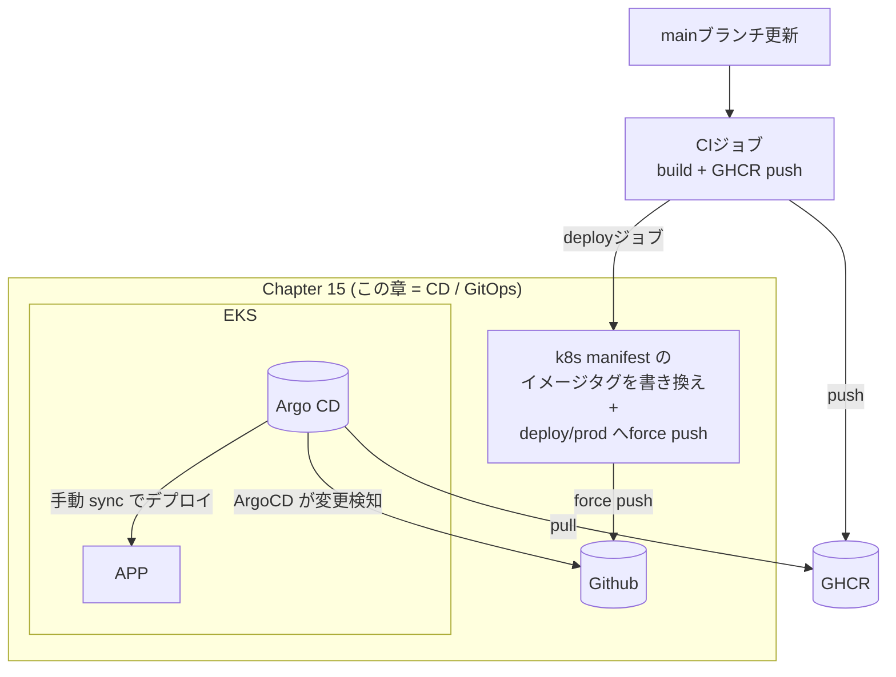
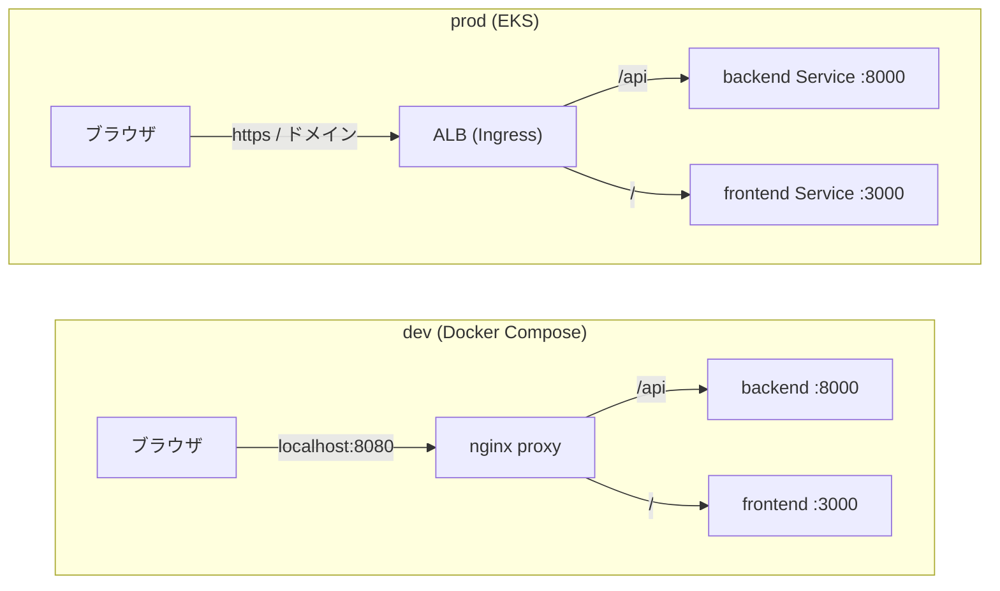
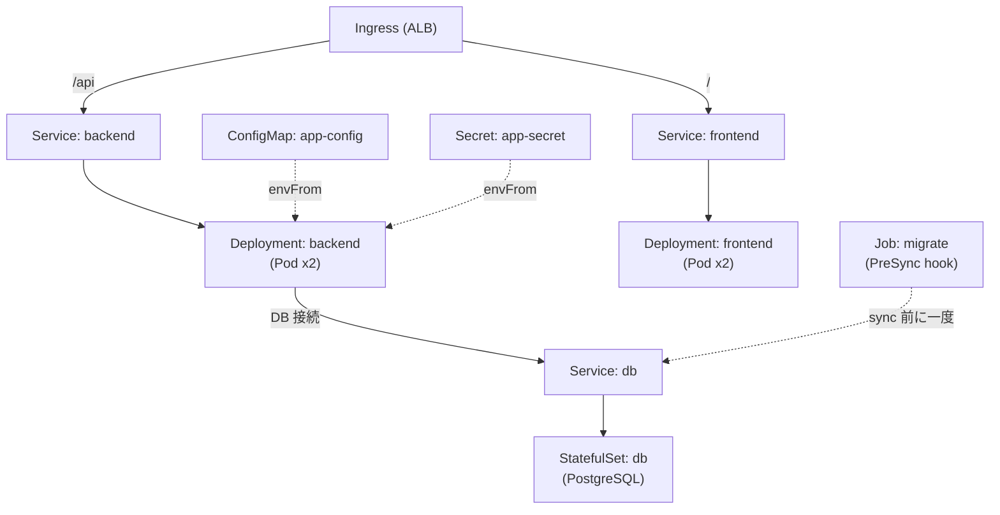
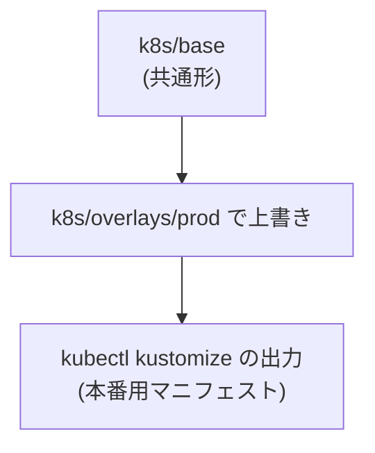
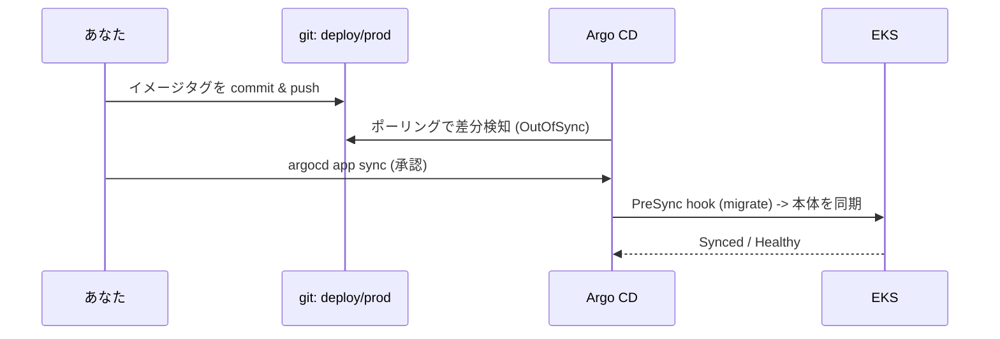

# Chapter 15: k8s (EKS) へのデプロイ

[<- 目次に戻る](../../README.md)

## この章のゴール

- **Kustomize** (base + overlays) で Kubernetes マニフェストを管理できます。
- **Deployment / Service / Ingress / StatefulSet / Job / ConfigMap / Secret** の役割を説明できます。
- **Argo CD** による **pull 型 GitOps** (git を望ましい状態とし、クラスタを手動 sync で同期させる) を実践できます。
- 「イメージタグを git に commit -> Argo CD が検知 -> 手動 sync で EKS へ反映」という CD の一連を体験できます。
- **ALB Ingress** でパスを振り分け、単一オリジン (`/api` -> backend, `/` -> frontend) を再現できます。

## スタート地点

```bash
# 前章 (Chapter 14) の完成状態から始めます
git checkout chapter14-end
```

## 完成形

```bash
git checkout chapter15-end
```

差分: `chapter14-end...chapter15-end`

---

## はじめに

Chapter 14 では、main にマージするたびに本番イメージを **GHCR (GitHub Container Registry)** へ push する CI を作りました。この章はその続きの **CD (Continuous Delivery)** です。GHCR に置かれたイメージを、**Argo CD** を使って **EKS (Amazon の Kubernetes)** へ届けます。



Chapter 14 のゴールは「GHCR にイメージを push する」まででした。この章は点線だった部分、つまり **イメージを EKS で動かす** ところを実装します。

### pull 型 GitOps とは

デプロイの方式は大きく 2 つあります。

| 方式 | 仕組み | 代表例 |
| :--- | :--- | :--- |
| push 型 | クラスタの外 (CI) から `kubectl apply` でクラスタへ反映する | CI から kubectl / helm |
| **pull 型 (GitOps)** | クラスタ内のエージェントが **git を監視**し、git の状態に自分で合わせにいく | **Argo CD** / Flux |

この章で使う [Argo CD](https://argo-cd.readthedocs.io/) は pull型です。**gitをSSoT(single source of truth)」** とする考え方が中心にあります。

> [!NOTE] ポイント解説: なぜ pull 型か
> pull 型では、クラスタの認証情報を CI に渡す必要がありません (エージェントがクラスタ内に居るため)。また「今クラスタで動いているもの = git の中身」になるので、変更履歴・監査・ロールバックが git ベースで完結します。

### この章の前提

この章は **デプロイ先の EKS クラスタが既にある**ことを前提とします。クラスタの構築 (eksctl / Terraform 等) は範囲外です。具体的には、以下が用意済みであることを前提に進めます。

| 前提 | 用途 |
| :--- | :--- |
| EKS クラスタ + `kubectl` の疎通 (`aws eks update-kubeconfig` 済み) | デプロイ先 |
| [AWS Load Balancer Controller](https://kubernetes-sigs.github.io/aws-load-balancer-controller/latest/) インストール済み | Ingress から ALB を作る |
| ACM 証明書 + ドメイン | HTTPS 公開 |
| [Argo CD](https://argo-cd.readthedocs.io/) インストール済み | GitOps の同期エージェント |
| この章を作業する **private リポジトリ** (chapter01 で作成済み) | 環境固有値 (ACM ARN・ドメイン等) を安全に commit する |
| **classic PAT** (`read:packages`) | EKS が private GHCR から image を pull する (`imagePullSecret`) |
| **fine-grained PAT** (対象リポジトリ / Contents: Read) | Argo CD が private リポジトリを読む |

> [!NOTE] ポイント解説: private リポジトリと GHCR イメージ
> GitHub Actions で push したパッケージは、実行元リポジトリに自動でリンクされ、**そのリポジトリの可視性を継承**します。この章のリポジトリは private なので、GHCR のイメージも private になります。  
> そのため EKS から pull するには認証が必要で、classic PAT (`read:packages`) を埋めた `imagePullSecret` (後述の `ghcr-secret`) を使います。Argo CD が読む git リポジトリも private のため、別途 repo credentials の登録が必要です (§6)。

### dev と prod の単一オリジン

ローカル開発では **nginx (proxy)** が `/api` を backend に、`/` を frontend に振り分けていました。  
EKS では、この役割を **ALB (Ingress)** が担います。



そのため、k8s では nginx proxy の Pod は作りません。

### この章で作るファイル

```
web-tutorial-v2/
├── backend/app/main.py          # <- /health エンドポイントを追加
├── .github/workflows/ci.yml     # <- deploy ジョブを追加
└── k8s/                         # <- 今回新規
    ├── base/                    # 共通マニフェスト
    │   ├── kustomization.yaml
    │   ├── namespace.yaml
    │   ├── configmap.yaml
    │   ├── db.yaml
    │   ├── migrate-job.yaml
    │   ├── backend.yaml
    │   ├── frontend.yaml
    │   └── ingress.yaml
    ├── overlays/prod/      # 本番固有の上書き
    │   ├── kustomization.yaml
    │   └── ingress-patch.yaml
    └── argocd/
        ├── project.yaml          # Argo CD の AppProject (権限を限定)
        └── application.yaml      # Argo CD への登録
```

---

## 1. Kubernetes の基礎概念

Kubernetes (k8s) は「**こうあってほしい状態 (マニフェスト)** を宣言すると、その状態に保ち続けてくれる」システムです。この章で使うリソースは次の通りです。

| リソース | 役割 |
| :--- | :--- |
| **Namespace** | リソースをまとめる論理的な区画 |
| **Deployment** | アプリ (stateless) の Pod を指定数だけ動かし続ける |
| **StatefulSet** | DB のように状態を持つ Pod を、安定した名前と永続ボリュームつきで動かす |
| **Job** | 一度だけ実行して終わる処理 (今回はマイグレーション) |
| **Service** | 複数の Pod へまとまった宛先 (クラスタ内 DNS 名) を与える |
| **Ingress** | クラスタの外からの HTTP(S) 入口。ALB を作りパスで振り分ける |
| **ConfigMap** | 非機密の設定値 |
| **Secret** | パスワード等の機密値 |

これらの関係を図にすると次のようになります。



> [!TIP] 公式ドキュメント
> - [Kubernetes Concepts | Kubernetes](https://kubernetes.io/docs/concepts/)
> - [Kustomize | Kubernetes](https://kubernetes.io/docs/tasks/manage-kubernetes-objects/kustomization/)

---

## 2. デプロイ準備: ヘルスチェックエンドポイント

Kubernetes は Pod の状態を **probe (ヘルスチェック)** で監視します。probe には 2 種類あります。

| probe | 失敗したとき | 用途 |
| :--- | :--- | :--- |
| **liveness** | Pod を**再起動**する | プロセスが生きているか |
| **readiness** | Service から**外す** (再起動はしない) | リクエストを受けられる状態か |

backend には、DB に疎通できるかを返す `GET /health` を追加します。これを **readiness** に使い、DB が一時的に不調なときは「準備できていない」とみなして Service から外します。一方 **liveness** は既存の `GET /`(DB に依存しない) を使います。

> [!NOTE] ポイント解説: liveness で DB を見ない理由
> liveness が DB 疎通で失敗すると Pod が**再起動**します。DB が落ちている間ずっと全 Pod が再起動を繰り返す (CrashLoop) と復旧の妨げになります。liveness は「プロセスが生きているか」だけを見て、DB 依存は readiness 側に置くのが定石です。

`backend/app/main.py` に `/health` を追加します。

```python
# backend/app/main.py
from fastapi import FastAPI, Depends, Response, status  # <- Depends, Response, status 追加
from sqlalchemy import text                             # <- 追加
from sqlalchemy.orm import Session                      # <- 追加

from app.session import get_session                     # <- 追加

# ... (既存の app 定義) ...


# Kubernetes の probe / ALB ヘルスチェック用。
# liveness は "/"(DB 非依存)、readiness はこの "/health"(DB 疎通)で使い分ける。
# include_in_schema=False で OpenAPI には出さない(フロントの型生成に影響させない)。
@app.get("/health", include_in_schema=False)
def health(
    response: Response,
    session: Session = Depends(get_session),
) -> dict[str, str]:
    try:
        # DB に到達できるかを軽量なクエリで確認する
        session.execute(text("SELECT 1"))
    except Exception:
        response.status_code = status.HTTP_503_SERVICE_UNAVAILABLE
        return {"status": "unhealthy"}
    return {"status": "ok"}
```

> [!NOTE] ポイント解説: include_in_schema=False
> `/health` を OpenAPI スキーマに含めると、フロントの型生成 (`schema.ts`) に差分が出て Chapter 14 の openapi-drift チェックが赤くなります。ヘルスチェックは API 仕様ではなく運用用のため、`include_in_schema=False` でスキーマから除外します。

動作を確認します (dev スタックを起動した状態で実行)。

```bash
cd $PROJECT_DIR
docker compose down && docker compose up -d --build

# DB 正常時: 200 / {"status":"ok"}
curl -s http://backend:8000/health

# DB を止めると 503 / {"status":"unhealthy"}
docker compose stop db
curl -s -o /dev/null -w "%{http_code}\n" http://backend:8000/health

# 元に戻す
docker compose start db
```

### テスト

```python
# backend/tests/test_api.py (末尾に追記)
class TestHealth:
    """ヘルスチェック API のテスト。"""

    def test_health_ok(self, client: TestClient):
        """DB に疎通できれば 200 と status: ok を返す"""
        response = client.get("/health")
        assert response.status_code == 200
        assert response.json() == {"status": "ok"}
```

```bash
cd $PROJECT_DIR/backend

# 環境変数を export (テスト DB 作成に必要)
export $(grep -v '^#' $PROJECT_DIR/backend/.env | xargs)

# テスト実行
uv run pytest tests/
```

### フォーマット・型チェック

```bash
cd $PROJECT_DIR/backend
uv run ruff check --fix 
uv run mypy
```

---

## 3. base マニフェストを書く

すべての環境で共通する定義を `k8s/base/` に置きます。ディレクトリを作ります。

```bash
mkdir -p $PROJECT_DIR/k8s/base
touch $PROJECT_DIR/k8s/base/namespace.yaml
touch $PROJECT_DIR/k8s/base/configmap.yaml
touch $PROJECT_DIR/k8s/base/db.yaml
touch $PROJECT_DIR/k8s/base/migrate-job.yaml
touch $PROJECT_DIR/k8s/base/backend.yaml
touch $PROJECT_DIR/k8s/base/frontend.yaml
touch $PROJECT_DIR/k8s/base/ingress.yaml
touch $PROJECT_DIR/k8s/base/kustomization.yaml
```

### 3.1 Namespace と ConfigMap

`Namespace` と 非機密の設定を保持するための `ConfigMap`

```yaml
# k8s/base/namespace.yaml
apiVersion: v1
kind: Namespace
metadata:
  name: web-tutorial
```

```yaml
# k8s/base/configmap.yaml
apiVersion: v1
kind: ConfigMap
metadata:
  name: app-config
data:
  # DB 接続先。DB_HOST はクラスタ内の Service 名(同一 namespace なのでショート名で解決)
  DB_HOST: db
  DB_PORT: "5432"
  DB_NAME: app
  DB_USER: app
  TOKEN_ALGORITHM: HS256
  TOKEN_EXPIRE_MINUTES: "480"
  COOKIE_SECURE: "true"   # HTTPS 公開なので Secure Cookie を有効化
  LOG_FORMAT: json
  # frontend の SSR が backend を直接呼ぶ先(同一 namespace の Service 名)
  INTERNAL_API_URL: http://backend:8000
```

> [!NOTE] ポイント解説: Service 名での通信
> 同一 namespace の Pod からは、Service を`backend`, `db` といった**ショート名**で解決できます。正式な名前は `<service-name>.<namespace>.svc.cluster.local` です。

> [!TIP] 公式ドキュメント: kubernetes  
> - [ConfigMap | kubernetes](https://kubernetes.io/ja/docs/concepts/configuration/configmap/)

### 3.2 PostgreSQL (StatefulSet)

DB は状態を持つので **StatefulSet** で動かし、各 Pod 専用の永続ボリューム (PVC) を `volumeClaimTemplates` で確保します。

> [!NOTE] ポイント解説: StatefulSet とは
> Deployment の Pod は「使い捨て・交換可能」で、名前はランダム、専用のストレージも持ちません。DB のように **データ (状態) を持つ** ワークロードには、StatefulSet が次の 3 つを保証します。
> - **安定した名前**: Pod は `db-0` / `db-1` のように連番で固定され、再作成されても同じ名前に戻ります。
> - **Pod 専用の永続ボリューム**: `volumeClaimTemplates` が Pod ごとに PVC を自動生成し、Pod を作り直しても **同じボリュームを再アタッチ**します (データが消えません)。
> - **順序保証**: 作成・削除・スケールを `db-0` から順番に行います。
>
> 「このデータはこの Pod のもの」という同一性が重要な DB に向いています。Deployment はこれらを保証しないため、DB には使いません。

```yaml
# k8s/base/db.yaml
apiVersion: v1
kind: Service
metadata:
  name: db
spec:
  clusterIP: None   # headless Service: StatefulSet の各 Pod に安定した DNS を与える
  selector:
    app: db
  ports:
    - port: 5432
      targetPort: 5432
---
apiVersion: apps/v1
kind: StatefulSet
metadata:
  name: db
spec:
  serviceName: db   # 上の headless Service 名と一致させる
  replicas: 1
  selector:
    matchLabels:
      app: db
  template:
    metadata:
      labels:
        app: db
    spec:
      containers:
        - name: postgres
          image: postgres:18-alpine
          ports:
            - containerPort: 5432
          env:
            # postgres 公式イメージは POSTGRES_* を要求する。
            # アプリ側の DB_USER / DB_NAME / DB_PASSWORD と同じ値を別名で渡す。
            - name: POSTGRES_USER
              valueFrom:
                configMapKeyRef:
                  name: app-config
                  key: DB_USER
            - name: POSTGRES_DB
              valueFrom:
                configMapKeyRef:
                  name: app-config
                  key: DB_NAME
            - name: POSTGRES_PASSWORD
              valueFrom:
                secretKeyRef:
                  name: app-secret
                  key: DB_PASSWORD
          volumeMounts:
            # postgres:18 の VOLUME は /var/lib/postgresql。
            # PVC ルート直下の lost+found による初期化失敗を避けるため subPath を使う。
            - name: data
              mountPath: /var/lib/postgresql
              subPath: pgdata
          readinessProbe:  # リクエストを受けられる状態か。失敗が続く場合は Service から外す。
            exec:
              command: ["pg_isready", "-U", "app", "-d", "app"]
            initialDelaySeconds: 5  # 最初に probeを実行するまでの待ち時間
            periodSeconds: 10  # 監視間隔
  volumeClaimTemplates:
    - metadata:
        name: data
      spec:
        # storageClassName を省略しているため、クラスタのデフォルト StorageClass が使われます
        # 必要であれば、EBS (gp3) などの外部ストレージを提供する StorageClass を明示的に指定する。
        accessModes: ["ReadWriteOnce"]
        resources:
          requests:
            storage: 1Gi
```

> [!NOTE] ポイント解説: 本番の DB
> 本番環境では、DB はクラスタ内ではなく **RDS などのマネージドサービス**を使うのが一般的です (バックアップ・冗長化・運用を任せられるため)。この章は学習のためクラスタ内で完結させています。

> [!NOTE] ポイント解説: postgres:18 のマウント先
> PostgreSQL 18 公式イメージは、データの VOLUME が `/var/lib/postgresql` です。PVC をここにマウントし、`subPath: pgdata` を付けてボリューム直下の `lost+found` を避けます。

> [!TIP] 公式ドキュメント: kubernetes  
> - [StatefulSet | kubernetes](https://kubernetes.io/ja/docs/concepts/workloads/controllers/statefulset/)
> - [Service | kubernetes](https://kubernetes.io/ja/docs/concepts/services-networking/service/)


### 3.3 マイグレーション (Job / PreSync hook)

DB スキーマの適用 (`alembic upgrade head`) と初期データ投入 (`app.seed`) を一度だけ実行する Job です。Chapter 14 までの `migrate` サービスと同じ処理を k8s 上で動かします。

> [!NOTE] ポイント解説: Argo CD の hook と PreSync とは
> hook は、`argocd.argoproj.io/hook` アノテーションを付きのマニフェストを、Argo CD が **Syncの特定のphaseで実行する**仕組みです。マニフェストには通常 Job や Pod を使います。phase には次のものがあります。
>
> | phase | 実行タイミング | 代表的なユースケース |
> | :--- | :--- | :--- |
> | **PreSync** | アプリ本体の同期の**前** | DB スキーママイグレーション |
> | **Sync** | アプリ本体の同期と**同時** | rolling update では足りない複雑なデプロイ制御 |
> | **PostSync** | アプリ本体の同期が**完了した後** | スモークテスト / 結合テスト |
> | **SyncFail** | sync が**失敗**したとき | クリーンアップ処理 |
>
> hook が失敗すると後続の phase へ進まず、sync 全体が止まります。

```yaml
# k8s/base/migrate-job.yaml
apiVersion: batch/v1
kind: Job
metadata:
  name: migrate
  annotations:
    # アプリ本体のsyncの前に実行されます。これが失敗するとアプリはsyncされません
    argocd.argoproj.io/hook: PreSync
    # マイグレーションが成功したら Job を削除して、次回、ジョブを再実行できるようにします。
    argocd.argoproj.io/hook-delete-policy: HookSucceeded
    # phase内での優先順位。小さいほど優先。(デフォルトは0、整数で指定)
    argocd.argoproj.io/sync-wave: '-1'
spec:
  backoffLimit: 2
  template:
    spec:
      imagePullSecrets:
        - name: ghcr-secret   # private GHCR から image を pull するための認証
      restartPolicy: Never
      containers:
        - name: migrate
          image: web-tutorial-v2-backend
          command:
            - sh
            - -c
            - uv run alembic upgrade head && uv run python -m app.seed
          envFrom:
            - configMapRef:
                name: app-config
            - secretRef:
                name: app-secret
```

> [!TIP] 公式ドキュメント: Argo CD  
> - [Sync Phases and Waves | Argo CD](https://argo-cd.readthedocs.io/en/stable/user-guide/sync-waves/)
> - [Initialize or migrate a database | Argo CD](https://argo-cd.readthedocs.io/en/stable/user-guide/sync-waves/#initialize-or-migrate-a-database)

> [!TIP] 公式ドキュメント: kubernetes  
> - [Job | kubernetes](https://kubernetes.io/ja/docs/concepts/workloads/controllers/job/)

> [!NOTE] ポイント解説: imagePullSecrets で private GHCR から pull する
> この章のイメージは private GHCR にあるため、Pod を動かす各マニフェスト (migrate Job / backend / frontend) に `imagePullSecrets` を付け、認証情報 `ghcr-secret` を参照させます。`ghcr-secret` はこの後の手順でクラスタに直接作成します。


### 3.4 backend (Deployment + Service)

backend は stateless なので **Deployment** で動かします。設定は ConfigMap と Secret から `envFrom` でまとめて受け取ります。

```yaml
# k8s/base/backend.yaml
apiVersion: apps/v1
kind: Deployment
metadata:
  name: backend
spec:
  replicas: 1
  selector:
    matchLabels:
      app: backend
  template:
    metadata:
      labels:
        app: backend
    spec:
      imagePullSecrets:
        - name: ghcr-secret   # private GHCR から image を pull するための認証
      containers:
        - name: backend
          image: web-tutorial-v2-backend
          ports:
            - containerPort: 8000
          envFrom:
            - configMapRef:  # 指定した config map を環境変数に設定
                name: app-config
            - secretRef:  # 指定した secret を環境変数に設定
                name: app-secret
          livenessProbe:  # プロセスが生きているか。失敗が続く場合はPodを再起動。
            httpGet:
              path: /    # "/"(DB 非依存)
              port: 8000
            initialDelaySeconds: 5  # 最初に probeを実行するまでの待ち時間
            periodSeconds: 10  # 監視間隔
          readinessProbe:  # リクエストを受けられる状態か。失敗が続く場合は Service から外す。
            httpGet:
              path: /health   # "/health"(DB 疎通)
              port: 8000
            initialDelaySeconds: 5
            periodSeconds: 10
          resources:
            requests:
              cpu: 100m
              memory: 128Mi
            limits:
              cpu: 500m
              memory: 256Mi
---
apiVersion: v1
kind: Service
metadata:
  name: backend
  annotations:
    # ALB のターゲットグループ(backend)のヘルスチェック設定。Service 単位で効く。
    alb.ingress.kubernetes.io/healthcheck-path: /health
    alb.ingress.kubernetes.io/success-codes: "200"
spec:
  selector:
    app: backend
  ports:
    - port: 8000
      targetPort: 8000
```

> [!TIP] 公式ドキュメント:  
> - [Service | kubernetes](https://kubernetes.io/ja/docs/concepts/services-networking/service/)
> - [Deployment | kubernetes](https://kubernetes.io/ja/docs/concepts/workloads/controllers/deployment/)

### 3.5 frontend (Deployment + Service)

frontend は SSR で backend を直接呼ぶため `INTERNAL_API_URL` だけを渡します (DB パスワードや JWT 鍵は渡しません)。

```yaml
# k8s/base/frontend.yaml
apiVersion: apps/v1
kind: Deployment
metadata:
  name: frontend
spec:
  replicas: 1
  selector:
    matchLabels:
      app: frontend
  template:
    metadata:
      labels:
        app: frontend
    spec:
      imagePullSecrets:
        - name: ghcr-secret   # private GHCR から image を pull するための認証
      containers:
        - name: frontend
          image: web-tutorial-v2-frontend
          ports:
            - containerPort: 3000
          env:
            - name: INTERNAL_API_URL
              valueFrom:
                configMapKeyRef:  # 指定したConfigMapから特定のキーの値を環境変数に設定
                  name: app-config
                  key: INTERNAL_API_URL
          livenessProbe:
            httpGet:
              path: /
              port: 3000
            initialDelaySeconds: 5
            periodSeconds: 10
          readinessProbe:
            httpGet:
              path: /
              port: 3000
            initialDelaySeconds: 5
            periodSeconds: 10
          resources:
            requests:
              cpu: 100m
              memory: 128Mi
            limits:
              cpu: 500m
              memory: 256Mi
---
apiVersion: v1
kind: Service
metadata:
  name: frontend
  annotations:
    # 未ログイン時のリダイレクト(3xx)も成功扱いにするため 200-399 を成功とする。
    alb.ingress.kubernetes.io/healthcheck-path: /
    alb.ingress.kubernetes.io/success-codes: 200-399
spec:
  selector:
    app: frontend
  ports:
    - port: 3000
      targetPort: 3000
```

> [!TIP] 公式ドキュメント:  
> - [Service | kubernetes](https://kubernetes.io/ja/docs/concepts/services-networking/service/)
> - [Deployment | kubernetes](https://kubernetes.io/ja/docs/concepts/workloads/controllers/deployment/)

### 3.6 Ingress (ALB)

AWS Load Balancer Controller がこの Ingress を見て **ALB を 1 つ**作り、パスで振り分けます。

```yaml
# k8s/base/ingress.yaml
apiVersion: networking.k8s.io/v1
kind: Ingress
metadata:
  name: web-tutorial
  annotations:
    alb.ingress.kubernetes.io/scheme: internet-facing       # インターネット公開
    alb.ingress.kubernetes.io/target-type: ip               # Pod の IP へ直接ルーティング(VPC CNI)
    alb.ingress.kubernetes.io/listen-ports: '[{"HTTP":80},{"HTTPS":443}]'
    alb.ingress.kubernetes.io/ssl-redirect: "443"           # HTTP は HTTPS へリダイレクト
    # 証明書 ARN は overlay/prod の patch で付与する
spec:
  ingressClassName: alb
  rules:
    - http:
        paths:
          # Prefix は長いものが優先されるため /api が / より先に評価される(記載順非依存)
          - path: /api
            pathType: Prefix
            backend:
              service:
                name: backend
                port:
                  number: 8000
          - path: /
            pathType: Prefix
            backend:
              service:
                name: frontend
                port:
                  number: 3000
```

> [!NOTE] ポイント解説: ALB のヘルスチェックは Service 側に書く
> `healthcheck-path` などを Ingress に書くと全ターゲットグループ共通になります。backend と frontend でパスを分けたいので、各 **Service の annotation** に書きます (Service の設定が優先されます)。

> [!TIP] 公式ドキュメント
> - [Ingress annotations | AWS Load Balancer Controller](https://kubernetes-sigs.github.io/aws-load-balancer-controller/latest/guide/ingress/annotations/)

### 3.7 base の kustomization

`kustomization.yaml` で base のリソースをまとめます。

```yaml
# k8s/base/kustomization.yaml
apiVersion: kustomize.config.k8s.io/v1beta1
kind: Kustomization

resources:
  - namespace.yaml
  - configmap.yaml
  - db.yaml
  - migrate-job.yaml
  - backend.yaml
  - frontend.yaml
  - ingress.yaml

# 全リソースの metadata に共通ラベルを付与する(spec.selectorにはラベルを付与しない)
labels:
  - pairs:
      app.kubernetes.io/part-of: web-tutorial
    includeSelectors: false
```

ここで一度、マニフェストが正しく組み立てられるか確認します。`kubectl kustomize` は **クラスタに接続せず**、ビルド結果を標準出力に出すだけのコマンドです。

```bash
cd $PROJECT_DIR
kubectl kustomize k8s/base | grep "^kind:" | sort | uniq -c
```

```
# 出力例
      1 kind: ConfigMap
      2 kind: Deployment
      1 kind: Ingress
      1 kind: Job
      1 kind: Namespace
      3 kind: Service
      1 kind: StatefulSet
```

---

## 4. Kustomize と overlays/prod

base は環境に依存しない共通形です。**環境ごとの差分** (イメージのレジストリ・タグ、レプリカ数、ドメイン、証明書) は **overlay** で上書きします。



ディレクトリと overlay を作ります。

```bash
mkdir -p $PROJECT_DIR/k8s/overlays/prod
touch $PROJECT_DIR/k8s/overlays/prod/kustomization.yaml
touch $PROJECT_DIR/k8s/overlays/prod/ingress-patch.yaml
```

base の Ingress に本番固有の値 (証明書 ARN・ドメイン) を足す patch です。`/` を含む annotation キーは JSON Patch では `~1` にエスケープします。

```yaml
# k8s/overlays/prod/ingress-patch.yaml
 - op: add
   path: /metadata/annotations/alb.ingress.kubernetes.io~1certificate-arn
   value: arn:aws:acm:ap-northeast-1:xxxxxxxxxxxx:certificate/xxxxxxxx-xxxx-xxxx-xxxx-xxxxxxxxxxxx
 - op: add
   path: /spec/rules/0/host
   value: web-tutorial.example.com
```

overlay の kustomization で、イメージ・レプリカ・patch をまとめます。

```yaml
# k8s/overlays/prod/kustomization.yaml
apiVersion: kustomize.config.k8s.io/v1beta1
kind: Kustomization

namespace: web-tutorial   # 全リソースを web-tutorial namespace に配置する

resources:
  - ../../base

# base のプレースホルダ image 名を GHCR の実イメージ + タグに置き換える。
# newTag のデフォルトは latest。CI の deploy ジョブが sha-<コミット> に書き換える。
# backend の置換は backend Deployment と migrate Job の両方に効く(同じ image 名のため)。
# your-org は自分の GitHub オーナー名に置き換える。
images:
  - name: web-tutorial-v2-backend
    newName: ghcr.io/your-org/web-tutorial-v2-backend
    newTag: latest
  - name: web-tutorial-v2-frontend
    newName: ghcr.io/your-org/web-tutorial-v2-frontend
    newTag: latest

replicas:
  - name: backend
    count: 2
  - name: frontend
    count: 2

patches:
  - path: ingress-patch.yaml
    target:
      kind: Ingress
      name: web-tutorial
```

overlay をビルドして、上書きが効いているか確認します。

```bash
cd $PROJECT_DIR
kubectl kustomize k8s/overlays/prod | grep -E "image: ghcr.io|replicas:|host:|certificate-arn"
```

```
# 出力例
    alb.ingress.kubernetes.io/certificate-arn: arn:aws:acm:ap-northeast-1:...
  - host: web-tutorial.example.com
        image: ghcr.io/your-org/web-tutorial-v2-backend:latest
        image: ghcr.io/your-org/web-tutorial-v2-frontend:latest
        image: ghcr.io/your-org/web-tutorial-v2-backend:latest   # migrate Job にも適用される
  replicas: 2
  replicas: 2
```

> [!NOTE] ポイント解説: overlay を増やせば環境が増える
> 今回は `prod` 1 つですが、`overlays/stg` を足してレプリカ数やドメインだけ変えれば、同じ base から staging 環境を作れます。これが base + overlays の利点です。

> [!TIP] 公式ドキュメント
> - [Kustomize - Reference | kubectl](https://kubectl.docs.kubernetes.io/references/kustomize/)

---


## 5. Secret の手動 bootstrap

DB パスワードや JWT 署名鍵は **git に置きません**。クラスタに直接 1 度だけ作成します (bootstrap)。`namespace` を先に作ってから Secret を作ります。

### EKS が private な GHCR からイメージを pull するための classic PAT(personal access token)を発行

- [Personal access tokens (classic) | GitHub](https://github.com/settings/tokens) にアクセス
- 「Generate new token (classic)」をクリック
  - Note: `web-tutorial-v2-image-pull` (任意)
  - Expiration: 任意
  - Select scopes:  
    - `read:packages`

### Secretの作成

```bash
# k8sクラスタに接続
aws eks update-kubeconfig --name CLUSTER_NAME
```

```bash
# namespace を先に作る
kubectl create namespace web-tutorial

# 機密値を Secret として作成する(値は自分のものに置き換える)
kubectl create secret generic app-secret -n web-tutorial \
  --from-literal=DB_PASSWORD='your-strong-db-password' \
  --from-literal=TOKEN_SECRET_KEY='your-strong-jwt-secret'

# private GHCR から image を pull するための認証 Secret を作成する
kubectl create secret docker-registry ghcr-secret -n web-tutorial \
  --docker-server=ghcr.io \
  --docker-username='<GitHub ユーザー名>' \
  --docker-password='<classic PAT (read:packages)>'
```
---

## 6. Argo CD で GitOps

ここからが pull 型 GitOps の中心です。Argo CD に「**deploy/prod ブランチの `k8s/overlays/prod` を監視し、このクラスタへ同期せよ**」と宣言します。


### 6.1 ブランチ戦略

| ブランチ | 役割 |
| :--- | :--- |
| `main` | 教材本体。人間が編集する |
| `deploy/prod` | Argo CD が監視する。**main の鏡像 + 確定したイメージタグ** |

`main` を直接監視させない理由は、main には今後の章の変更も入っていくためです。デプロイ対象を `deploy/prod` に分けることで、Argo CD は安定したブランチだけを見ます。


### 6.2 Repository を登録する

private リポジトリなので、Argo CDにはGitHubにアクセスするためのPAT(personal access token)が 必要です。

- [fine-grained PAT](https://github.com/settings/personal-access-tokens)にアクセス
- 「Generate new token」をクリック
  - Token name: `web-tutorial-v2-argocd` (任意)
  - Expiration: 任意
  - Repository access: `Only select repositories` -> 対象のリポジトリを選択
  - Permissions: 
    - `Contents` (Read-only)
    - `Metadata` (Read-only)

発行したPATをArgoCDのリポジトリ設定に登録します。

```bash
# ArgoCDにログイン
ARGOCD_ADMIN_PASSWD=$(kubectl -n argocd get secret argocd-initial-admin-secret -o jsonpath='{.data.password}' | base64 -d)
argocd login argocd.internal.baseport.net --grpc-web \
    --username admin \
    --password "$ARGOCD_ADMIN_PASSWD"
# 'admin:login' logged in successfully
# Context 'argocd.internal.baseport.net' updated
```

```bash
argocd repo add https://github.com/your-org/web-tutorial-v2.git \
  --username x-access-token \
  --password '<fine-grained PAT (Contents: Read)>'
```

> [!NOTE] ポイント解説:  
> - `x-access-token` は任意の文字列でOK

> [!TIP] 公式ドキュメント: 
> - [Private Repositories | ArgoCD](https://argo-cd.readthedocs.io/en/latest/user-guide/private-repositories/)


### 6.3 Project と Application を登録する

`k8s/argocd/` に Argo CD の AppProject と Application を作ります。

```bash
mkdir -p $PROJECT_DIR/k8s/argocd
touch $PROJECT_DIR/k8s/argocd/project.yaml
touch $PROJECT_DIR/k8s/argocd/application.yaml
```

まず **AppProject** で、このアプリが使える source リポジトリ・デプロイ先・リソース種別を限定します。

```yaml
# k8s/argocd/project.yaml
apiVersion: argoproj.io/v1alpha1
kind: AppProject
metadata:
  name: web-tutorial
  namespace: argocd   # AppProject も Argo CD のインストール namespace に作る
spec:
  description: web-tutorial アプリ専用プロジェクト
  # この repo からのデプロイだけを許可する
  sourceRepos:
    - https://github.com/your-org/web-tutorial-v2.git   # <- 自分の private リポジトリの URL に置き換え
  # このクラスタの web-tutorial namespace だけを許可する
  destinations:
    - server: https://kubernetes.default.svc
      namespace: web-tutorial
  # base の Namespace は cluster-scoped なので明示的に許可する
  clusterResourceWhitelist:
    - group: ''
      kind: Namespace
  # web-tutorial namespace 内のリソースはすべて許可する
  namespaceResourceWhitelist:
    - group: '*'
      kind: '*'
```

> [!NOTE] ポイント解説: AppProject で最小権限にする
> `default` プロジェクトは任意の repo / cluster / リソースを許可します。専用の AppProject を作り `sourceRepos` を自分の repo に、`destinations` を `web-tutorial` namespace に絞ることで、GitOps レイヤーでも最小権限を効かせます。
> 注意: base の `Namespace` は **cluster-scoped** リソースなので、`clusterResourceWhitelist` に明示しないと sync が `Namespace` の作成で失敗します。

次に Application です。`project` に上で作った AppProject を指定します。

```yaml
# k8s/argocd/application.yaml
apiVersion: argoproj.io/v1alpha1
kind: Application
metadata:
  name: web-tutorial
  namespace: argocd   # Application は Argo CD のインストール namespace に作る
spec:
  project: web-tutorial   # 専用 AppProject (source/destination を限定)
  source:
    repoURL: https://github.com/your-org/web-tutorial-v2.git  # <- 自分の private リポジトリの URL に置き換え
    targetRevision: deploy/prod          # 監視するブランチ
    path: k8s/overlays/prod        # kustomization.yaml があるパス
  destination:
    server: https://kubernetes.default.svc   # このクラスタ
    namespace: web-tutorial
  syncPolicy:
    # automated: を指定しないため sync は手動。
    syncOptions:
      - CreateNamespace=true
```

> [!NOTE] ポイント解説: 手動 sync を「承認」にする
> `syncPolicy.automated` を付ければ git の変更を自動で反映できますが、この章では**あえて手動 sync** にしています。`deploy/prod` が更新されると Argo CD は変更を検知するだけで止まり、人が `argocd app sync` を実行して初めてクラスタへ反映されます。この**手動 sync が「デプロイ承認」**にあたります。

> [!TIP] 公式ドキュメント: 
> - [Application Specification Reference | ArgoCD](https://argo-cd.readthedocs.io/en/latest/user-guide/application-specification/)

監視対象の `deploy/prod` ブランチを作成します。

```bash
cd $PROJECT_DIR

git add .
git commit -m "chapter15の変更をコミット"

# main の内容をそのまま deploy/prod として push する
git push origin main:deploy/prod
```

AppProject と Application を登録します (Application が project を参照するので AppProject を先に)。

```bash
kubectl apply -f $PROJECT_DIR/k8s/argocd/project.yaml
kubectl apply -f $PROJECT_DIR/k8s/argocd/application.yaml
```

登録した時点では git とクラスタが未一致なので **OutOfSync** です。手動 sync で反映します。

```bash
argocd app sync web-tutorial
```

sync すると Argo CD は `deploy/prod` を読み、PreSync hook の migrate Job を流したあと、本体 (db / backend / frontend / Service / Ingress) を同期します。

```bash
# 同期状況を確認(Synced / Healthy になれば成功)
argocd app get web-tutorial

# Pod の状態
kubectl get pods -n web-tutorial

# ALB の URL を確認(ADDRESS 列)
kubectl get ingress -n web-tutorial
```

ブラウザで `https://<あなたのドメイン>` を開き、ログイン〜CRUD ができれば成功です。

### 6.4 手動でタグを変えて同期を体験する

GitOps の本質を体感するため、一度手動でイメージタグを変えてみます。

```bash
cd $PROJECT_DIR
git checkout deploy/prod

# overlays/prod/kustomization.yaml の newTag を別の sha タグに書き換えてコミット
# (例: newTag: sha-xxxxxxx)
git commit -am "deploy: pin backend/frontend to sha-xxxxxxx"
git push origin deploy/prod

git checkout main
```

push すると Argo CD が差分を **OutOfSync** として検知します。`argocd app sync` で反映すると、新しいイメージへ入れ替わります (`argocd app get` で確認)。**git にタグを commit -> 手動 sync で承認 = デプロイ**、という GitOps の流れです。

```bash
argocd app sync web-tutorial
```



> [!TIP] 公式ドキュメント
> - [Application Specification | Argo CD](https://argo-cd.readthedocs.io/en/stable/user-guide/application-specification/)
> - [Resource Hooks (Sync Phases) | Argo CD](https://argo-cd.readthedocs.io/en/stable/user-guide/sync-waves/)

---

## 7. CD を自動化する

手動のタグ書き換えを CI に任せます。Chapter 14 の `ci.yml` に **deploy ジョブ**を足し、「main へ push -> イメージ build/push -> `deploy/prod` へタグを force push」までを自動化します。

まず `image` ジョブに、push したタグを出力させます。

```yaml
# .github/workflows/ci.yml の image ジョブに追記
  image:
    runs-on: ubuntu-latest
    needs: [backend-quality, frontend-quality, openapi-drift, e2e]
    outputs:
      image_tag: ${{ steps.meta.outputs.version }}   # <- 追記 (image_tag="sha-xxxxxxx" となる)
    strategy:
      # ... (既存) ...
```

> [!NOTE] ポイント解説: `outputs.version` は短縮 SHA
> `outputs.version` にはmetaステップで作成したタグが入ります。Chapter 14 で `type=sha,priority=900` としたため、ここでは短縮 SHA (`sha-xxxxxxx`) になります。

続けて deploy ジョブを追加します。

```yaml
# .github/workflows/ci.yml の末尾に追記
  deploy:
    runs-on: ubuntu-latest
    needs: [image]
    if: ${{ github.event_name == 'push' && github.ref == 'refs/heads/main' }}
    permissions:
      contents: write          # deploy/prod へ push するため(job 単位で最小権限)
    steps:
      - uses: actions/checkout@v6
      - name: Configure git identity
        run: |
          git config user.name "github-actions[bot]"
          git config user.email "41898282+github-actions[bot]@users.noreply.github.com"
      - name: Set image tags in overlay
        working-directory: k8s/overlays/prod
        # ubuntu-latest には kustomize がプリインストール済み
        run: |
          kustomize edit set image \
            web-tutorial-v2-backend=ghcr.io/${{ github.repository }}-backend:${{ needs.image.outputs.image_tag }} \
            web-tutorial-v2-frontend=ghcr.io/${{ github.repository }}-frontend:${{ needs.image.outputs.image_tag }}
      - name: Commit and force-push to deploy/prod
        run: |
          git commit -am "deploy: ${{ needs.image.outputs.image_tag }}"
          git push --force origin HEAD:deploy/prod
```

deploy ジョブは `deploy/prod` ブランチを更新します。実際にクラスタへ反映するかは、 argocd の手動 sync が必要です。

> [!NOTE] ポイント解説: なぜループしないのか
> deploy ジョブは `deploy/prod` へ push しますが、ワークフローのトリガは `push: branches: [main]` です。さらに **`GITHUB_TOKEN` で push したコミットは新しいワークフローを発火しない**という GitHub の仕様があります。この 2 点により、CI が自分自身を呼び続けるループは起きません。

> [!NOTE] ポイント解説: deploy/prod は main のミラー
> deploy ジョブは `main` をチェックアウトし、イメージタグだけ書き換えて `deploy/prod` へ **force push** します。そのため `deploy/prod` は常に「main の最新 + 確定タグ」になり、マニフェストを変更しても次のデプロイで自動的に反映されます (main から deploy/prod へマージする手間が不要です)。

これで「main にマージ -> CI が deploy/prod を更新 -> Argo CD を手動 sync で承認・反映」という CD パイプラインが完成しました。

---

## 8. 運用

### よく使うコマンド

```bash
# Argo CD の同期状態
argocd app get web-tutorial

# Pod / Service / Ingress
kubectl get pods,svc,ingress -n web-tutorial

# あるデプロイのログ
kubectl logs -n web-tutorial deploy/backend
```

### ロールバック

git の履歴ではなく **Argo CD の同期履歴**から戻します (`deploy/prod` は force push で履歴が上書きされるため)。

```bash
argocd app history web-tutorial          # 過去の同期を一覧
argocd app rollback web-tutorial <ID>    # 指定の状態へ戻す
```

> [!NOTE] ポイント解説: 手動 sync と automated
> この章は手動 sync 前提のため、git から消したリソースをクラスタからも消すには `argocd app sync --prune` のように都度指定します。
> 一方 Application に `automated` を付けると、次の自動化もできます (この章では承認のため使いません)。
> - `selfHeal: true` ... クラスタ側で手動変更しても、git の状態へ**自動で戻されます**。
> - `prune: true` ... git から消したリソースは、クラスタからも**自動で削除されます**。
>
> 「常に git を正とする」運用に倒したい場合の選択肢です。

---

## まとめ

- **Kustomize (base + overlays)**: 共通形を base に、環境差分 (image / replicas / patch) を overlay に分けて管理する。
- **k8s リソース**: stateless は Deployment、状態を持つ DB は StatefulSet + PVC、一度きりの処理は Job。Service で宛先を、Ingress (ALB) で外部入口を与える。
- **probe**: liveness は `/`(DB 非依存)、readiness は `/health`(DB 疎通)で使い分ける。
- **マイグレーション**: Argo CD の **PreSync hook** + `HookSucceeded` で、同期前に一度だけ安全に実行する。
- **Secret**: 機密は git に置かず `kubectl create secret` で bootstrap する。
- **private リポジトリ**: GHCR の pull は `imagePullSecret` (`ghcr-secret`)、Argo CD の git 読み取りは `argocd repo add` で認証する。
- **pull 型 GitOps (Argo CD)**: git (deploy/prod) を望ましい状態とし、クラスタを手動 sync で追従させる (sync が承認点)。
- **CD 自動化**: CI が `deploy/prod` へイメージタグを force push し、Argo CD の手動 sync で EKS へ反映する。

## 次の章

[Chapter 16: Keycloak + 自前 OIDC 実装 ->](../chapter16/README.md)

次の章では、Chapter 6 で作った自前の ID/PW 認証を、Keycloak を使った OIDC 認証へと発展させます。
